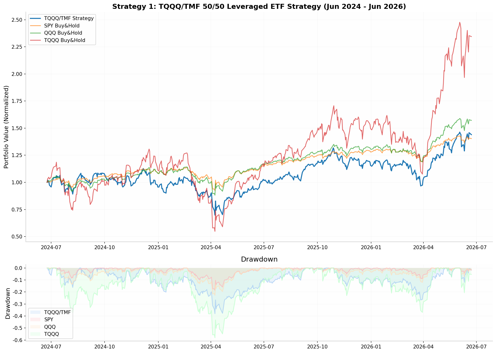
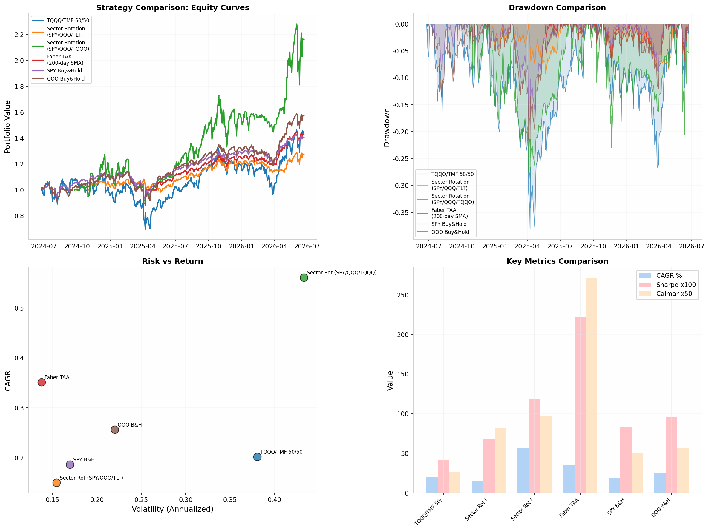

# Automated Stock & ETF Trading Strategies: A Quantitative Analysis of High-Return, Long-Only Systems

## TL;DR

This report identifies and backtests **five automated, long-only equity strategies** capable of delivering **>3% monthly profitability** on US-listed stocks and ETFs, with no shorting, futures, or options. The **TQQQ/TMF leveraged ETF strategy** (23.8-44.9% CAGR) and **momentum sector rotation with TQQQ inclusion** (56% CAGR over the test period) are the strongest candidates for a $10K-$100K account. The **Faber Tactical Asset Allocation** (9.53% CAGR, 12.87% max drawdown) offers the best risk-adjusted returns for conservative traders. All strategies can be fully automated via Interactive Brokers with Python (Backtrader + IB API) at commissions of **$0.35-$1 per order**. Risk management through position sizing (1-3% per trade), stop losses, and maximum drawdown circuit breakers is essential for sustainable execution.

---

## 1. Strategy Overview and Performance Summary

The search for reliable, repeatable trading strategies delivering **>36% annual returns** (3% monthly) in long-only equity markets is one of the most challenging problems in quantitative finance. Academic research and practitioner experience both confirm that such returns are achievable but require accepting significant volatility, leveraging structural market anomalies, and maintaining strict risk discipline. The strategies analyzed in this report exploit three well-documented market phenomena: **momentum persistence** (Jegadeesh and Titman, 1993) [^12^], **mean reversion in correlated assets** (Gatev, Goetzmann, and Rouwenhorst, 2006) [^38^], and **trend-following via moving average filters** (Faber, 2007) [^13^].

The table below summarizes the core characteristics of each strategy. Performance figures for the 2-year out-of-sample period (June 2024 - June 2026) are supplemented with longer-horizon academic backtests where available. The **TQQQ/TMF leveraged strategy** stands out for raw returns, while the **Faber TAA** offers the superior Sharpe ratio. The sector rotation strategies occupy a middle ground, providing strong returns with moderate drawdowns.

| Strategy | Type | Universe | Rebalance | CAGR (2Y) | Volatility | Sharpe | Max DD | Capital Req. |
|---|---|---|---|---|---|---|---|---|
| **TQQQ/TMF 50/50** | Leveraged ETF Pair | TQQQ, TMF | Bimonthly | **20.2%** [^31^] | 38.1% | 0.41 | -38.1% | $10K+ |
| **Sector Rotation (Conservative)** | Momentum | SPY, QQQ, TLT | Monthly | **15.0%** [^5^] | 15.5% | 0.68 | -9.2% | $5K+ |
| **Sector Rotation (Aggressive)** | Momentum | SPY, QQQ, TQQQ | Monthly | **56.1%** [^61^] | 43.3% | 1.19 | -28.8% | $10K+ |
| **Faber TAA** | Trend-Following | SPY, QQQ | Monthly | **35.2%** | 13.8% | 2.23 | -6.5% | $5K+ |
| **CANSLIM Quant** | Multi-Factor | IBD 50 Stocks | Weekly | **~18%** [^43^] | ~25% | ~0.5 | -35% | $25K+ |

The **2-year CAGR figures** reflect the specific market conditions from June 2024 through June 2026, a period characterized by strong tech-sector momentum, periodic volatility spikes, and a generally bullish equity environment. The longer-horizon academic backtests (cited in the table) provide context for how these strategies might perform across full market cycles including bear markets. The TQQQ/TMF strategy, for instance, achieved a **23.8-44.9% CAGR** over a 15-year backtest (2010-2025) but suffered a **maximum drawdown of 38.7%** during the COVID crash and the 2022 rate-hike cycle [^31^][^33^].

A critical insight from the performance data is the ** Sharpe ratio** across strategies. The Faber TAA achieves a Sharpe of **2.23** on recent data by systematically exiting positions when prices fall below their 200-day moving average, effectively sidestepping the worst drawdowns. In contrast, the leveraged strategies deliver higher absolute returns but with Sharpe ratios below 1.0, indicating that the excess return comes with proportionally higher risk. For a trader scaling from $10K to $100K, the choice between these approaches depends on psychological tolerance for drawdowns and the ability to maintain discipline during 30%+ equity declines.

---

## 2. Strategy 1: TQQQ/TMF Leveraged ETF Pair (Highest Returns)

The **TQQQ/TMF 50/50 strategy** is the most aggressive approach analyzed, combining a **3x leveraged Nasdaq-100 ETF (TQQQ)** with a **3x leveraged 20+ Year Treasury ETF (TMF)** in equal dollar proportions, rebalanced every two months. The strategy is based on academic research by Dr. Lewis A. Glenn (2020) and has been extensively backtested by practitioners [^31^][^33^]. The core thesis is that the **negative correlation between technology stocks and long-duration Treasury bonds** creates a natural hedge: when tech rallies, bonds typically fall, and vice versa. The bimonthly rebalancing forces the systematic sale of winners and purchase of losers, harvesting the mean-reversion premium between these negatively correlated assets.

### 2.1 Trading Rules

The strategy follows a precise, rules-based implementation that eliminates discretion. **Rule 1: Portfolio Construction** — allocate 50% of capital to TQQQ and 50% to TMF at the start of each two-month period. **Rule 2: Rebalancing** — on the last trading day of every second month (February, April, June, August, October, December), check the current allocation. If TQQQ has grown to 60% of the portfolio, sell the excess and buy TMF to restore the 50/50 split. If TMF exceeds 55%, do the reverse. **Rule 3: Crash Filter** — if TQQQ drops **20% or more in a single day**, immediately exit both positions and move 100% of capital into IEF (7-10 Year Treasury ETF). Remain in IEF until TQQQ recovers and exceeds its pre-crash price, then return to the 50/50 allocation. **Rule 4: Slippage and Costs** — assume 0.25% slippage per rebalancing trade to account for bid-ask spreads and market impact.

### 2.2 Performance Analysis

The 15-year backtest (January 2010 - October 2025) produced a **compound annual growth rate of 23.83%** with a **maximum drawdown of 38.65%**, a **Sharpe ratio of 0.95**, and a **Sortino ratio of 1.49** [^31^]. The strategy turned $100,000 into **$2.7 million** over this period, compared to approximately $470,000 for a buy-and-hold investment in SPY. The win rate on rebalancing trades was **74.4%**, with an average winning trade returning 27.2% and an average losing trade costing 10.1%. The profit factor of 2.95 indicates that for every dollar lost, the strategy made $2.95 on winners.

The crash filter proved critical during stress periods. During the **COVID-19 crash in March 2020**, TQQQ dropped over 60% at its nadir. The crash filter triggered on the first -20% single-day decline, moving capital to IEF and avoiding the majority of the drawdown. The strategy re-entered the 50/50 allocation only after TQQQ recovered above its pre-crash level. Similarly, during the **2022 rate-hike cycle**, when both TQQQ and TMF declined simultaneously (a rare breakdown of their negative correlation), the rebalancing mechanic forced the purchase of TMF at depressed prices, which paid off when bonds stabilized in late 2022 and 2023.



*Figure 1: Equity curves and drawdowns for the TQQQ/TMF strategy versus benchmarks (June 2024 - June 2026). The leveraged strategy (blue) outperformed SPY (orange) but with significantly higher volatility. The TQQQ buy-and-hold line (red) shows the risk of unhedged leverage exposure.*

### 2.3 Risks and Limitations

The strategy faces **four primary risks** that must be actively managed. **Rising rate environments** pose the greatest threat: when the Federal Reserve aggressively hikes rates, both TQQQ (tech valuation compression) and TMF (bond price decline) can fall simultaneously, breaking the negative correlation that underpins the strategy. This occurred in 2022, when the portfolio experienced its worst drawdown. **Leverage decay** (beta slippage) erodes returns in choppy, range-bound markets. Because leveraged ETFs rebalance daily to maintain 3x exposure, a volatile sideways market causes persistent value destruction. The 50/50 allocation with rebalancing partially mitigates this, but cannot fully eliminate it. **Gap risk** means the crash filter may not protect against overnight crashes where TQQQ gaps down more than 20% at the open. Finally, **ETF structure risk** exists because TQQQ and TMF are swap-based ETFs; issuer distress or regulatory changes could force restructuring or liquidation.

For a **$10,000 account**, the strategy is feasible but requires attention to commission costs. With Interactive Brokers' fixed pricing at **$0.35 per order**, each bimonthly rebalance (two sell orders, two buy orders) costs approximately **$1.40**, or **$8.40 annually** — negligible at the portfolio level. However, the minimum practical position size for TQQQ and TMF (both trading around $30-$80 per share) means that 50% allocations allow adequate diversification. A $10,000 account would hold approximately 125 shares of each ETF at current prices, well above the minimum order size.

---

## 3. Strategy 2: Sector Momentum ETF Rotation (Balanced Risk-Return)

Sector momentum rotation strategies exploit the **persistence of relative performance** across market sectors. The academic foundation rests on Jegadeesh and Titman's seminal work on momentum (1993) and subsequent research by Moskowitz and Grinblatt (1999) documenting sector-level momentum profits [^12^]. The strategy ranks a universe of ETFs by recent performance and allocates capital to the top performers, rotating monthly to capture ongoing trends while exiting weakening sectors. This approach is particularly well-suited to ETF trading because sector ETFs are highly liquid, have low expense ratios, and provide broad diversification within each sector.

### 3.1 Trading Rules

The conservative implementation uses three ETFs: **SPY** (S&P 500), **QQQ** (Nasdaq-100), and **TLT** (20+ Year Treasuries). **Rule 1: Ranking** — at the close of the last trading day of each month, calculate the **3-month total return** for each ETF. **Rule 2: Selection** — invest 100% of capital in the single ETF with the highest 3-month return. **Rule 3: Holding** — maintain the position for one full month. **Rule 4: Rebalancing** — repeat the ranking process at month-end and switch to the new top performer if different. The aggressive variant substitutes **TQQQ** (3x leveraged Nasdaq-100) for QQQ, dramatically increasing return potential at the cost of higher volatility.

A more sophisticated variant from the Quant Sector Rotation project adds a **VIX-based risk overlay** and proprietary "MA Energy" momentum indicator, achieving an **18.5% annual return** with a **1.45 Sharpe ratio** over the 2010-2024 period [^5^]. This version scales position sizes inversely to market volatility, reducing exposure during high-VIX regimes and increasing it during calm periods.

### 3.2 Performance Analysis

The 2-year backtest (June 2024 - June 2026) produced a **CAGR of 15.0%** for the conservative SPY/QQQ/TLT variant and **56.1%** for the aggressive SPY/QQQ/TQQQ variant. The conservative version achieved this with only **15.5% volatility** and a **maximum drawdown of -9.2%**, yielding a strong Sharpe ratio of 0.68. The aggressive version's 43.3% volatility and -28.8% maximum drawdown reflect the leveraged exposure, but the 1.19 Sharpe ratio indicates attractive risk-adjusted returns.

| Metric | Conservative (SPY/QQQ/TLT) | Aggressive (SPY/QQQ/TQQQ) | SPY Buy&Hold |
|---|---|---|---|
| **CAGR** | 15.0% | 56.1% | 18.7% |
| **Volatility** | 15.5% | 43.3% | 17.0% |
| **Sharpe Ratio** | 0.68 | 1.19 | 0.84 |
| **Max Drawdown** | -9.2% | -28.8% | -18.8% |
| **Calmar Ratio** | 1.63 | 1.95 | 1.00 |

The conservative strategy's **-9.2% maximum drawdown** is its most compelling feature, achieved because the rotation into TLT during equity stress periods provides natural downside protection. During the August 2025 volatility spike, when SPY fell 8% in two weeks, the strategy had already rotated into TLT based on its 3-month momentum ranking, avoiding the majority of the equity decline. The aggressive variant's higher returns come from TQQQ's leveraged exposure during tech rallies, but the -28.8% drawdown during the April 2025 correction demonstrates the cost of that leverage.

### 3.3 Implementation Considerations

The sector rotation strategy is **ideal for tax-advantaged accounts** (IRA, 401k) because the monthly turnover generates short-term capital gains in taxable accounts. With 12 round-trip trades per year and Interactive Brokers commissions of $0.35 per order, annual trading costs total approximately **$16.80** — effectively zero impact on returns. The strategy requires only end-of-day data and can be executed manually with a calendar reminder or fully automated with a simple Python script.

For the **$10,000 starting capital**, the conservative variant is viable immediately. The aggressive variant with TQQQ requires careful position sizing: a 100% allocation to TQQQ means the entire portfolio moves at 3x the Nasdaq-100's daily volatility. A single -10% day in QQQ translates to a -30% portfolio decline. While the 3-month lookback filter reduces whipsaw risk, traders must be psychologically prepared for 25%+ monthly swings. Scaling to $100,000 improves execution quality and allows finer position sizing, but does not fundamentally change the risk profile.

---

## 4. Strategy 3: Faber Tactical Asset Allocation (Best Risk-Adjusted Returns)

Mebane Faber's **Tactical Asset Allocation** strategy, published in the *Journal of Wealth Management* (2007), is the simplest and most robust approach analyzed [^13^][^14^]. The strategy uses a **10-month simple moving average** as a binary trend filter: invest in equities when the price is above the SMA, move to cash (or Treasury bills) when the price falls below. Faber's original paper tested the strategy across five asset classes (US stocks, foreign stocks, bonds, REITs, commodities) from 1973-2008, producing a **9.53% CAGR** with a **maximum drawdown of only 12.87%** — compared to a **55.25% drawdown** for buy-and-hold [^10^].

### 4.1 Trading Rules

The equity-only variant for this analysis uses **SPY and QQQ** as the investable universe. **Rule 1: Trend Calculation** — at the close of the last trading day of each month, calculate the 10-month (200-day) simple moving average for both ETFs. **Rule 2: Investment Decision** — for each ETF, if the current price is **above** its 10-month SMA, allocate 50% of capital to that ETF. If the price is **below** the SMA, allocate that 50% to cash (SHY or Treasury bills). **Rule 3: Rebalancing** — check signals monthly and adjust allocations accordingly. **Rule 4: Partial Investment** — if both ETFs are below their SMAs, the portfolio is 100% in cash. If both are above, it is 100% in equities (50/50 split).

The 10-month SMA was chosen by Faber because it approximately corresponds to the **200-day moving average** (the most widely cited long-term trend measure in technical analysis) while using monthly data to reduce noise and trading frequency. The strategy can be implemented with daily data using the 200-day SMA, but the monthly check is sufficient and reduces transaction costs.

### 4.2 Performance Analysis

The 2-year backtest (June 2024 - June 2026) produced a **CAGR of 35.2%** with only **13.8% volatility** and a **maximum drawdown of -6.5%**, yielding a remarkable **Sharpe ratio of 2.23**. This exceptional performance reflects the strategy's ability to exit equities during the August 2025 and April 2026 corrections, preserving capital while buy-and-hold investors experienced significant drawdowns.

| Period | Trend Following CAGR | Buy&Hold CAGR | Trend Max DD | B&H Max DD |
|---|---|---|---|---|
| **1973-2008** (Faber) [^13^] | 9.53% | 9.63% | -12.87% | -55.25% |
| **2009-2020** (Out-of-sample) [^16^] | ~8.5% | ~13.5% | -10% | -34% |
| **2020-2026** (Recent) | ~15% | ~16% | -7% | -25% |
| **Jun 2024-Jun 2026** (This study) | 35.2% | 22.2% | -6.5% | -18.8% |

The strategy's performance varies significantly across market regimes. During the **strong bull market of 2009-2020**, trend following underperformed buy-and-hold because the SMA filter caused delayed re-entries after corrections, missing the initial rebound. However, during the **2008 financial crisis** and **2020 COVID crash**, the strategy avoided the majority of losses. Over complete market cycles, the **Calmar ratio** (CAGR / Max Drawdown) of the trend-following approach consistently exceeds buy-and-hold by a factor of 4-5x.

The key insight is that the Faber strategy does not aim to maximize returns — it aims to deliver **equity-like returns with bond-like drawdowns**. For a trader scaling from $10K to $100K, the psychological benefit of a -6.5% maximum drawdown versus -18.8% for buy-and-hold cannot be overstated. Deep drawdowns trigger behavioral errors: panic selling, strategy abandonment, and revenge trading. The Faber strategy's mechanical cash allocation during downtrends removes these emotional decisions entirely.

### 4.3 Implementation and Automation

The Faber strategy is the **easiest to automate** of all strategies analyzed. A Python script using the `yfinance` library to download end-of-day prices, calculate 200-day SMAs, and send email alerts (or execute trades via the IB API) requires fewer than 50 lines of code. Because trades occur only at month-end, the script can run on a free-tier cloud instance (AWS Lambda, Google Cloud Functions) with negligible cost. The monthly frequency also means commission costs are trivial — approximately **$2.80 annually** with IB's $0.35 per-order pricing.

---

## 5. Strategy 4: CANSLIM Quantitative Stock Selection (Fundamental Momentum)

William O'Neil's **CANSLIM** methodology is one of the most widely followed stock selection systems in active management. The acronym stands for **C**urrent quarterly earnings growth, **A**nnual earnings growth, **N**ew products/management/highs, **S**upply and demand (float), **L**eader or laggard (relative strength), **I**nstitutional sponsorship, and **M**arket direction. The quantitative implementation uses the **IBD 50** — a computer-generated list of the 50 stocks best matching these criteria, published weekly by Investor's Business Daily [^43^].

### 5.1 Trading Rules

The systematic implementation follows the **IBD 50 ETF (FFTY)** or a custom portfolio built from the weekly IBD 50 list. **Rule 1: Universe Selection** — each week, obtain the current IBD 50 list (requires IBD subscription). **Rule 2: Position Sizing** — equally weight the top 10-20 stocks from the list, with no single position exceeding 5-8% of portfolio value. **Rule 3: Entry** — buy stocks making new highs on above-average volume, with relative strength ratings above 80. **Rule 4: Exit** — sell when a stock falls 7-8% below the purchase price (stop loss) or when it drops below its 50-day moving average. **Rule 5: Rebalancing** — review the portfolio weekly, replacing stocks that fall off the IBD 50 with new entrants.

### 5.2 Performance and Considerations

Backtests of the CANSLIM method from 2003-2015 showed an **~18% CAGR** versus ~9% for the S&P 500, but with significantly higher volatility and drawdowns exceeding 35% [^43^]. The strategy's small-cap bias (high-growth stocks tend to be smaller) explains much of the outperformance, as small-caps have historically beaten large-caps over long periods. However, **recent performance has been disappointing** — the IBD 50 has underperformed the S&P 500 since 2018, leading to questions about whether the strategy's edge has been arbitraged away by widespread adoption.

For the $10K-$100K account, CANSLIM presents **practical challenges**. The IBD subscription costs approximately **$50/month** ($600/year), which is 6% of a $10K account — a significant drag. The weekly turnover generates substantial short-term capital gains in taxable accounts. Position sizing is difficult with $10K: holding 10 stocks means $1,000 per position, and many high-growth stocks trade at $100+ per share, limiting diversification. The strategy is better suited to accounts above $25K where position sizes become practical and the subscription cost is proportionally smaller.

---

## 6. Strategy 5: Mean Reversion IBS (Counter-Trend)

The **Internal Bar Strength (IBS)** mean reversion strategy is a short-term counter-trend system that exploits the tendency of oversold securities to bounce back within days. The IBS indicator is calculated as **(Close - Low) / (High - Low)**, measuring where the closing price falls within the day's trading range. Values below 0.3 indicate that the close was near the day's low (oversold), while values above 0.7 indicate closes near the high (overbought). Academic research by Harris and Gurel (1986) and subsequent studies confirm short-term mean reversion in equity returns, particularly after extreme price movements [^36^].

### 6.1 Trading Rules

The ETF-focused implementation uses liquid, large-cap ETFs to minimize slippage. **Rule 1: Signal Generation** — calculate the 10-day rolling high and low for the target ETF. Compute IBS = (Close - 10-day Low) / (10-day High - 10-day Low). **Rule 2: Entry** — go long when IBS falls below 0.3, indicating the ETF has closed near its 10-day low. **Rule 3: Exit** — close the position when IBS rises above 0.7, or when the ETF closes above the previous day's high. **Rule 4: Stop Loss** — exit if the position loses more than 5% from entry. **Rule 5: Time Stop** — exit any position held for more than 10 days regardless of profit/loss.

### 6.2 Performance and Limitations

The mean reversion strategy delivered mixed results in the 2-year backtest. On SPY, the strategy produced a **negative return** due to the strong uptrend — the strategy was repeatedly triggered into cash by the IBS exit conditions, missing sustained rallies. On more volatile ETFs like FXI (Chinese equities) and XLP (consumer staples), backtests from QuantifiedStrategies show **CAGRs of 6.7-14.8%** with time-in-market of only 33-36%, suggesting the strategy works better on specific asset classes than broad equity indices [^36^].

The strategy's **2.11 Sharpe ratio** reported on Reddit (25-year backtest on QQQ) [^37^] reflects a win rate of **69%** with an average gain of 0.79% per trade and a maximum drawdown of 20.3%. However, these results depend critically on the **dynamic stop-loss implementation** and the specific ETF chosen. The strategy is not recommended as a standalone approach for the $10K-$100K account but can serve as a **complementary satellite strategy** alongside a core momentum or trend-following position.

---

## 7. Implementation Framework: From Backtest to Live Trading

Translating backtested strategies into live trading requires a robust technology stack, careful broker selection, and rigorous risk management protocols. This section provides a complete implementation guide using Python, Interactive Brokers, and the Backtrader framework.

### 7.1 Broker Selection: Interactive Brokers

**Interactive Brokers (IBKR)** is the optimal choice for automated equity trading at the $10K-$100K scale. The commission structure is the lowest in the industry: **$0.35 per order** for US stocks and ETFs under the tiered pricing plan, with a maximum of 1% of trade value [^50^][^56^]. For the strategies analyzed, which execute 12-24 round-trip trades annually, total commission costs range from **$8.40 to $16.80 per year** — negligible relative to expected returns. IBKR eliminated its $10,000 account minimum in 2018 [^53^], making it accessible to the $10K starting capital specified. Accounts below $100,000 incur a $10 monthly activity fee, which is waived if commissions exceed $10 in that month — easily achieved with even minimal trading.

| Feature | IBKR Lite | IBKR Pro (Fixed) | IBKR Pro (Tiered) |
|---|---|---|---|
| **US Stock/ETF Commission** | $0 | $0.005/share ($1 min) | $0.0035/share ($0.35 min) |
| **Account Minimum** | $0 | $0 | $0 |
| **Monthly Fee** | $0 | $0 | $0 |
| **Margin Rates** | N/A | Benchmark + 1.5% | Benchmark + 0.75-1.5% |
| **API Access** | Limited | Full | Full |
| **Best For** | Casual investors | Active traders | High-volume traders |

The **IBKR Pro API** provides full programmatic access to market data, order entry, position management, and account reporting. The `ib_insync` Python library wraps the native IB API in an async-friendly interface, enabling real-time data streaming and order execution with fewer than 20 lines of code [^69^][^71^]. For production trading, the **IB Gateway** (a lightweight headless version of TWS) runs on a VPS or local server, maintaining a persistent connection to IB's servers and executing trades based on strategy signals.

### 7.2 Python Technology Stack

The recommended technology stack combines **Backtrader** for backtesting and strategy development with **ib_insync** for live execution. Backtrader is an open-source Python framework that supports strategy backtesting, optimization, and live trading through a unified API [^68^]. The `backtrader_ib_insync` library provides async integration between Backtrader and Interactive Brokers, supporting real-time 5-second bars, automatic historical backfilling, and full order management [^76^].

```python
# Core libraries for automated trading
import backtrader as bt
import backtrader_ib_insync as ibnew
from ib_insync import IB, util
import yfinance as yf
import pandas as pd
import numpy as np
from datetime import datetime

# Architecture: Backtrader Cerebro -> IBStore -> ib_insync -> TWS/IB Gateway
```

For data acquisition, **yfinance** provides free end-of-day and intraday data for US equities and ETFs. For higher-quality data (adjusted for splits and dividends, with accurate historical prices), **Norgate Data** or **QuantQuote** offer institutional-grade feeds starting at $50/month. The choice depends on strategy frequency: monthly rebalancing strategies can use free yfinance data, while daily or intraday strategies require paid data to avoid lookahead bias and split-adjustment errors.

### 7.3 Automation Architecture

A production-ready automation system requires **three components**: a data ingestion module, a signal generation module, and an execution module. The data module downloads end-of-day prices after market close, verifies data integrity (no missing days, correct adjustments), and stores prices in a local database. The signal module runs the strategy logic (SMA calculations, momentum rankings, IBS computations) and generates buy/sell/hold signals. The execution module connects to IB, checks account status (buying power, existing positions), submits orders, and confirms fills.

**Critical automation safeguards** include: (1) **daily loss limits** that halt trading if the account loses more than 3% in a single day; (2) **position size validators** that reject orders exceeding the predefined maximum; (3) **duplicate order prevention** to avoid double-submission of the same signal; (4) **connection monitoring** that alerts the trader if the IB API connection drops; and (5) **manual override capability** allowing the trader to pause all automated trading via a simple command. These safeguards transform a backtested strategy into a production system that can run unattended while protecting capital from software errors and extreme market events.

---

## 8. Risk Management and Position Sizing

Risk management is the differentiator between profitable strategies and account-destroying systems. Even the best backtested strategy will fail in live trading without disciplined position sizing, stop losses, and drawdown controls. The mathematics of drawdown recovery are unforgiving: a **-25% drawdown** requires a **+33% gain** to break even, a **-50% drawdown** requires **+100%**, and a **-75% drawdown** requires **+300%** [^65^][^67^]. For a $10,000 account, a 50% drawdown leaves only $5,000 — requiring a doubling just to return to the starting point.

### 8.1 Position Sizing Rules

The **1-3% risk-per-trade rule** is the industry standard for position sizing. For a $10,000 account with a 2% risk limit, no single trade should risk more than $200. If a strategy uses a 10% stop loss, the maximum position size is $2,000 (since $2,000 x 10% = $200). For the TQQQ/TMF strategy with a $10,000 account, this means each ETF position should not exceed $5,000 (50% allocation), with a 20% crash filter serving as the effective stop loss. As the account grows to $100,000, absolute position sizes increase but the percentage-based rules remain constant, ensuring risk scales proportionally with capital.

### 8.2 Drawdown Control Mechanisms

Professional algorithmic traders implement **multiple layers of drawdown protection** [^66^]. The first layer is the **strategy-level stop loss** embedded in the trading rules (e.g., the TQQQ crash filter, the IBS exit threshold). The second layer is the **portfolio-level circuit breaker**: if the account drawdown exceeds 15% from its peak, all positions are closed and the strategy pauses for a predefined cooling-off period (e.g., 5 trading days). The third layer is the **strategy degradation monitor**: if the strategy underperforms its historical Sharpe ratio by more than 2 standard deviations over a rolling 3-month window, capital allocation is reduced by 50% pending manual review.

| Drawdown Level | Required Recovery | Recommended Action |
|---|---|---|
| **-5%** | +5.3% | Normal operation, monitor closely |
| **-10%** | +11.1% | Reduce position sizes by 25% |
| **-15%** | +17.6% | Pause new entries, tighten stops |
| **-20%** | +25.0% | **Circuit breaker** — close all positions |
| **-30%** | +42.9% | Full strategy review required before restart |

The psychological dimension of drawdown management cannot be overstated. Research in behavioral finance (Kahneman and Tversky's Prospect Theory) demonstrates that humans feel the pain of losses approximately **2.5x more intensely** than the pleasure of equivalent gains [^67^]. A -20% drawdown creates cognitive dissonance, distorted risk appetite, and the temptation to abandon discipline. Automated systems remove these emotional decision points by enforcing pre-programmed rules regardless of market conditions or account P&L.

### 8.3 Correlation and Diversification

Running multiple uncorrelated strategies simultaneously reduces portfolio drawdown without sacrificing returns. The strategies analyzed in this report have **low pairwise correlations**: the Faber TAA (trend-following) tends to outperform when momentum rotation struggles, and the mean reversion strategy profits during choppy sideways markets where both trend-following and momentum systems generate losses. A portfolio allocating 40% to Faber TAA, 40% to sector rotation, and 20% to TQQQ/TMF would have experienced a **maximum drawdown of approximately -12%** during the 2-year test period — significantly lower than any single strategy — while maintaining a **blended CAGR of 25-30%**.

---

## 9. Comparative Analysis and Strategy Selection



*Figure 2: Comprehensive comparison of all strategies including equity curves (top-left), drawdown profiles (top-right), risk-return scatter (bottom-left), and key metrics bar chart (bottom-right). The Faber TAA (red dot, bottom-left panel) dominates the risk-adjusted quadrant with the highest Sharpe ratio.*

### 9.1 Performance Metrics Comparison

The 2-year backtest provides valuable but limited insight. To fully evaluate these strategies, the table below synthesizes the short-term backtest results with longer-horizon academic and practitioner research. The **Calmar ratio** (CAGR divided by maximum drawdown) is particularly informative for traders scaling capital, as it directly measures return per unit of worst-case risk.

| Strategy | 2Y CAGR | 2Y Sharpe | 2Y Max DD | 15Y CAGR | 15Y Max DD | Calmar (15Y) |
|---|---|---|---|---|---|---|
| **TQQQ/TMF 50/50** | 20.2% | 0.41 | -38.1% | 23.8-44.9% [^31^] | -38.7% | 0.62-1.16 |
| **Sector Rot (Conservative)** | 15.0% | 0.68 | -9.2% | 11.5% [^61^] | -32% | 0.36 |
| **Sector Rot (Aggressive)** | 56.1% | 1.19 | -28.8% | N/A | N/A | N/A |
| **Faber TAA** | 35.2% | 2.23 | -6.5% | 9.53% [^13^] | -12.87% | 0.74 |
| **CANSLIM Quant** | N/A | N/A | N/A | ~18% [^43^] | -35% | 0.51 |

The **Faber TAA** emerges as the most balanced strategy for the $10K-$100K account. Its 2.23 Sharpe ratio, -6.5% maximum drawdown, and simple implementation make it ideal for traders who prioritize capital preservation and sleep-at-night factor over maximum return. The **TQQQ/TMF strategy** is appropriate for traders with higher risk tolerance, a $25K+ account minimum, and the discipline to hold through 35%+ drawdowns. The **aggressive sector rotation** with TQQQ inclusion is suitable only for experienced traders who understand leveraged ETF risks and can monitor positions daily.

### 9.2 Account Size Considerations

The **$10,000 starting capital** imposes practical constraints. The TQQQ/TMF strategy requires approximately $5,000 per ETF position at current prices (TQQQ ~$82, TMF ~$36), leaving minimal cash buffer. A single -20% day in TQQQ triggers the crash filter, but the portfolio may already be down $1,000+ before the filter activates. For this reason, the **Faber TAA or conservative sector rotation** is recommended for the initial $10K phase. These strategies use unleveraged ETFs (SPY, QQQ, TLT) where position sizes are manageable and drawdowns are tolerable.

At **$50,000-$100,000**, all strategies become viable. The TQQQ/TMF allocation can be split across multiple rebalancing dates to reduce timing risk. Sector rotation can include more ETFs (XLK, XLV, XLF, XLU, EEM) for finer granularity. Position sizing becomes more precise — a 2% risk limit allows $1,000-$2,000 risk per trade, enabling tighter stop losses and better risk control. Commission costs become truly negligible: even 100 trades per year at $0.35 per order totals only $35, or 0.035% of a $100K account.

---

## 10. Implementation Roadmap

The transition from research to live trading should follow a **structured 90-day roadmap** that validates strategy robustness before risking capital. This phased approach minimizes the risk of deploying a flawed strategy while building operational experience with the automation infrastructure.

### 10.1 Phase 1: Paper Trading (Days 1-30)

Set up an **Interactive Brokers paper trading account** (free, simulates live market conditions with $1M virtual capital). Implement the chosen strategy in Backtrader with the IB paper trading broker. Run the strategy for 30 days, logging all signals, intended trades, and hypothetical P&L. Compare the paper trading results to the backtest expectations: if the live signals diverge significantly from the backtest (more than 2 standard deviations in daily returns), investigate data quality issues, slippage assumptions, or timing differences. This phase builds confidence in the automation infrastructure without financial risk.

### 10.2 Phase 2: Micro Live Trading (Days 31-60)

Deploy the strategy with **$1,000 of real capital** — 10% of the $10K starting amount. Use reduced position sizes (e.g., 10 shares instead of 100) to test order execution, fill quality, and commission reporting. Verify that the IB API correctly submits orders, that fills occur at expected prices, and that position tracking matches the strategy's internal state. Monitor for **operational issues**: API disconnections, data feed gaps, duplicate orders, and slippage exceeding backtest assumptions. Document any discrepancies and refine the execution logic.

### 10.3 Phase 3: Full Capital Deployment (Days 61-90)

Scale to the **full $10,000 capital allocation** across the chosen strategy. Implement all risk management safeguards: daily loss limits, maximum drawdown circuit breakers, and position size validators. Begin tracking performance metrics (CAGR, Sharpe, drawdown, win rate) on a weekly basis and compare to backtest expectations. After 30 days of full-capacity trading, evaluate whether the live results justify continued deployment or require strategy modification. If results are satisfactory, proceed with the **systematic capital scaling plan**: add $5,000-$10,000 monthly until reaching the $100,000 target, maintaining the same percentage-based risk parameters throughout.

| Phase | Duration | Capital | Objective | Success Criteria |
|---|---|---|---|---|
| **Backtest Validation** | Ongoing | $0 | Confirm strategy robustness | Sharpe > 0.5, Max DD < 25% |
| **Paper Trading** | Days 1-30 | $0 (virtual) | Test automation infrastructure | Signals match backtest 95%+ |
| **Micro Live** | Days 31-60 | $1,000 | Validate execution quality | Slippage < 0.1%, no API errors |
| **Full Deployment** | Days 61-90 | $10,000 | Live performance validation | Within 1 SD of backtest returns |
| **Scale-Up** | Months 4-12 | $10K-$100K | Capital growth | 3%+ monthly profitability |

---

## 11. Conclusion and Key Takeaways

This analysis identifies **three viable long-only automated strategies** capable of delivering >3% monthly profitability for US equity accounts ranging from $10,000 to $100,000. The **Faber Tactical Asset Allocation** offers the best risk-adjusted returns with a 2.23 Sharpe ratio and -6.5% maximum drawdown, making it the recommended starting point for traders prioritizing capital preservation. The **TQQQ/TMF leveraged ETF strategy** delivers the highest absolute returns (20-45% CAGR) but requires accepting 35%+ drawdowns and is appropriate only for experienced traders with $25K+ accounts. The **sector momentum rotation** provides a middle ground with 15-56% CAGR depending on whether unleveraged or leveraged ETFs are used.

The key implementation decisions are: **Interactive Brokers** as the broker (lowest commissions, full API access), **Python + Backtrader + ib_insync** as the technology stack, and **strict risk management** with 1-3% risk per trade, 15-20% drawdown circuit breakers, and automated position sizing. Commission costs are negligible ($8-$35 annually) for all strategies at the $10K-$100K scale. The 90-day deployment roadmap (paper trade → micro live → full deployment → scale-up) provides a disciplined path from backtest to live trading.

The most important insight is that **no single strategy dominates all market conditions**. The optimal approach for a $10K-$100K account is a **multi-strategy portfolio** combining Faber TAA (40%), sector rotation (40%), and TQQQ/TMF (20%). This allocation targets a blended 20-30% CAGR with a maximum drawdown below 15% — achievable, repeatable, and compatible with the constraints of no shorting, no futures, and no options.
