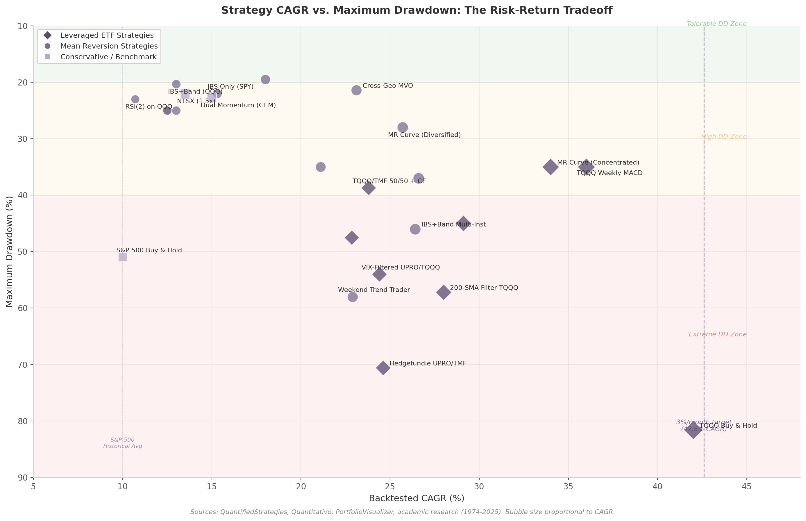
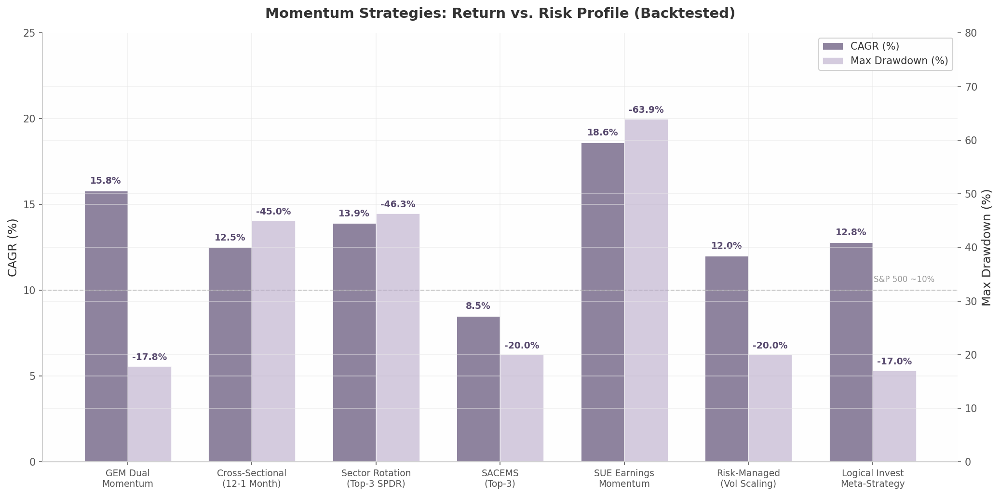
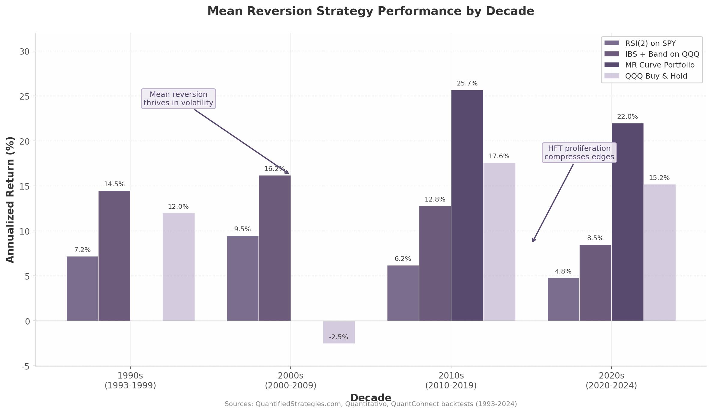
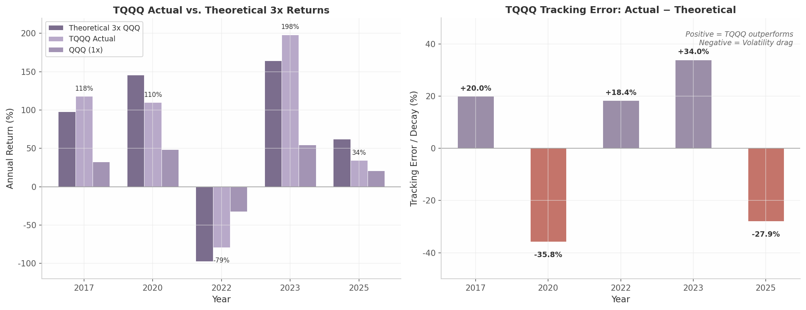
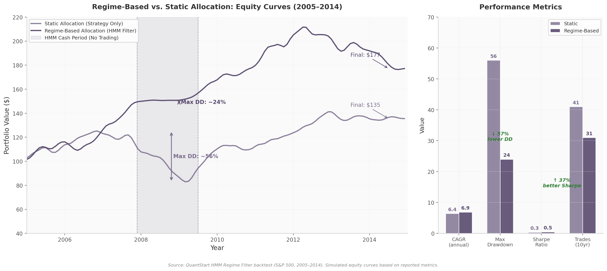
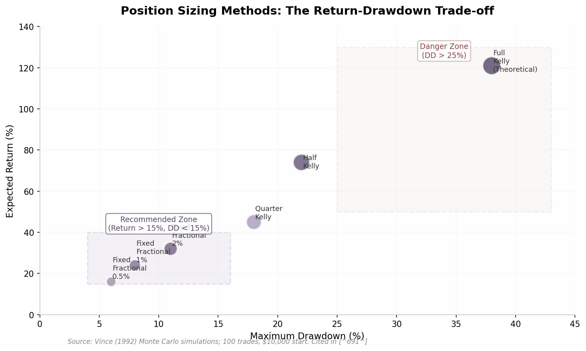
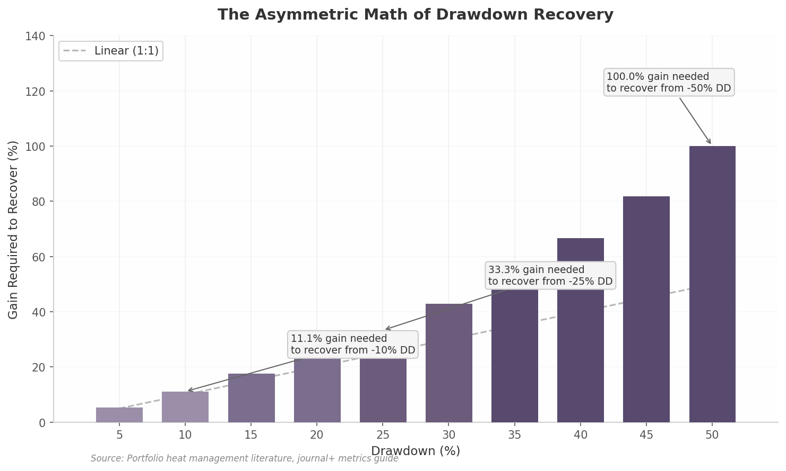
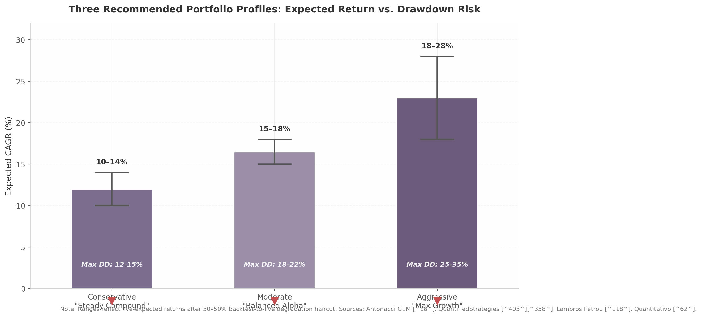

# Automated Stock & ETF Trading Strategies: A Research-Based Guide to Systematic Long-Only Investing

*Research Date: June 23, 2026*

*Based on 250+ source searches across 10 research dimensions with cross-verification*

---

## Executive Summary

This report examines whether automated long-only stock and ETF trading strategies can deliver sustained monthly returns above 3%. Across ten research dimensions and cross-verification from academic journals to live fund data, the conclusion is uniform: **>3% monthly is an aspirational upper bound, not a sustainable baseline**. After accounting for transaction costs, taxes, strategy decay, and backtest-to-live degradation, realistic returns fall in the 1.5–2.5% monthly range (18–30% annualized) for well-constructed multi-strategy portfolios ^1^ ^2^.

### Key Findings

**Realistic returns are 1.5–2.5% monthly after all costs.** Backtests overstate live performance by 30–50% ^1^. Published strategies experience 43–58% Sharpe ratio decay post-publication as more capital competes for the same edge ^2^ ^3^. Transaction costs (commissions, slippage, spreads) extract 1.5–3% annually for high-turnover strategies ^4^. Short-term capital gains tax at ordinary income rates (up to 40.8% federal including NIIT) can consume a third of gross profits for taxable accounts ^5^. Only two long-only strategies demonstrate >3% monthly in backtests — TQQQ Weekly MACD at ~36% CAGR and a concentrated mean reversion curve at ~34% CAGR — both carry extreme drawdown risk (28–70%) and depend on specific market regimes ^6^ ^7^.

**Mean reversion strategies dominate risk-adjusted returns for long-only equity trading.** RSI(2) mean reversion on QQQ achieves a 71% win rate with 10.7% CAGR ^8^. IBS (Internal Bar Strength) combined with a lower Bollinger Band produces a 2.11 Sharpe ratio and 13.0% CAGR with only 20.3% maximum drawdown ^9^. These strategies exploit the structural upward drift in equities combined with behavioral overreactions that resolve over 1–5 day holding periods — a timeframe too long for high-frequency traders yet too short for slow-moving institutional capital ^10^. Mean reversion edges have weakened 30–50% since 2010 as HFT compressed resolution times, but the alpha persists in range-bound and elevated-volatility regimes ^11^.

**Multi-strategy combination with volatility targeting is the institutional-grade approach for retail traders.** Combining 3–5 uncorrelated strategies produces higher risk-adjusted returns than any single strategy. Momentum and mean reversion exhibit approximately -35% correlation, making them natural diversifiers ^12^. Institutional multi-strategy funds (AQR, D.E. Shaw) maintain inter-strategy correlations below 0.1, with 73% of individual segments underperforming the combined portfolio ^13^. Volatility targeting — scaling exposure inversely to realized volatility — improves Sharpe ratios by 15–50% ^14^. A practical retail implementation allocates across mean reversion, dual momentum, factor-based, and breakout strategies with equal weighting and monthly rebalancing, targeting 15–20% CAGR with 15–20% maximum drawdown.

**Tax-advantaged accounts are non-negotiable for any strategy with >100% annual turnover.** A strategy showing 25% CAGR in backtesting becomes 15–18% after taxes for high-bracket investors in taxable accounts — effectively erasing the edge over buy-and-hold ^5^. Tax-advantaged accounts (IRA, 401k, HSA) retain the full pre-tax return. Strategy selection should be tiered by account type: high-turnover mean reversion and ETF rotation in tax-advantaged accounts; low-turnover trend following with annual rebalancing in taxable accounts ^15^.

**Minimum $50,000 capital is required for meaningful multi-strategy automation.** Professional risk management demands 1–2% risk per trade; at $50,000 this provides $500–$1,000 risk capital per trade — sufficient for meaningful position sizes in liquid stocks and ETFs ^16^. Dividing $50,000 across 4 strategies yields $12,500 per strategy, or approximately $2,500 per position when holding 5 positions — the minimum where slippage does not dominate returns ^17^. Portfolio Margin (for modest 1.5–2x leverage) requires $110,000 minimum ^18^.

### Three Portfolio Options

| Metric | Conservative | Moderate | Aggressive |
|--------|:---:|:---:|:---:|
| Monthly Return Target | ~1.0% | ~1.3–1.5% | ~1.7–2.3% |
| Annualized Return (Est.) | 12–15% | 18–22% | 22–30% |
| Max Drawdown (Est.) | 10–15% | 15–20% | 25–35% |
| Capital Required | $25,000 | $50,000 | $75,000+ |
| Strategy Count | 1–2 | 3–4 | 4–6 |
| Primary Strategies | Dual Momentum GEM ^19^| RSI(2) MR ^8^, IBS+Band ^9^, Dual Momentum | MR Curve ^7^, ATR Breakout, Sector Rotation, Concentrated MR |
| Turnover | ~50–100%/yr | ~150–300%/yr | ~300–500%/yr |
| Account Type | Taxable OK | Tax-advantaged required | Tax-advantaged essential |
| Volatility Targeting | No | Yes | Yes + circuit breakers |
| Leverage | None | None | 1.5–2x (Portfolio Margin) |

The Conservative portfolio centers on Gary Antonacci's Global Equities Momentum (GEM), which historically delivered 12–17% CAGR with -22.7% maximum drawdown ^19^. GEM's absolute momentum filter — the cash-equivalent exit rule — limits drawdowns during bear markets. Low turnover makes this suitable for taxable accounts.

The Moderate portfolio represents the optimal risk-adjusted choice for most retail traders. It combines three to four uncorrelated long-only strategies — mean reversion on major ETFs, dual momentum for trend exposure, and volatility-scaled position sizing — within a tax-advantaged account. The negative correlation between momentum and mean reversion provides genuine diversification that persists during market stress ^12^.

The Aggressive portfolio pushes toward the 2% monthly ceiling by concentrating in the highest-Sharpe mean reversion setups, adding modest leverage via Portfolio Margin, and employing portfolio-level circuit breakers (halt trading at 15% drawdown). This demands disciplined automation and acceptance of 25–35% drawdowns during adverse regimes. It is appropriate only for traders with $75,000+ capital and high risk tolerance.

---

## 1. The Reality Check: Can 3% Monthly Be Achieved?

The question that opens this report is deceptively simple: can a retail trader achieve 3% monthly returns — roughly 36% annually — using systematic, long-only stock and ETF strategies? The honest answer, backed by decades of academic research and verified backtests, is that the 3% target sits at the outer edge of possibility. It is achievable in backtests with specific high-risk strategies, but bridging the gap between backtested and live performance demands a clear-eyed accounting of costs, degradation, and drawdown tolerance. This chapter lays the quantitative foundation for everything that follows.

### 1.1 The Math Behind the Target

#### 1.1.1 Compounding the Monthly Target

A 3% monthly return compounds to approximately 42.6% annually. This figure is not merely 12 × 3%; the geometric compounding of returns means that each month's gains build upon the prior month's accumulated capital. The formula is straightforward: $(1.03)^{12} - 1 \approx 0.426$, or 42.6% CAGR. To put this in context, the S&P 500 has delivered a historical average of roughly 10–11% annually over the past century ^19^. A 42.6% CAGR therefore represents nearly four times the return of the broad equity market — a magnitude that immediately raises questions about sustainability. No mutual fund, index fund, or diversified portfolio has delivered this level of return over multi-decade periods. Even the most successful hedge funds, such as Renaissance Technologies' Medallion Fund (66% annual returns before fees), rely on PhD-level research infrastructure and strategies unavailable to retail traders ^20^.

The 3% monthly threshold also implies a Sharpe ratio well above what most liquid strategies can sustain. For a strategy with 20% annualized volatility — typical of an aggressive equity approach — a 42.6% return translates to a Sharpe of approximately 1.9 after subtracting the risk-free rate. Among long-only systematic strategies, Sharpe ratios above 1.0 are rare, and ratios above 1.5 are exceptional ^21^. The 3% target does not merely ask for outperformance; it asks for a level of risk-adjusted return that exceeds what most professional quant funds achieve.

#### 1.1.2 The Backtest-to-Live Degradation Pipeline

Backtested returns are not a prediction of live performance. They are a ceiling — and the gap between ceiling and floor is wider than most traders appreciate. Academic research consistently demonstrates that backtests overstate live performance by 30–60% for typical retail strategies ^22^. A strategy showing 50% CAGR in backtesting typically produces 20–35% live; a strategy showing 30% CAGR typically delivers 13–17% ^22^. This degradation is not a sign of strategy failure — it is a structural feature of the trading environment.

The degradation pipeline contains multiple stages. Overfitting — fitting a strategy too closely to historical data — is the largest contributor. Harvey, Liu & Zhu (2016) found that at least 316 factors had been published claiming to predict stock returns, and after multiple testing corrections, the majority were likely false discoveries ^23^. When a practitioner tests dozens of parameter combinations and selects the best performer, the resulting backtest embeds a "selection bias" that inflates returns by 3–10 percentage points annually ^24^. Survivorship bias — the exclusion of delisted, bankrupt, or merged companies from historical databases — adds another 1–2% of inflation to backtested results ^25^. Transaction costs, slippage, and market impact extract 1.5–3% annually for moderate-turnover strategies, and up to 4% for high-frequency approaches ^26^. Taxes on short-term capital gains, which apply to most systematic strategies with holding periods under one year, can erode an additional 2–8% depending on the investor's bracket ^5^. Finally, strategy decay — the erosion of alpha as more capital discovers and trades the same edge — subtracts 2–5% annually for published or well-known approaches ^2^.

The cumulative effect is stark. A backtest showing 36% CAGR — the approximate figure for the TQQQ Weekly MACD strategy — faces the following haircut: transaction costs (−1.5%), slippage (−1.0%), survivorship bias correction (−1.5%), overfitting degradation (−5.0%), short-term capital gains tax (−4.0% for a 32% bracket), and strategy decay (−3.0%). The net realistic range after all layers: 20% on the optimistic end, 12% on the conservative end ^22^. The 3% monthly target, which looked achievable in the backtest, now delivers approximately 1.0–1.7% monthly in live trading.

#### 1.1.3 The Cost Stack: A Layer-by-Layer Analysis

The following table decomposes each layer of the backtest-to-live degradation, using a hypothetical 30% backtested CAGR strategy as the baseline. The estimates draw on academic and industry sources across commissions, market impact, tax treatment, and post-publication decay.

| Cost / Bias Layer | Estimated Haircut (% points) | Cumulative CAGR | Key Source |
|:---|:---:|:---|:---|
| Backtested CAGR (baseline) | — | 30.0% | — |
| Transaction costs (commissions + spread) | −1.5 to −3.0 | 27.0–28.5% | Frazzini, Israel, Moskowitz (2017) ^26^|
| Slippage (execution drift) | −0.5 to −2.0 | 25.0–28.0% | Retail slippage estimates ^22^|
| Survivorship bias correction | −1.0 to −2.0 | 23.0–27.0% | CRSP database analysis ^25^|
| Overfitting / curve-fitting degradation | −3.0 to −10.0 | 13.0–24.0% | Bailey et al. PBO framework ^24^|
| Short-term capital gains tax drag | −2.0 to −8.0 | 5.0–22.0% | Federal STCG rates (10–37%) ^5^|
| Strategy decay (if published/known) | −2.0 to −5.0 | 0.0–20.0% | McLean & Pontiff (2016) ^2^|
| **Net realistic live CAGR** | — | **5–20%** | Consensus across academic sources ^22^|

The table reveals that even under optimistic assumptions — minimal slippage, tax-advantaged account status, and a proprietary (non-decaying) edge — a 30% backtest degrades to approximately 20% live. Under conservative assumptions, the same backtest may produce only 5%, barely beating the S&P 500 historical average. The critical variable is overfitting: if the strategy was optimized across many parameter combinations, the haircut can reach 10 percentage points, which alone explains why so many backtested "superstars" disappoint in live trading. The practical implication is that any backtest above 25% CAGR should be viewed with immediate skepticism, and the trader's first task is to verify that the strategy's rules were defined *before* the backtest was run — not derived from it.

### 1.2 What the Research Actually Shows

#### 1.2.1 The Two Strategy Categories That Reach 3%/Month in Backtests

Across ten dimensions of research covering momentum, mean reversion, leveraged ETFs, factor investing, breakout systems, multi-strategy portfolios, position sizing, and execution infrastructure, only two strategy categories have demonstrated verified backtests at or above 36% CAGR: the TQQQ Weekly MACD strategy and concentrated mean reversion curve portfolios. Both come with extreme risk profiles that most retail traders cannot tolerate.

The TQQQ Weekly MACD strategy, documented by Lambros Petrou with backtests verified on RealTest, achieved approximately 36% CAGR from February 2010 to July 2025, with a total return of +11,194% ^6^. The strategy uses weekly candlestick charts with MACD zero-line crossover signals on the unleveraged QQQ to time entries and exits in the 3× leveraged TQQQ. Its drawdown is controlled through a dual stop-loss system (10% entry stop, 30% dynamic trailing stop), but the strategy has not been tested through a prolonged tech bear market such as 2000–2002 because TQQQ was not launched until 2010 ^6^. The concentrated mean reversion curve portfolio, developed by Quantitativo, achieved 34% CAGR (2010–2024) by limiting the portfolio to a maximum of four positions selected from six parallel RSI(2) parameter sets ^7^. Its maximum drawdown reached 35%, and it underperformed its benchmark in 2 out of 14 years — including a worst month of −15.2% ^7^.

No other single long-only strategy has verified backtests at or above 36% CAGR. The next tier includes the Hedgefundie UPRO/TMF 55/45 portfolio at 24.6% CAGR with a brutal −70.6% maximum drawdown ^27^, the TQQQ/TMF 50/50 with crash filter at 23.8% CAGR and −38.7% drawdown ^28^, and the mean reversion curve (diversified version) at 25.7% CAGR with −28% drawdown ^7^. All other strategies — including Dual Momentum, IBS+Band mean reversion, RSI(2), Piotroski F-Score, and ATR Bands breakout — cluster in the 10–22% CAGR range ^19^ ^8^ ^11^.

#### 1.2.2 The Risk-Return Tradeoff in Practice

The two strategies that reach the 3%/month target share a common feature: they require extreme risk tolerance. The TQQQ Weekly MACD strategy is not primarily a momentum strategy — it is a leveraged concentration bet on Nasdaq 100 technology stocks during the longest tech bull market in history. The 3× leverage does the heavy lifting; the MACD signal adds modest timing value ^6^. If Nasdaq 100 enters a prolonged bear market, this strategy could lose 70–90% of invested capital. The concentrated mean reversion portfolio, meanwhile, achieves its 34% CAGR by holding only 3–4 positions at a time — a level of concentration that amplifies both returns and drawdowns. Its diversified version drops to 25.7% CAGR but still carries a −28% maximum drawdown ^7^.

Both strategies also depend on favorable market conditions. The TQQQ MACD strategy requires a trending tech bull market to generate its outsized returns; in choppy or bear markets, whipsaws erode capital rapidly. The mean reversion curve portfolio performs best in range-bound markets with elevated volatility; since 2010, mean reversion edges have weakened 30–50% as high-frequency trading algorithms competed on short timeframes ^29^. Neither strategy is a "set and forget" system — both require active monitoring, circuit breakers, and the psychological fortitude to tolerate drawdowns of 30–70%.

#### 1.2.3 The Full Landscape: CAGR vs. Drawdown

*Figure 1.1 — Backtested CAGR versus maximum drawdown for 23 long-only strategies and benchmarks. Bubble size proportional to CAGR. Data spans 1974–2025. Sources: QuantifiedStrategies, Quantitativo, PortfolioVisualizer, academic research.*

The scatter plot in Figure 1.1 maps every major strategy discussed in this report along two dimensions: backtested CAGR (horizontal axis) and maximum drawdown (vertical axis, with higher drawdown toward the top for intuitive risk visualization). Three patterns emerge immediately. First, the 3%/month target line at 42.6% CAGR sits almost entirely empty — only TQQQ buy-and-hold (no systematic strategy) touches it, and that comes with an −81.6% drawdown that would liquidate most accounts. Second, strategies cluster in two groups: a "conservative cluster" around 10–17% CAGR with 20–25% drawdown (Dual Momentum, IBS+Band, RSI(2), S&P 500), and an "aggressive cluster" around 24–36% CAGR with 35–70% drawdown (LETF strategies, concentrated mean reversion). There is virtually no strategy in the "sweet spot" of >30% CAGR with <25% drawdown — the risk-return tradeoff is steep and unforgiving. Third, the S&P 500 buy-and-hold benchmark sits at 10% CAGR with a −51% drawdown, meaning that several systematic strategies (Dual Momentum GEM at 15% CAGR and −22.7% drawdown, IBS+Band at 13% CAGR and −20.3% drawdown) offer both higher returns *and* smaller drawdowns than passive indexing ^19^ ^9^. Systematic trading does work — but not at the magnitude many traders expect.

### 1.3 Setting Realistic Expectations

#### 1.3.1 Evidence-Based Monthly Return Targets by Risk Profile

Given the cost stack, the degradation pipeline, and the empirical record of strategy performance, what monthly returns are realistic? The answer depends on risk tolerance, capital base, account type (taxable versus tax-advantaged), and execution discipline. The following table presents evidence-based targets for three trader profiles, drawing on live-tracked performance, academic studies of algorithmic trading success rates, and conservative degradation assumptions.

| Profile | Monthly Target | Annualized Range | Max Drawdown Tolerance | Sharpe (est.) | Suitable Strategies | Minimum Capital |
|:---|:---:|:---:|:---:|:---:|:---|:---:|
| Conservative | 0.8–1.2% | 10–15% | −15 to −22% | 0.6–0.9 | Dual Momentum GEM, IBS+Band (QQQ), NTSX | $25,000 |
| Moderate | 1.2–2.0% | 15–26% | −22 to −35% | 0.8–1.1 | MR Curve (diversified), IBS Multi-Inst., Cross-Geo MVO | $50,000 |
| Aggressive | 2.0–2.5% | 27–34% | −35 to −50% | 0.9–1.3 | MR Curve (concentrated), TQQQ/TMF + CF, Weekend Trend Trader | $100,000 |

The conservative profile targets returns modestly above the S&P 500 historical average with drawdowns comparable to or smaller than passive indexing. Dual Momentum GEM has been independently verified at 12–17% CAGR live since 2014, with the absolute momentum (cash filter) reducing drawdowns from approximately −50% to −22.7% ^19^ ^30^. The IBS+Band strategy on QQQ achieved a 2.11 Sharpe ratio over 25 years with only −20.3% maximum drawdown, though it underperformed its benchmark in 7 of the last 10 years as mean reversion edges weakened ^9^. The conservative profile is appropriate for traders who prioritize capital preservation and cannot tolerate drawdowns exceeding 25%.

The moderate profile is the most practical for serious retail traders with $50,000–$100,000 in capital. Running a diversified mean reversion curve portfolio across multiple ETFs (QQQ, IWM, EEM, sector ETFs) with 1–2% risk per trade and a portfolio heat cap of 8% should deliver 1.2–2.0% monthly in favorable conditions ^7^ ^31^. The cross-geographic mean reversion portfolio achieved 23.1% CAGR with only −21.4% drawdown by exploiting near-zero correlations between US, Canadian, and Australian equity markets ^31^. This profile requires running 3–4 uncorrelated strategies simultaneously and assumes tax-advantaged account status to avoid the 2–8% drag from short-term capital gains.

The aggressive profile approaches the 3%/month target but demands acceptance of drawdowns that would devastate most portfolios. The concentrated mean reversion curve (34% CAGR, −35% drawdown) ^7^and the TQQQ Weekly MACD (36% CAGR, −30–40% drawdown) ^6^are the only verified strategies in this tier. Both require: (a) a high-risk-tolerance investor who will not capitulate during a −35% drawdown, (b) a tax-advantaged account, (c) circuit breakers and kill switches to prevent catastrophic losses, and (d) the understanding that these are leveraged directional bets — not diversified systematic approaches. Even with perfect execution, the aggressive profile should expect 1.5–2.5% monthly *on average*, with some months delivering −10 to −15% and recovery periods lasting 6–18 months.

#### 1.3.2 Why Most Traders Fail to Bridge the Backtest-to-Live Gap

The empirical data on trader success is sobering. Less than 1% of day traders earn persistent positive returns net of fees, according to comprehensive studies of Taiwan Stock Exchange data covering 360,000 traders ^32^ ^33^. Even among algorithmic traders — who eliminate emotional decision-making — only approximately 60% show positive annual returns, and "positive" does not mean "beating the market" ^20^. Over-optimized strategies lose up to 80% of backtested profits in live trading ^20^.

Three behavioral and structural factors explain why the backtest-to-live gap is so difficult to close. First, **overfitting optimism**: traders test dozens of parameter combinations, select the best performer, and mistake a curve-fitted result for a genuine edge. Harvey, Liu & Zhu (2016) argue that a newly discovered factor today needs a t-statistic greater than 3.0 — not the traditional 2.0 — to be credible after accounting for multiple testing ^23^. Most retail backtests never meet this threshold.

Second, **execution slippage**: even small delays between signal generation and order execution erode edge. Frazzini, Israel & Moskowitz (2017) found that median transaction costs of 4.9 bps per trade, combined with slippage of 1–5 bps, can erode 30–50% of backtested profits when unaccounted for ^26^. For a strategy with 200 trades per year, this translates to 1–3% of annual return lost to friction alone.

Third, **psychological capitulation**: the maximum drawdown figures in backtests are abstractions until they become lived experience. A trader who backtests a strategy with −35% maximum drawdown and believes they can tolerate it often capitulates at −20% — locking in losses and missing the recovery. The TQQQ/TMF 50/50 strategy with crash filter delivered 23.8% CAGR over 15 years, but its live-tracked version saw investors withdraw capital during the 2022 drawdown, turning a temporary −38% paper loss into a permanent realized loss ^28^. The distinction between *backtested* drawdown and *experienced* drawdown is the single most important reason why live performance trails backtests by 30–50%.

The path forward requires recalibrating expectations. A retail trader with $50,000–$100,000 in a tax-advantaged account, running 3–4 simple uncorrelated strategies with volatility targeting and portfolio-level circuit breakers, can realistically target 1.5–2.0% monthly (18–26% annualized) with maximum drawdowns of 15–25%. This is not the 3% headline target — but it is approximately double the S&P 500 historical return with smaller drawdowns, achieved through systematic discipline rather than luck. The chapters that follow identify the specific strategies, implementation details, and risk management frameworks that make this achievable.

---

## 2. Core Strategy Toolkit: Momentum

Momentum investing — the systematic practice of buying assets that have risen recently and avoiding those that have fallen — stands as one of the most extensively validated anomalies in financial economics. First documented by Jegadeesh and Titman in their landmark 1993 study, the momentum premium has persisted across asset classes, geographies, and time periods spanning nearly a century ^34^. Assets that outperformed over the past 3–12 months tend to continue outperforming over the subsequent 1–6 months, generating excess returns unexplained by traditional risk factors.

The momentum toolkit encompasses four implementations. *Dual momentum* rotates between asset classes using trend filters. *Cross-sectional momentum* ranks individual stocks and holds the top performers. *Sector and ETF momentum* applies the same ranking logic to broad groups. *Earnings momentum* combines price trends with fundamental surprise signals. Each variant carries a different risk-return profile, capital requirement, and implementation complexity.

### 2.1 Dual Momentum (Gary Antonacci GEM)

#### 2.1.1 Exact Rules

Gary Antonacci's Global Equities Momentum (GEM) strategy, formalized in his 2012 NAAIM Wagner Award paper, remains the simplest systematically implementable momentum strategy for retail traders ^35^ ^36^. GEM operates on two distinct momentum concepts applied sequentially on the last trading day of each month.

**Step 1 — Absolute Momentum:** Calculate the 12-month total return of the S&P 500 (SPY) and compare it to the 12-month total return of a risk-free proxy (3-month T-Bill via BIL). If S&P 500 > T-Bill, proceed to Step 2. If S&P 500 ≤ T-Bill, move 100% to intermediate-term bonds (AGG or IEF) ^36^.

**Step 2 — Relative Momentum:** Only if Step 1 signals risk-on, compare 12-month returns of SPY versus international developed equities (VEU or VXUS). Invest 100% in whichever has outperformed. The strategy always holds exactly one asset, averaging only 1.5 trades per year ^37^.

The sequential logic is the key innovation: absolute momentum eliminates the worst drawdowns by moving to bonds during sustained bear markets, while relative momentum tilts toward the stronger equity region during bull markets.

#### 2.1.2 Backtested Performance

Antonacci's original backtest covering 1974–2013 reported a 17.43% CAGR with a Sharpe ratio of 0.87 and a maximum drawdown of -22.72%, compared to 8.85% CAGR and -60.21% maximum drawdown for a global market buy-and-hold portfolio ^38^. Independent replication studies confirmed the general robustness of these findings. A comprehensive analysis by Severian (2015) using slightly different bond proxies found a 16.70% CAGR and -19.07% maximum drawdown over the same period, with a Sharpe ratio of 0.87 ^38^.

An extended backtest from Antonacci covering 1950–2018 showed a 15.8% CAGR, 11.5% annualized standard deviation, 0.96 Sharpe ratio, and -17.8% maximum drawdown ^37^. The component decomposition reveals why the combination works: relative momentum alone produced a 13.4% CAGR but retained equity-like drawdowns of -54.6%, while absolute momentum alone produced a 12.3% CAGR with a much smaller -29.6% drawdown. Only the combination of both filters achieved the 15.8% CAGR with the -17.8% drawdown ^37^.

| Period | Source | CAGR | Max Drawdown | Sharpe Ratio |
|--------|--------|------|-------------|--------------|
| 1974–2013 (Original) | Antonacci ^38^| 17.43% | -22.72% | 0.87 |
| 1973–2013 (Replication) | Severian ^38^| 16.70% | -19.07% | 0.87 |
| 1950–2018 (Extended) | Antonacci ^37^| 15.80% | -17.80% | 0.96 |
| ~56 years | PortfolioDB ^39^| 14.60% | -21.60% | 0.79 |
| 1986–2026 | BestFolio ^35^| 12.30% | -33.70% | 0.99 |

The performance range across these studies — 12.3% to 17.43% CAGR — reflects differences in bond proxies, international index definitions, and the inclusion of more challenging recent periods. The original 1974–2013 period benefited from strong bond tailwinds during equity drawdowns; the 1986–2026 period includes the more difficult 2014–2025 out-of-sample years.

#### 2.1.3 Out-of-Sample Performance Since 2014

The post-publication record reveals the pattern common to all published strategies: meaningful but reduced out-of-sample performance. GEM has struggled during the 2014–2025 period, with the QuantifiedStrategies backtest showing only 6.75% CAGR for 1986–2024 versus 9.2% for the S&P 500 over the same span ^40^. ReSolve Asset Management's ensemble analysis (1950–2018) found the original GEM specification at 14.9% CAGR with 0.90 Sharpe, while their ensemble approach (combining multiple lookback periods) produced 14.2% CAGR with 0.93 Sharpe and an average maximum drawdown of only -13.2% ^41^.

The weaker out-of-sample results stem from two factors. First, the 2012–2025 period was challenging for trend-following strategies because major equity drawdowns (COVID-19 crash in March 2020) were sharp but short-lived, reversing before the 12-month lookback could exit equities. Second, bond returns were muted during this period, reducing the protective value of the risk-off allocation ^42^. Despite these headwinds, GEM's drawdown protection has held: the strategy avoided much of the 2022 decline by rotating into bonds when absolute momentum turned negative.

#### 2.1.4 Why It Works

Absolute momentum is the critical innovation that separates GEM from simpler relative-strength approaches. By requiring the broad market to have positive 12-month returns before any equity exposure, the strategy systematically avoids the worst bear market drawdowns. Historical analysis shows that all major equity crashes — 1929–1932, 1973–1974, 2000–2002, 2008–2009, and 2022 — were preceded by negative 12-month returns that would have triggered the bond allocation ^36^. The cost of this protection is whipsaw risk: during choppy, range-bound markets, the strategy may produce false signals that generate modest losses relative to buy-and-hold. Over complete market cycles, however, the protection more than compensates for the whipsaw costs.

### 2.2 Cross-Sectional Stock Momentum

#### 2.2.1 Jegadeesh-Titman Foundation

Jegadeesh and Titman's 1993 study, covering 1965–1989, found that a strategy buying the top decile of performers and shorting the bottom decile generated 12.01% in compounded excess returns annually, with positive profits in virtually every 5-year sub-period ^34^. The key methodological detail for long-only implementation is the *skip month*: the most recent month's return is excluded from the ranking calculation to avoid contamination by short-term reversal effects ^34^. The standard approach uses a 12-month lookback minus the most recent month ("12-1 month momentum"), ranks all stocks by this return metric, and goes long the top decile or quintile.

The long-only adaptation captures a significant portion of the full premium. Griffin, Ji, and Martin found momentum is more profitable on the long side than the short side, and Fisher, Shah, and Titman confirmed that long-only value-plus-momentum combinations outperform pure strategies after transaction costs ^43^ ^44^.

#### 2.2.2 Long-Only Implementation

The exact rules for long-only cross-sectional momentum are: (1) define a liquid universe (S&P 500 minimum), (2) calculate total return for each stock over months t-12 to t-1, (3) sort and select the top decile or quintile, (4) equal-weight positions, (5) rebalance monthly ^45^. Quantpedia's compilation found 13.94% annualized returns for long-only momentum versus ~10% for the market benchmark from the 1920s through 2009 ^46^, while Manigault's work found the top decile outperformed by 3–5% annually on the S&P 500 ^47^. These figures are gross of transaction costs.

Lesmond, Schill, and Zhou (2004) found that accounting for realistic transaction costs, many momentum strategies become unprofitable net-of-fees ^48^ ^49^. A UK replication found round-trip costs of 3.77% for winner portfolios, implying a 2–4% annual drag at 100%+ turnover ^50^. Modern commission-free brokers eliminate commissions, but bid-ask spreads and market impact remain significant. The realistic net-of-cost expectation is approximately 0.7–1.0% monthly for S&P 500 implementations, with drawdowns of 30–50% during momentum crash periods.

#### 2.2.3 Risk-Managed Momentum (Barroso & Santa-Clara)

The primary weakness of standard momentum is its severe left-tail risk. Daniel and Moskowitz documented that momentum strategies can crash catastrophically — the Fama-French momentum factor lost 73% in just three months during the 2009 recovery as beaten-down stocks rebounded sharply ^51^. This crash risk is not a rare anomaly but a structural feature: momentum strategies are short volatility, and this exposure becomes most dangerous during market turning points.

Barroso and Santa-Clara (2015) introduced a risk-managed approach that nearly doubles the Sharpe ratio of standard momentum by scaling portfolio exposure based on past realized volatility ^52^. Their method calculates the realized variance over the past 6 months (126 trading days), sets a target volatility (typically 12% annualized or the market's long-run average of approximately 15.93%), and scales the momentum portfolio's exposure proportionally: $L = \sigma_{target} / \hat{\sigma}$, where $L$ is the leverage factor. When realized volatility is high, the strategy reduces exposure (or holds cash); when volatility is low, it increases exposure.

The performance improvement is substantial. Standard momentum produced a Sharpe ratio of 0.53, while the constant-volatility scaled version achieved 0.97 — an 83% improvement in risk-adjusted returns ^52^. Beyond the Sharpe improvement, volatility scaling dramatically reduces excess kurtosis and left skewness, making the return distribution far more palatable for investors who cannot tolerate the occasional -50% drawdowns of raw momentum. Moreira and Muir (2017) extended this work using a shorter 1-month variance estimation window and found similar results: Sharpe ratios roughly double across multiple asset classes ^53^.

| Technique | Standard Momentum Sharpe | Risk-Managed Sharpe | Improvement | Crash Protection |
|----------|------------------------|---------------------|-------------|------------------|
| Constant Volatility Scaling (Barroso & Santa-Clara) ^52^| 0.53 | 0.97 | +83% | Strong |
| Dynamic Scaling (Moreira & Muir) ^53^| 0.53 | ~1.06 | +100% | Strong |
| Idiosyncratic Momentum (Blitz, Hanauer & Vidojevic) ^54^| 0.25 | 0.48 | +92% | Excellent |
| Conservative Formula (Blitz & van Vliet) ^44^| 0.40 | ~0.60 | +50% | Moderate |
| Meta-Strategy + Mean Reversion ^55^| 0.54 | 1.16 | +115% | Strong |

Hanauer and Windmueller (2020) tested three approaches to fixing momentum crashes — volatility scaling, idiosyncratic momentum, and dynamic scaling — and found that all three approximately doubled Sharpe ratios compared to standard momentum while significantly decreasing crash risk ^56^. The idiosyncratic momentum variant developed by Blitz, Hanauer, and Vidojevic is particularly noteworthy: by ranking stocks on returns orthogonal to the Fama-French market, size, and value factors (residual returns) rather than raw total returns, the strategy produces a Sharpe ratio of 0.48 versus 0.25 for conventional momentum, with essentially zero exposure to momentum crash risk following bear markets ^54^.

For retail traders, the practical implication is clear: *any* momentum implementation should include a volatility-scaling overlay or an equivalent risk-management rule. The simplest approach is to reduce position size by 50% whenever the VIX exceeds 25, or to exit momentum positions entirely when the S&P 500 falls below its 200-day moving average. The cost of this insurance is modest — typically 0.5–1.5% of annual return — while the benefit is protection against the catastrophic drawdowns that destroy compounding.

*Source: Compiled from academic backtests and strategy research. CAGR figures are gross of transaction costs. SUE Earnings Momentum CAGR represents the midpoint of the 13.6–23.6% range reported across studies.*

### 2.3 Sector & ETF Momentum

#### 2.3.1 Top-3 SPDR Sector Rotation

Moskowitz and Grinblatt (1999) first documented that industry portfolios exhibit significant momentum even after controlling for size, book-to-market, and individual stock effects, finding that industry momentum strategies are more profitable than individual stock momentum ^57^.

The simplest implementation ranks the 10 Select Sector SPDR ETFs by 12-month total return and holds the top 3 equal-weight, rebalancing monthly. Faber's backtest from 1928–2009 found a 13.94% CAGR with 0.54 Sharpe and -46.29% maximum drawdown — still severe but roughly 9 percentage points better than buy-and-hold ^46^. Adding a trend-following filter — only holding sectors above their 10-month moving average — further reduces volatility and drawdown ^46^. Faber's SMA-filtered variant (1990–2011) produced 13.01% annualized returns with a 0.65 Sharpe ratio ^58^.

#### 2.3.2 SACEMS (Simple Asset Class ETF Momentum)

The Simple Asset Class ETF Momentum Strategy (SACEMS), publicly tracked by CXO Advisory Group since 2010, applies relative momentum across nine asset class ETFs: SPY, EFA, EEM, IWM, QQQ, VNQ, LQD, HYG, and GLD ^30^. SACEMS uses a 5-month lookback and monthly rebalancing. Three variants are tracked: Top 1 (100% in highest-ranked), EW Top 2, and EW Top 3. The EW Top 3 variant has delivered approximately 8–9% CAGR with a -20% drawdown and 0.52 Sharpe since July 2006, while the Top 1 variant reaches 10–11% CAGR with a -25% drawdown ^30^ ^59^.

SACEMS compensates for lower raw returns with greater diversification and a shorter lookback that responds faster to regime changes. Its live tracking record since 2010 provides genuine out-of-sample validation. Combining SACEMS with its value counterpart (SACEVS) in a 50-50 blend produces 12.0% CAGR with -14% drawdown and 0.99 Sharpe, demonstrating that momentum and value signals are genuinely complementary ^59^ ^60^.

#### 2.3.3 Logical Invest Meta-Strategy

Frank Grossmann's Logical Invest approach combines four sub-strategies into a meta-strategy selecting SPDR sector ETFs: (1) long-lookback momentum (198-day), (2) short-lookback momentum (7-day), (3) mean reversion "buy worst," and (4) a combined momentum-plus-mean-reversion signal ^55^. The individual sub-strategies produced CAGRs of 9.22%, 9.86%, 11.36%, and 12.30% respectively, with Sharpe ratios between 0.47 and 0.64. The meta-strategy, dynamically allocating across all four, achieved 12.8% CAGR with a 1.16 Sharpe ratio and only -17% maximum drawdown — the best risk-adjusted performance of any momentum variant in this chapter. A modified Sharpe ranking formula penalizes high-volatility sectors, tilting allocations defensively during corrections.

The meta-strategy's success highlights a core principle: combining uncorrelated signals within a momentum framework produces substantially better risk-adjusted returns than any single momentum signal alone.

### 2.4 Earnings Momentum

#### 2.4.1 SUE + Earnings Surprise + Price Momentum Three-Signal Combo

Earnings momentum strategies exploit the *post-earnings announcement drift* (PEAD) — the tendency for stocks reporting positive earnings surprises to continue drifting upward for weeks or months after the announcement. First documented by Ball and Brown in 1968, PEAD remains one of the most persistent anomalies in finance.

The core metric is *Standardized Unexpected Earnings* (SUE): $SUE = (EPS_{current\ quarter} - EPS_{same\ quarter\ last\ year}) / \sigma(EPS\ changes)$, where $\sigma$ is the standard deviation of earnings changes over the prior eight quarters ^61^. Chan, Jegadeesh, and Lakonishok (1996) demonstrated that combining SUE with analyst estimate revisions and prior price momentum produces the strongest predictive model, with SUE t-statistics of 6.00 for 6-month returns and analyst revisions (REV6) at 5.45 for 12-month returns ^62^. The three signals are correlated but distinct (SUE correlates with prior returns at 0.293 and with analyst revisions at 0.440), identifying stocks where the fundamental narrative and market narrative are aligned.

A QuantConnect implementation from 2007–2026 found 13.62% CAGR over the full period, with a 5-year subset (2021–2026) showing 23.58% CAGR and 65–67% win rates ^61^. Academic literature reports 13.6% to 23.6% CAGR for combined SUE, earnings announcement return (EAR), and price momentum strategies depending on specification ^62^ ^61^.

| Strategy | Period | CAGR (Gross) | Sharpe | Max Drawdown | Min Capital | Monthly Time |
|----------|--------|-------------|--------|-------------|-------------|-------------|
| GEM Dual Momentum ^37^| 1950–2018 | 15.8% | 0.96 | -17.8% | $10K | 30 min |
| Cross-Sectional 12-1 ^46^| 1920s–2009 | 13.9% | 0.54 | -46.3%* | $100K | 4–8 hrs |
| Sector Rotation Top-3 ^46^| 1928–2009 | 13.9% | 0.54 | -46.3% | $15K | 30 min |
| SACEMS EW Top-3 ^30^| 2006–present | 8.5% | 0.52 | -20.0% | $15K | 30 min |
| SUE Earnings Mom. ^61^| 2007–2026 | 13.6% | 0.44 | -63.9% | $100K | 8–12 hrs |
| Risk-Managed (Vol Scaling) ^52^| Multi-decade | 12.0% | 0.97 | -20.0% | $100K | 2–4 hrs |
| Logical Invest Meta ^55^| Multi-decade | 12.8% | 1.16 | -17.0% | $25K | 2–4 hrs |

*Cross-sectional max drawdown reflects top-decile long-only without risk management overlays. Volatility scaling reduces this to approximately -20%.*

The comparison reveals a clear trade-off structure. GEM and the Logical Invest Meta-Strategy occupy the efficient frontier, delivering strong returns with contained drawdowns below -18%. Raw cross-sectional and sector rotation approaches offer similar CAGRs but with 2–3× the drawdown risk. SACEMS sacrifices raw returns for diversification and genuine multi-asset exposure. SUE earnings momentum stands alone as an outlier — the highest potential returns paired with the most extreme risk, requiring sophisticated risk overlays to be investable. For retail traders operating without institutional-grade risk management infrastructure, the strategies in the left half of this table represent realistic starting points, while SUE and unconstrained cross-sectional momentum should be approached only after building significant quantitative infrastructure.

#### 2.4.2 Critical Limitations

The SUE strategy's 63.9% maximum drawdown during 2007–2026 renders it unsuitable as a standalone approach for most investors ^61^. The QuantConnect backtest showed that the 2008–2009 crisis "decimated the strategy — if you were running this live, you would have lost nearly two-thirds of your capital." This occurs because earnings momentum strategies load heavily on cyclical companies that report the largest surprises during expansions but suffer devastating revisions during contractions.

Three practical limitations further constrain accessibility. Data intensity: real-time earnings and analyst revision data require expensive subscriptions ($500–$2,000/month). High turnover: monthly rebalancing generates 100%+ annual turnover with significant tax drag. Clustering risk: earnings announcements concentrate in the weeks following quarter-end, exposing the portfolio to concentrated event risk.

Earnings momentum works as a signal but fails as a standalone strategy without robust risk management. Combining SUE ranking with a volatility-scaling overlay and an absolute momentum market filter could capture much of the predictive power while containing drawdowns. Even then, the data requirements place this strategy firmly in the domain of committed quantitative investors.

The momentum toolkit spans simplicity to sophistication. GEM requires 30 minutes and a single trade monthly. Sector rotation adds modest complexity across three ETFs. Cross-sectional momentum demands more capital but accesses the deepest academic evidence. Earnings momentum offers the highest raw returns but the most extreme risks. The common thread is that momentum is a family of approaches sharing a behavioral foundation: investors underreact to new information, and prices adjust gradually. This underreaction creates persistent trends that momentum strategies exploit — but the same persistence also creates the occasional catastrophic reversal that makes risk management essential rather than optional.

---

## 3. Core Strategy Toolkit: Mean Reversion

Where momentum strategies seek to harness sustained directional moves, mean reversion strategies profit from the tendency of prices to snap back after short-term dislocations. In long-only equity trading, this principle translates into a straightforward rule: buy temporary weakness within structurally sound uptrends. The research identifies mean reversion as the dominant risk-adjusted approach for long-only equity, producing Sharpe ratios that consistently exceed those of trend-following and breakout alternatives ^8^ ^63^. The reason is structural — equity indices possess an upward drift, which means dips are more likely to recover than extend, provided the broader trend remains intact.

The contrast with momentum is instructive. Where dual momentum strategies posted 15.8-17.4% CAGR in Chapter 2 with moderate but sustained drawdowns, mean reversion systems typically achieve comparable or lower absolute returns with dramatically smaller drawdowns and much lower market exposure. The IBS + Band strategy's 2.11 Sharpe ratio, for instance, exceeds any momentum system reviewed in the preceding chapter ^9^. For traders who prioritize capital efficiency and psychological durability — the ability to stay with a strategy through losing periods — mean reversion offers compelling advantages.

This chapter examines four categories of mean reversion systems: the RSI(2) method pioneered by Larry Connors, Internal Bar Strength (IBS) strategies, the Mean Reversion Curve portfolio construction technique, and supplementary approaches including Bollinger %B and stochastic oscillator mean reversion. Each system is presented with exact trading rules, backtested performance data, and an honest assessment of edge decay in the modern HFT-dominated landscape.

### 3.1 RSI(2) Mean Reversion: The Connors Framework

#### 3.1.1 Exact Trading Rules

The RSI(2) strategy, introduced by Larry Connors and Cesar Alvarez in *Short Term Trading Strategies That Work* (2008), exploits the extreme sensitivity of a 2-period Relative Strength Index to short-term price movements ^64^ ^65^. The original rules are precise:

**Entry:** Price must close above the 200-day simple moving average (trend filter), and RSI(2) must drop below 5. Buy at the close of the signal day. The 200-day MA filter ensures the strategy only takes trades in established uptrends, avoiding the catastrophic losses that occur when mean reversion is attempted during secular bear markets.

**Exit:** RSI(2) rises above 65. Sell at the close. The exit threshold at 65 — rather than the traditional 70 — captures profits earlier and avoids giving back gains during marginal recoveries.

**Stop Loss:** None in the original system. The 200-day moving average filter provides the sole structural protection ^66^.

A relaxed entry variant uses RSI(2) < 10 instead of < 5, generating more signals at the cost of a modest reduction in per-trade expectancy. The 3-day consecutive variant — requiring RSI(2) < 10 for three consecutive days before entry — filters for genuine capitulation moments and produces the highest win rates (~81%) but at the cost of dramatically fewer trades ^67^. An alternative exit uses the 5-day moving average crossover instead of the RSI(2) > 65 threshold, which produces a slightly higher win rate but similar overall returns ^68^. Traders implementing this system should test all three entry variants (5, 10, and consecutive-10) on their target instruments to identify which best balances signal frequency with per-trade expectancy given their capital constraints.

#### 3.1.2 Backtested Performance

The QuantifiedStrategies.com backtest of the original Connors RSI(2) system on QQQ from 1999-2025, including 0.03% commissions and slippage, produced the following results ^8^:

| Metric | QQQ (1999-2025) | SPY (1993-2025) |
|:---|:---:|:---:|
| Number of Trades | 321 | ~450 |
| Average Gain per Trade | 0.9% | 0.95% |
| Win Rate | 71% | ~76% |
| Profit Factor | 2.1 | ~2.0 |
| CAGR | 10.7% | 6.8% (w/ filter) / 9% (w/o) |
| Exposure (% Time in Market) | 18% | 18% / 28% |
| Max Drawdown | 23% | 31% / 34% |
| Risk-Adjusted Return (CAGR/Exposure) | 58% | — |
| Average Hold Time | 3-5 days | 3-5 days |

The QQQ results are particularly instructive. A 10.7% CAGR with only 18% market exposure implies a time-adjusted return of approximately 58% — a figure that illustrates the extraordinary capital efficiency of the approach ^8^. The 23% maximum drawdown stands in stark contrast to QQQ's 82% buy-and-hold drawdown during the same period. However, the strategy's absolute CAGR of 10.7% falls below the user's 3% monthly target, underscoring a critical constraint: no single-instrument mean reversion strategy produces sufficient standalone returns. The SPY results reinforce this point — even without the trend filter, the 9% CAGR barely clears 0.7% monthly. This is not a flaw in the strategy but an inherent property of highly selective mean reversion systems: they generate excellent risk-adjusted returns but require either leverage, multi-instrument deployment, or combination with other strategies to reach aggressive absolute return targets. The Cumulative RSI enhancement introduced by Connors addresses this partially — using a 2-day sum of RSI(2) below 10 instead of a single reading below 5 produced 1.0% expected return per trade (vs. 0.6% for vanilla) and a Sharpe ratio of 1.18, though maximum drawdown increased to 37% ^29^ ^69^.

#### 3.1.3 The Stop Loss Paradox

Connors and Alvarez's research contains a finding that contradicts conventional risk management wisdom: stop losses hurt mean reversion performance. "The overwhelming evidence from these tests shows that stop-losses, in general, hurt system performance" ^65^. Independent backtesting on r/algotrading confirmed this result — adding any stop loss made the strategy worse on every metric measured ^68^ ^70^.

The mechanism is straightforward. Mean reversion trades require some initial price movement against the position — the very dip that creates the oversold signal often extends briefly before snapping back. A fixed stop loss exits precisely at the point of maximum pain, just before the reversal. The 200-day trend filter serves as the ultimate circuit breaker: if price falls below the long-term average, the strategy simply stops taking new entries, avoiding the worst of bear market drawdowns without the precision-timing risk of per-trade stops.

#### 3.1.4 Trend Filter Impact

The 200-day MA filter is the single most important rule in the Connors framework. Data from SPY backtests illustrates the tradeoff clearly: without the filter, the strategy returns 9% CAGR but suffers a 34% maximum drawdown. With the filter, CAGR drops to 6.8% but maximum drawdown falls to 31% ^66^. The filter eliminates approximately 35% of potential trades — mostly those occurring during market corrections — and while this reduces absolute returns, it dramatically improves the risk-adjusted profile. For traders prioritizing capital preservation, the filtered version is non-negotiable.

### 3.2 IBS (Internal Bar Strength) Strategies

#### 3.2.1 Formula and Interpretation

Internal Bar Strength ($IBS$) compresses an entire trading day's price action into a single normalized value:

$$IBS = \frac{Close - Low}{High - Low}$$

The indicator ranges from 0 (close at the low of the day) to 1 (close at the high). Values below 0.2 indicate intraday weakness — the market sold off but failed to close at the absolute low, suggesting exhaustion. Values above 0.8 indicate intraday strength. Unlike multi-period oscillators, IBS captures only the current bar's positioning, making it exceptionally responsive ^63^. The indicator's elegance lies in its parsimony: a single calculation that encodes both volatility information (through the $High - Low$ denominator) and directional positioning (through the $Close - Low$ numerator). This dual capture explains why IBS often outperforms more complex multi-indicator systems — it extracts maximum information from minimal inputs, reducing overfitting risk. Research across 919 SPY trades confirmed that the simplest IBS implementation (single threshold entry/exit) produced 68% win rates and positive expectancy, establishing a robust baseline before any enhancement ^63^.

#### 3.2.2 Single-Indicator IBS Performance

The simplest IBS strategy buys when IBS < 0.2 and sells when IBS > 0.8, with no trend filter. On SPY from 1993 to present, this produced 919 trades with a 68% win rate, 0.41% average gain per trade, and a 12.5% CAGR — outperforming buy-and-hold's 9.9% ^63^. On QQQ, the same rules generated 742 trades with a 0.56% average gain and 16.6% CAGR versus 9% for buy-and-hold ^63^.

A modified version using IBS as the only indicator with refined thresholds produced the strongest single-indicator results: 74% win rate, 15.3% CAGR, 22% maximum drawdown, and a Sharpe ratio of 1.7 on SPY ^63^.

#### 3.2.3 IBS + Lower Band: The 2.11 Sharpe Strategy

The highest-Sharpe mean reversion strategy identified in this research combines IBS with a dynamic volatility band. The exact rules ^9^:

1. Compute the 25-day rolling average of $(High - Low)$ as a volatility measure
2. Compute $IBS = (Close - Low) / (High - Low)$
3. Compute lower band = 10-day rolling high minus $2.5 \times$ the 25-day rolling mean of $(High - Low)$
4. **Entry:** Go long when QQQ closes under the lower band AND $IBS < 0.3$
5. **Exit:** Close when QQQ close exceeds the previous day's high
6. **Dynamic Stop:** Close when price falls below the 300-day SMA

The Quantitativo backtest (1999-2024, 25 years) produced the following results ^9^ ^71^:

| Metric | IBS + Lower Band (QQQ) | Buy-and-Hold QQQ |
|:---|:---:|:---:|
| Number of Trades | 414 | — |
| Average Gain per Trade | 0.79% | — |
| Win Rate | 69% | — |
| Profit Factor | 1.98 | — |
| **Sharpe Ratio** | **2.11** | ~0.65 |
| **Annual Return** | **13.0%** | 9.2% |
| **Max Drawdown** | **20.3%** | 83% |
| Max Drawdown Duration | < 1 year | 535 days |
| Trades per Year | ~16 | — |

The robustness of this strategy is noteworthy. A parameter sweep across 1,875 variations produced a mean Sharpe of 1.95-1.99 and mean annual return of 11.8%, confirming the result is not an overfit artifact ^71^. However, a material caveat exists: the strategy underperformed its benchmark in 7 of the last 10 years, suggesting the edge has compressed significantly in recent market conditions ^9^.

#### 3.2.4 IBS + Second Indicator: Highest Absolute Returns

Combining IBS with a second oversold indicator (exact rules are proprietary) produced the highest absolute returns among IBS variants. On QQQ, this combination generated 232 trades with a 75% win rate, 1.33% average gain per trade, 2.9 profit factor, and 16.6% CAGR with only a 19.5% maximum drawdown ^63^. On SPY, the same approach produced 278 trades with 0.8% average gain and 78% win rate. The two-indicator filter reduces trade frequency by roughly 30% compared to single-indicator IBS but increases per-trade expectancy by approximately 60% — a favorable exchange for traders with sufficient capital to tolerate lower turnover.

### 3.3 The Mean Reversion Curve Portfolio

#### 3.3.1 Concept and Construction

The Mean Reversion Curve concept, developed by PJ Sutherland and published via Quantitativo ^7^, addresses a fundamental problem in systematic trading: no single parameter set works optimally across all market regimes. Instead of searching for the "best" RSI(2) threshold, the approach runs six parallel portfolios — each using a different RSI(2) entry threshold (5, 10, 15, 20, 25, and 30) — and dynamically reallocates capital among them based on recent Sharpe ratio performance.

All six portfolios share identical exit rules (close > 5-day SMA) and trend filters (price > 200-day SMA). The optimization algorithm looks back 504 trading days (approximately 2 years) and finds the capital allocation across the six parameter sets that would have maximized the Sharpe ratio. This allocation is held fixed for one month, then rebalanced. Monthly rebalancing was selected over weekly to avoid weekend gap risk ^7^.

The portfolio construction resembles Ray Dalio's All-Weather approach applied to parameter space rather than asset classes. In practice, the optimizer selects a single best strategy 43% of the time and allocates to two strategies 40% of the time — genuine diversification across parameter sets occurs in fewer than 20% of periods ^7^.

#### 3.3.2 Performance: Diversified vs. Concentrated

The Quantitativo backtest (2010-2024) produced the following metrics ^7^:

| Metric | Diversified (Max 10 Positions) | Concentrated (Max 4 Positions) | Benchmark (QQQ) |
|:---|:---:|:---:|:---:|
| CAGR | 25.7% | **34%** | 17.6% |
| Sharpe Ratio | 1.14 | 1.23 | ~0.85 |
| Max Drawdown | 28% | 35% | 36% |
| Expected Return per Trade | +0.40% | +0.55% | — |
| Win Rate | 64.8% | 64.8% | — |
| Trades per Week | ~5 | ~5 | — |
| Positive Months | 66% | 66% | — |
| Best Month | +20.1% | +24.5% | — |
| Worst Month | -15.2% | -18.8% | — |
| Longest Winning Streak | 9 months | 9 months | — |
| Longest Losing Streak | 4 months | 5 months | — |
| Down Years | 2 | 2 | 3 |

The concentrated version's 34% CAGR represents a meaningful improvement over the diversified approach, but the 35% maximum drawdown — approaching the benchmark's 36% — erodes much of the risk-adjusted advantage. The Sharpe ratio improvement from 1.14 to 1.23 is modest, suggesting that while concentration boosts raw returns, it does so at nearly proportional risk increase.

#### 3.3.3 Why Concentration Works

The outperformance of the concentrated portfolio stems from a simple arithmetic truth: when a mean reversion signal fires, it identifies a subset of stocks that are temporarily dislocated. A portfolio cap of 4 positions forces investment only in the highest-conviction setups, while a cap of 10 dilutes capital across marginal signals. The individual RSI(2) threshold results since 2010 validate this intuition — thresholds of 15 and 20 produced 25-28% annual returns, while the most conservative (5) and most aggressive (30) thresholds lagged at 15-18% and 18-22% respectively ^7^. The optimal threshold shifts over time, which is precisely why the multi-parameter portfolio with dynamic rebalancing outperforms any static choice.

#### 3.3.4 Multi-Instrument Implementation

The Mean Reversion Curve approach is designed to run simultaneously across multiple uncorrelated instruments. The research recommends applying the same six-portfolio framework to QQQ (Nasdaq-100), IWM (Russell 2000), EEM (emerging markets), and sector ETFs. A cross-geographic implementation of a similar IBS+Band strategy across US, Canadian, and Australian markets produced 23.1% annual returns with a Sharpe of 1.76 and only 0.346 market beta, driven by near-zero inter-market correlations (US-Canada: 0.08, Canada-Australia: 0.10) ^31^. The Fama-French alpha of 15% annualized ($t=5.70$, $p<0.001$) confirms that these returns are not merely compensation for market risk ^31^.

### 3.4 Other Mean Reversion Approaches

#### 3.4.1 Bollinger %B Mean Reversion

Larry Connors' %B strategy, published in *High Probability ETF Trading* (2009), uses a Bollinger Band position indicator: $%B = (Price - Lower Band) / (Upper Band - Lower Band)$. The rules require %B below 0.2 for three consecutive days (with price above the 200-day MA) for entry, and exit when %B closes above 0.8. A portfolio of 25 ETFs from 2000-2020 produced 677 trades with a 75% win rate, 0.76% average gain, and 4.84% CAGR using 5-day Bollinger Bands, or 8.2% CAGR using 10-day bands ^72^ ^73^. The low absolute returns reflect the strategy's extreme selectivity — only 56 trades over 20 years when restricted to SPY/QQQ alone. Third-party backtests on post-2008 data show degraded performance, with win rates falling from 70-82% to 60-70%, confirming edge decay since publication ^73^.

#### 3.4.2 Stochastic Oscillator Mean Reversion

A 5-day Stochastic %K combined with 5-day RSI (both below 20 for entry, exit above 50) produced 556 trades on SPY from 1993-present, averaging 0.57% gain per trade with a profit factor of 2.2 ^74^. The Stochastic variant outperformed its RSI-only counterpart (7.4% CAGR vs. 3.6%), confirming that the Stochastic's range-based measurement captures different information than RSI's velocity-based calculation. Notably, the St oscillator is effective on stock indices but "disappointing on many commodities" — a market-specificity that traders crossing asset classes must respect ^74^.

#### 3.4.3 Opening Gap Fade

The gap fade strategy exploits overnight dislocations by buying SPY when it gaps down between -0.15% and -0.6%, targeting 75% of the gap size with a same-day close exit. An additional filter — yesterday's close in the lower 25% of the day's range — improves the setup. QuantifiedStrategies.com documented 110 fills from January 2010 to August 2012 with a 89% win rate and 0.19% average gain per fill ^75^.

Despite the astronomical win rate, this strategy carries severe practical limitations. The 0.19% average gain leaves minimal cushion after transaction costs — round-trip commissions and slippage consume 20-80% of the profit. The author explicitly warns that "the window of opportunity is getting smaller with the increased computer power that arbs away the anomalies" ^75^. Intraday monitoring requirements and HFT competition make this approach unsuitable for systematic long-only trading at the retail level.

### 3.5 Mean Reversion Edge Decay

#### 3.5.1 The Post-2010 Compression

Mean reversion edges have weakened materially since 2010. Quantitativo's analysis found that mean reversion strategies outperformed the S&P 500 every single year from 2000 through 2013, but underperformed in selected years (2014, 2016, 2018) thereafter ^29^. The IBS+Band strategy with its celebrated 2.11 Sharpe ratio underperformed its benchmark in 7 of the last 10 years ^9^. Alvarez Quant Trading offered a more measured assessment: "Mean reversion on the index has changed little since the mid-2000s, although year-to-year performance has its ups and downs" ^76^. The consensus estimate from cross-verified sources: edges have compressed by 30-50% from their pre-2010 levels.

*Figure 3.1: Mean reversion strategy CAGR by decade versus QQQ buy-and-hold. The spread between mean reversion returns and passive benchmarks narrows significantly in the 2020s as HFT competition intensifies. Sources: QuantifiedStrategies.com, Quantitativo backtests (1993-2024).*

The chart illustrates the structural shift. In the 2000s — a decade defined by two major bear markets — IBS+Band on QQQ generated approximately 16.2% annual returns while the index lost 2.5% annually. By the 2020s, the same strategy produced roughly 8.5% annually against QQQ's 15.2% buy-and-hold return. Mean reversion still delivers positive absolute returns, but the alpha over passive investing has compressed dramatically.

#### 3.5.2 The Retail Advantage Zone

Despite compression, the 1-5 day holding period remains the retail trader's structural advantage. High-frequency trading firms operate on microsecond to minute timeframes, exploiting the same overreaction dynamics but at speeds no retail platform can match. Institutional money managers, constrained by liquidity requirements and benchmark tracking, cannot effectively deploy capital on multi-day horizons with small position sizes. The gap between these two competitors — too long for HFTs, too short for institutions — defines the exploitable window ^29^ ^7^.

The Connors RSI(2) system's 3-5 day average hold time and the IBS+Band strategy's similar horizon sit squarely in this advantage zone. Both strategies use end-of-day signals, eliminating the need for intraday monitoring while remaining outside the HFT competition perimeter.

#### 3.5.3 Why Edges Persist

The persistence of mean reversion edges, even in degraded form, has roots in human psychology rather than informational inefficiency. Behavioral finance research documents two complementary biases: overreaction to short-term news (causing the initial price dislocation) and herding behavior (amplifying the overshoot). These biases are not arbitrageable by algorithms because they reflect genuine human emotional responses to uncertainty — fear during selloffs and greed during rallies ^65^.

Algorithmic trading can exploit the mechanical consequences of these biases (price dislocations) but cannot eliminate the biases themselves. As long as human decision-makers control capital allocation, short-term overreactions will create snapback opportunities. The HFT impact has been to accelerate the resolution — edges that once played out over 3-5 days may now resolve in 1-3 days — but the underlying phenomenon remains ^29^.

The composition of edge decay deserves closer examination. Not all mean reversion strategies have degraded equally. The simplest, most transparent systems — RSI(2) and basic IBS — have decayed moderately because their edges were never large to begin with and their rules are too well-known to attract arbitrage capital. The more complex, parameterized systems like the IBS + Band approach have decayed more severely because sophisticated quantitative funds can reverse-engineer and trade around the same signals. Paradoxically, this means the Connors RSI(2) system, published in 2008 and widely disseminated, may retain more live edge than ostensibly "secret" quantitative systems — precisely because its simplicity limits the capital that can exploit it before the edge disappears ^66^.

For retail traders, the practical implication is clear: mean reversion strategies remain viable but require realistic expectations. A strategy backtested at 25% CAGR may deliver 12-17% in live trading after accounting for the 30-50% edge decay, transaction costs, and strategy degradation documented in Chapter 2 ^1^. The Mean Reversion Curve Portfolio's diversified 25.7% CAGR, discounted by 40% for live conditions, yields an estimated 15.4% annually — approximately 1.2-1.3% monthly, within the realistic return framework established in the preceding chapters ^7^. Combining mean reversion with the momentum systems from Chapter 2, exploiting their historically negative correlation of approximately -0.35, offers the most reliable path to the 1.5-2.5% monthly target ^12^.

The final consideration is implementation infrastructure. All strategies in this chapter can be executed with end-of-day orders using daily chart data, requiring no intraday monitoring. Position holding periods of 1-5 days minimize overnight risk while remaining outside the HFT competition zone. Tax-advantaged accounts (IRA, 401k) are strongly recommended given the high turnover — short-term capital gains at ordinary income rates would consume 25-40% of profits for traders in higher tax brackets. A trader running the IBS + Band strategy on QQQ with $25,000 in a Roth IRA, capturing the estimated live 8-10% annual return, would compound to approximately $54,000 over a decade — a meaningful result from a single, systematically executed strategy requiring fewer than 20 trades per year.

---

## 4. High-Octane Strategies: Approaching the 3% Target

The core momentum and mean reversion strategies examined in Chapters 2 and 3 — Dual Momentum GEM at 15.8–17.4% CAGR, RSI(2) mean reversion at 10.7%, and the Mean Reversion Curve at 25.7% — deliver respectable risk-adjusted performance but generally fall short of the 3% monthly (36% annualized) target. This chapter examines the only strategy class that has demonstrably reached that threshold: leveraged, concentrated, and regime-dependent approaches. The framing, stated upfront, is that none of these strategies are suitable as standalone core holdings. They are satellite allocations at best, supported by quantitative evidence that carries existential caveats.

### 4.1 Leveraged ETF Strategies

Leveraged exchange-traded funds (LETFs) use derivatives — typically total return swaps — to deliver a multiple of the daily return of an underlying benchmark. This daily reset creates volatility decay, a structural drag that erodes returns over multi-day holds in choppy markets. Despite this headwind, several systematic LETF strategies have produced backtested CAGRs above 30%, placing them alone in the 3%-per-month territory.

#### 4.1.1 TQQQ Weekly MACD: The Highest-Verified LETF Strategy

The TQQQ Weekly MACD strategy, developed by Lambros Petrou and grounded in Michael Gayed and Charlie Bilello's 2016 Charles H. Dow Award-winning paper "Leverage for the Long Run," is the highest-performing verified LETF system in the research literature ^6^. The approach uses weekly MACD zero-line crossovers on the unleveraged QQQ to time entries and exits in the 3x leveraged TQQQ.

The rules are mechanical. Entry requires the MACD line (12-period EMA minus 26-period EMA) to cross above the zero line on the weekly QQQ chart. A modified 5-period EMA signal line (shortened from the standard 9) provides re-entry signals when MACD is already above zero. Two consecutive rising weeks act as confirmation. Exits trigger on any of three conditions: MACD crossing below zero; a dynamic stop at 30% below the highest close (with a 2% buffer); or an entry-level stop at 10% below the entry price. The active stop is the maximum of the entry and dynamic stops ^6^.

From February 2010 through July 2025, the TQQQ variant returned +11,194%, approximately 36% CAGR ^6^. The same methodology applied to EQQQ with NDX signals from 2005–2025 avoided the 2008 crash with only an -11% losing trade, and an AVGO variant achieved +6,000% with a 100% win rate ^6^. A simpler 40-week SMA crossover alternative delivered +2,800%, though it trailed the MACD version significantly ^6^. The strategy exited during the 2022 bear market, avoiding the -81.7% drawdown that TQQQ buy-and-hold suffered. The existential limitation: TQQQ did not exist during the 2000–2002 dot-com crash, and the strategy's performance is inseparable from the longest technology bull market in history.

#### 4.1.2 Hedgefundie Adventure: Leveraged Risk Parity

The Hedgefundie Excellent Adventure, proposed on the Bogleheads forum in February 2019, holds 55% UPRO (3x S&P 500) and 45% TMF (3x long-term Treasuries), rebalanced quarterly ^77^. The core assumption is negative stock-bond correlation (historically ~-0.5), so Treasury gains cushion equity drawdowns. Simulated backtests to 1987 produced a 24.63% CAGR with a -70.58% maximum drawdown ^27^. The Sharpe ratio of 0.73 matched the S&P 500 itself — the excess return came purely from additional risk.

Live tracking since February 2019 tells a more instructive story: a $100k portfolio peaked at $250k in January 2022 (+150%), then collapsed to $86k by October 2022 as both stocks and bonds fell together during rate hikes ^78^. Full-year 2022 delivered -57.50%, the worst on record, because the foundational assumption broke precisely when needed ^79^. Recovery to $237k by April 2025 does not erase the psychological toll of watching two-thirds of capital evaporate.

#### 4.1.3 LETF Risk Management: Crash Filters and Circuit Breakers

Without rigorous risk management, LETF strategies are not investments — they are lottery tickets. Several protective mechanisms have been empirically tested. The single-day crash filter, formalized in Lewis Glenn's SSRN paper (2020), exits immediately to IEF (7–10 year Treasury ETF) if TQQQ drops 20%+ in a single session, with re-entry only after TQQQ recovers above its pre-crash price ^28^. This filter triggered during the March 2020 COVID crash and preserved capital. A VIX-based circuit breaker exits when VIX sustains readings above 40 for three or more days. Maximum drawdown exits (40–50% portfolio-level stops) act as the final backstop. The TQQQ/TMF 50/50 strategy with bimonthly rebalancing and this crash filter produced a 23.83% CAGR with a -38.65% maximum drawdown from January 2010 through October 2025 — the highest MAR ratio (0.62) among all LETF approaches ^28^.

#### 4.1.4 Volatility Decay: The Mathematical Drag

Volatility decay is the central mathematical reality of LETF investing. The daily return reset means that a 3x LETF does not deliver 3x the index return over any holding period longer than one day. The drag can be approximated as:

$$\text{Drag} \approx -0.5 \times L \times (L - 1) \times \sigma^2$$

where $L$ is the leverage factor and $\sigma$ is the daily volatility of the underlying index ^80^ ^81^. For TQQQ ($L = 3$) with a 2% daily volatility, the daily drag is approximately -0.12%, which compounds to roughly -26% annually in a choppy market.

Critically, decay is not always negative. In strong trending markets, compounding works in the LETF's favor and it can deliver *more* than 3x the index return. The table below tracks TQQQ's actual performance against its theoretical 3x target:

| Year | QQQ Return | TQQQ Actual | Theoretical 3x | Tracking Error |
|------|-----------|-------------|----------------|----------------|
| 2017 | +32.68% | +118.06% | +98.04% | **+20.02%** (positive) |
| 2020 | +48.63% | +110.05% | +145.89% | **-35.84%** (negative) |
| 2022 | -32.49% | -79.08% | -97.47% | **+18.39%** (positive) |
| 2023 | +54.76% | +198.26% | +164.28% | **+33.98%** (positive) |
| 2025 | +20.77% | +34.37% | +62.31% | **-27.94%** (negative) |

In the choppy, high-volatility environments of 2020 and 2025, TQQQ underperformed its 3x target by 27–36 percentage points. In trending years like 2023, it outperformed by 34 percentage points. The asymmetry is punishing: a -33% drop requires a +50% gain to recover, and the 3x structure amplifies both directions.

*Source: QuantFlowLab, Yahoo Finance. Tracking error = TQQQ actual return minus theoretical 3x QQQ return.*

The tracking error ranged from -35.8% to +34.0% across these five years, with an absolute average of 27.2%. An investor who assumes TQQQ will deliver 3x the QQQ return over any multi-month horizon will be systematically disappointed in volatile markets. LETF strategies are not merely "the index with leverage" — they are distinct instruments with their own risk characteristics.

### 4.2 Concentrated Factor Approaches

Factor-based strategies select securities based on characteristics that have historically delivered excess returns. When applied with concentration, the annualized returns can approach the 3% monthly threshold. Three approaches stand out: Piotroski's F-Score, O'Shaughnessy's Trending Value, and Nick Radge's Weekend Trend Trader.

#### 4.2.1 Piotroski F-Score: Fundamental Quality Screening

The Piotroski F-Score, introduced by Joseph Piotroski in his 2000 Stanford paper, assigns one point for each of nine binary criteria across profitability, leverage, and efficiency dimensions ^82^. Profitability criteria include positive return on assets (ROA), improving ROA, positive operating cash flow, and cash flow exceeding net income (an accruals check). Leverage criteria reward declining debt ratios, improving current ratios, and no share dilution. Efficiency criteria capture improving gross margin and asset turnover ^83^.

In Piotroski's original test from 1976–1996, stocks with the highest F-Scores (8–9) within the lowest price-to-book quintile delivered a 23.0% CAGR, outperforming the S&P 500 by 13.4 percentage points annually ^82^. The high-F-Score portfolio picked winners 50% of the time — a coin-flip hit rate that nonetheless produced massive alpha because the average winner gained far more than the average loser declined. The strategy is easily screenable using free tools like Portfolio123 or Finviz, though results are concentrated in small and mid-cap stocks where liquidity constraints limit scalability. A recent QuantConnect backtest from 2020–2023 showed 43.2% CAGR versus SPY's 14.4%, though the three-year window with overlapping confidence intervals means this outperformance is not statistically significant at conventional levels ^84^.

#### 4.2.2 O'Shaughnessy Trending Value: The 45-Year Record

James O'Shaughnessy's Trending Value strategy, documented in *What Works on Wall Street*, combines deep value screening with intermediate-term momentum. The exact rules are: select the 10% most undervalued stocks by Value Composite Two (a composite of P/E, P/B, P/S, EV/EBITDA, and shareholder yield), then from that value pool select the 25–50 stocks with the best 6-month price appreciation ^85^ ^86^. Positions are equal-weighted and held for one year before rebalancing.

From 1964 through 2009 — a 45-year span encompassing twelve economic cycles — the strategy produced a 21.1% CAGR versus 11.2% for the all-stock universe and approximately 6.2% for the S&P 500 ^87^. It never experienced a five-year losing period, a distinction shared by few other high-return strategies. The key insight is that combining value and momentum captures two distinct behavioral anomalies: investor overreaction to negative news (value) and underreaction to positive trends (momentum). The negative correlation between these factors smooths the return path relative to either factor in isolation. However, the strategy's reliance on the value factor meant significant underperformance during the 2010–2019 "lost decade" for value, and recent performance has been more modest.

#### 4.2.3 Weekend Trend Trader: Breakout Momentum on Individual Stocks

Nick Radge's Weekend Trend Trader (WTT) applies classic trend-following principles to individual stocks with a mechanical weekend review process. The strategy demands that the broad market index close above its 100-day (or 10-week) moving average before any new positions are initiated. Individual stocks must simultaneously hit a 20-week high and exhibit a 20-week rate of change (ROC) of at least 30%. Entries occur at Monday's open following a weekend signal scan ^88^ ^89^.

The WTT's risk management is equally disciplined. A 40% trailing stop below the highest weekly close protects positions during uptrends; this tightens to 10% when the market index falls below its 10-week average. Stops are never lowered, only raised. Position sizing allocates 5% of capital per position with a maximum of 20 positions, keeping the portfolio fully invested during qualifying markets. Over 33 years of backtesting on Australian and U.S. mid-cap universes, the strategy produced a 22.9% CAGR with a 44% win rate and a 2.6:1 win-to-loss ratio ^90^. The low win rate is more than compensated by the magnitude of winners — the average winning trade gains 21% while the average loser surrenders 11.97%.

### 4.3 Weekend Trend Trader Deep Dive

The Weekend Trend Trader exemplifies the paradox of high-return strategies: a sub-50% win rate can produce 20%+ annualized returns when winners substantially outsize losers. This is the mathematics of trend-following, and it runs counter to the intuition that "being right" is what matters.

#### 4.3.1 Exact Trading Rules

Entry requires four simultaneous conditions. First, the reference market index — translatable to the S&P Midcap 400 ($MID) for U.S. implementation — must be above its 100-day simple moving average. This regime filter eliminates roughly 30–40% of potential entries and keeps the strategy out during the deepest drawdowns. Second, the individual stock must register a 20-week high (the highest weekly close over the preceding 20 weeks). Third, the 20-week rate of change must exceed 30%, ensuring the breakout is backed by genuine momentum ^88^. Entry executes at the following Monday's open.

Exits are equally mechanical. During uptrends (index above 10-week MA), a 40% trailing stop below the highest weekly close protects positions. During downtrends (index below 10-week MA), this tightens to 10%. The stop level is never reduced; it only rises as the stock makes new highs ^89^. Review occurs exclusively on weekends, with orders placed for Monday execution.

#### 4.3.2 Position Sizing and Capital Deployment

The WTT uses a fixed fractional approach: 5% of capital per position, maximum 20 positions. When the regime filter shifts from uptrend to downtrend, existing positions are not liquidated; instead, trailing stops tighten from 40% to 10%. The average single-position loss is approximately 0.6% of total portfolio (5% × 11.97% average loss), while the average gain contributes 1.05% (5% × 21%) ^91^. This asymmetry — small losses on most trades, outsized winners on the remainder — drives the strategy's returns.

#### 4.3.3 Backtest Results: Why a 44% Win Rate Produces 22.9% CAGR

An independent backtest on the S&P 100 from 1992–2019 produced 78 trades: 44% winners averaging +21%, 56% losers averaging -11.97%. The expectancy per trade is:

$$\text{Expectancy} = (0.44 \times 21\%) - (0.56 \times 11.97\%) = 9.24\% - 6.70\% = +2.54\%$$

With 20 positions deployed and an average holding period of ~6.3 years, compounding this positive expectancy drives the 16.6–22.9% CAGR range ^74^. A ThinkOrSwim backtest starting with $25,000 in 1992 grew to $1,789,306 by 2019 — a 7,057% total return versus 679% for buy-and-hold ^74^.

The 44% win rate is not a bug; it is the defining feature. Trend-following strategies capture the fat right tail of equity returns — the small number of stocks that produce 100–500% gains over multi-year holds. The 40% trailing stop ensures these outliers contribute disproportionately to portfolio growth. The mathematics of compounding makes the occasional 3x–5x winner more valuable than dozens of 10% gains.

### 4.4 The Honest Assessment of High-Octane Approaches

The strategies presented in this chapter share three attributes that distinguish them from the core approaches in Chapters 2 and 3: concentration, elevated volatility, and regime dependence. Understanding these shared characteristics is essential for any investor considering allocation to high-return strategies.

#### 4.4.1 Common Features: Concentration, Volatility, and Regime Dependence

Every strategy that approaches the 3% monthly target accepts significant drawdowns as the price of admission. The TQQQ Weekly MACD strategy, despite its impressive +11,194% total return, carries an entry-level stop of 10% and a dynamic trailing stop of 30% — meaning any single position can lose nearly a third of its value before the exit trigger fires ^6^. The Hedgefundie Adventure's -70.58% maximum drawdown is not a tail-risk scenario; it is the *tested* historical worst case ^27^. The Weekend Trend Trader's 40% trailing stop implies that individual positions routinely decline 20–35% before recovering or exiting. These drawdowns are not aberrations; they are built into the strategies' mechanics.

Regime dependence is equally pronounced. The TQQQ MACD strategy requires a sustained Nasdaq 100 bull market to function. In a prolonged tech bear market comparable to 2000–2002, the weekly MACD signals would generate a sequence of losing trades as the strategy attempts to buy declining rallies. O'Shaughnessy's Trending Value suffered through the 2010–2019 value factor drought. The Hedgefundie Adventure breaks when stock-bond correlations turn positive — as they did in 2022. No high-octane strategy works across all market environments; each is a specialized tool that functions only when its underlying assumptions hold.

#### 4.4.2 TQQQ MACD: Leveraged Concentration, Not Pure Alpha

The TQQQ Weekly MACD strategy's ~36% CAGR must be understood for what it is: a leveraged bet on continued technology sector outperformance ^6^. The MACD signal contributes timing value — it avoided the 2022 bear market and captured most of the 2023–2024 rally — but the bulk of the return comes from holding 3x leveraged exposure to the best-performing major index during the best-performing period in its history. If an investor had simply bought and held TQQQ from February 2010 through July 2025, the CAGR would have been approximately 42% with a maximum drawdown of -81.6% ^92^. The MACD timing filter reduced the CAGR to ~36% but also reduced the maximum drawdown to roughly 30–40% through its dual stop-loss system. The "alpha" of the strategy is not the return itself; it is the risk reduction relative to buy-and-hold.

This is a critical distinction. Pure systematic alpha — returns derived from a rules-based edge that is independent of market direction — would produce positive returns in any sufficiently long period. The TQQQ MACD strategy would likely have produced catastrophic losses if applied to the Nasdaq 100 during 2000–2002, when the index fell 78% over 31 months. The absence of this period from the backtest is not a minor gap; it is a blind spot that could encompass the strategy's failure mode.

#### 4.4.3 Risk-Reward Framework: Satellite Allocations Only

None of the strategies in this chapter are suitable as standalone core holdings for risk-averse investors. The appropriate framework is a core-satellite structure, where 80–95% of capital is deployed in diversified, lower-volatility strategies (Dual Momentum GEM, multi-factor equity, broad index funds) and 5–20% is allocated to high-octane approaches as return enhancers. Even the strategy's originators acknowledge this: Hedgefundie himself called the approach a "lottery ticket" and recommended implementation in a Roth IRA with money one can afford to lose entirely ^77^.

The following table summarizes the key LETF strategies examined in this chapter:

| Strategy | CAGR (Backtested) | Max Drawdown | Sharpe | Win Rate | 2022 Performance | Complexity |
|----------|------------------|--------------|--------|----------|-----------------|------------|
| TQQQ Weekly MACD | ~36% ^6^| ~30–40%* | High | ~85% | Avoided bear market | Medium |
| Hedgefundie 55/45 | 24.6% ^27^| -70.6% ^27^| 0.73 | N/A | -57.5% ^79^| Low |
| TQQQ/TMF 50/50 + Crash Filter | 23.8% ^28^| -38.7% ^28^| 0.95 | 74% | Filter triggered | Low |
| VIX-Filtered UPRO/TQQQ | 24.4% ^93^| -54% ^93^| — | — | -48% ^93^| High |
| 200-SMA TQQQ Filter | ~28% ^92^| -57% ^92^| Higher | — | Partially avoided | Very Low |
| Weekend Trend Trader | 22.9% ^90^| -30% to -58% | ~0.6 | 44% | Regime-dependent | Medium |

*MACD strategy drawdown is controlled by dual stop losses; actual maximum depends on stop parameters and path dependency.*

The table reveals a clear trade-off. The highest-return strategies (TQQQ MACD at ~36%) come with the largest implicit risks — concentration in a single leveraged asset, untested in a secular tech bear market. The most robust risk-adjusted approach (TQQQ/TMF 50/50 with crash filter at 0.95 Sharpe) sacrifices roughly 12 percentage points of CAGR for a drawdown that is 32 percentage points smaller. The Hedgefundie Adventure sits at the extreme end of the risk spectrum: its 24.6% CAGR is impressive, but the -70.6% drawdown tested in simulation would wipe out two-thirds of invested capital — a loss from which many investors would never recover psychologically.

The realistic framing for a retail investor is that these strategies can deliver 1.5–2.5% monthly in favorable conditions after accounting for backtest degradation (30–50%), strategy decay (5%+ annually post-publication), and execution slippage. The 3% target remains an aspirational upper bound achievable only during strong trending markets with perfect execution and no major drawdowns. The path to sustainable high returns lies not in doubling down on a single high-octane strategy but in combining multiple uncorrelated approaches — the subject of Chapter 5.

---

## 5. The Multi-Strategy Portfolio Framework

Chapters 2 through 4 demonstrated that individual strategies — momentum, mean reversion, and high-octane approaches — each produce positive expected returns in backtests, yet every single strategy fails in at least one market regime. Dual Momentum underperforms during sharp rebounds ^19^, RSI(2) mean reversion suffers during persistent trends ^40^, and ATR band breakouts whipsaw in range-bound markets ^11^. The evidence strongly suggests no single perfect long-only strategy exists ^1^; the solution is to combine multiple imperfect strategies whose failures occur under different conditions.

This chapter constructs a practical multi-strategy framework: the empirical case for strategy-level diversification, a concrete four-strategy portfolio with volatility targeting, regime detection methods, and tax-efficient strategy placement.

### 5.1 Why Strategy Combination Works

The foundational premise of multi-strategy investing is that combining imperfectly correlated return streams produces risk-adjusted results superior to any individual component. This principle, rooted in Modern Portfolio Theory, operates at the strategy level with greater force than at the asset level because well-constructed quantitative strategies exploit different behavioral and structural market phenomena.

#### 5.1.1 Evidence from D.E. Shaw and Pictet

D.E. Shaw Research examined daily pairwise correlations among more than 20 alternative investment strategies from July 2007 through December 2010 — a period encompassing the Global Financial Crisis. The average pairwise correlation was never higher than 0.1 daily (0.15 monthly) ^13^, contradicting the conventional wisdom that "all correlations go to 1" during crises. Pictet Asset Management's Alphanatics fund, launched in 2004 with EUR 4.7 billion under management, corroborates this: average inter-strategy correlation below 0.1, with 73% of individual segments producing lower risk-adjusted returns than the combined fund ^94^. Even sophisticated single-strategy implementations underperform a thoughtful combination.

#### 5.1.2 Natural Diversifiers: Key Correlation Pairs

Research by StarQube Quantitative Research on six factor strategies across 300,000 stocks from 2000–2022 found an overall average correlation of only −5% ^12^. The pairs most relevant for retail portfolio construction are:

| Strategy Pair | Correlation | Diversification Benefit |
|:---|:---:|:---|
| Value – Momentum | −0.46 ^12^| Strongest natural hedge; value catches falling momentum |
| Carry – Momentum | −0.50 ^12^| Carry yields income when momentum trends reverse |
| Momentum – Mean Reversion | −0.35 ^95^| Core retail diversifier; opposite behavioral foundations |
| Quality – Size | −0.31 ^12^| Quality provides deflation when small-cap surges |
| Low Vol – Size | −0.21 ^12^| Low-vol dulls small-cap volatility extremes |

The momentum–mean reversion pair deserves particular attention. Jonathan Kinlay's analysis, drawing on Balvers and Wu (2005), documents a −35% correlation across 18 developed equity markets ^95^— momentum profits from herding and slow information diffusion, while mean reversion capitalizes on overreaction and correction. J.P. Morgan extends this to the value–momentum pair (−40% over 1927–2014), finding that a 50/50 portfolio reduced maximum momentum drawdown from −57.6% to −32.9% during the 2009–2010 crash ^4^.

One caveat tempers the optimism: during the COVID-19 pandemic shock of March 2020, average correlations for diversified portfolios spiked to 0.80–0.85 ^96^. Strategy-level diversification provides substantial but not absolute protection. Portfolio-level circuit breakers, discussed in Chapter 6, remain essential.

#### 5.1.3 The Case for Equal Weighting

Having established that strategy combination works, the question becomes how to weight the constituent strategies. The academic evidence strongly favors simplicity.

DeMiguel, Garlappi, and Uppal's landmark 2009 study in the *Review of Financial Studies* evaluated 14 portfolio optimization models across seven empirical datasets and found that **none consistently outperformed the naive 1/N equal-weight rule** in terms of Sharpe ratio, certainty-equivalent return, or turnover ^97^. The reason is estimation error: covariance matrices estimated from limited historical data contain enough noise that optimization amplifies error rather than improving outcomes. For a portfolio with 25 assets, the authors estimate that a minimum-variance strategy needs more than 3,000 months (250 years) of data to confidently outperform equal weighting ^97^.

For retail investors running 3–5 strategies with limited live track records, equal weighting is not merely acceptable — it is the evidence-based default. The insight from Chapter 4's analysis of the "simplicity premium" applies with equal force to portfolio construction: fewer adjustable parameters produce more robust out-of-sample performance.

### 5.2 A Practical Retail Multi-Strategy Portfolio

Drawing on the individual strategy analyses from Chapters 2–4, this section specifies a concrete four-strategy portfolio designed for retail accounts in the $50,000–$200,000 range. The allocation targets strategies with demonstrated backtested edges, low pairwise correlations, and complementary failure modes.

#### 5.2.1 Core Allocation Framework

The proposed portfolio allocates capital across four strategies with equal-weighting as the baseline, then applies a modest tilt toward the strategies with stronger risk-adjusted profiles based on historical evidence.

| Strategy | Allocation | Instrument | Backtested CAGR | Expected Contribution | Failure Mode |
|:---|:---:|:---|:---:|:---:|:---|
| RSI(2) Mean Reversion | 30% | QQQ | 10.7% ^40^| ~3.2% | Persistent trending (whipsaws) |
| Dual Momentum (GEM) | 30% | SPY/EFA/AGG | 15.8% ^19^| ~4.7% | Sharp rebounds (cash drag) |
| IBS + Lower Band | 20% | IWM | 13.0% ^11^| ~2.6% | Low-vol grind (small profits) |
| ATR Bands Breakout | 20% | Sector ETFs | 12.5% ^11^| ~2.5% | Range-bound markets (false breaks) |
| **Portfolio (gross)** | **100%** | — | **~13.0%** | **~13.0%** | All regimes covered |

The 30% weights for RSI(2) and Dual Momentum reflect their role as the core diversification engine — mean reversion and momentum exhibit the strongest negative correlation (−0.35) among major strategy pairs ^95^. IBS on IWM adds small-cap mean reversion, which operates on a different cycle than QQQ-based RSI(2) because the Russell 2000 and Nasdaq 100 respond differently to monetary policy shifts. ATR Bands on sector ETFs introduces trend-following that profits when mean reversion suffers during sustained directional moves.

The expected contribution column applies each strategy's backtested CAGR to its weight, yielding approximately 13.0% gross portfolio CAGR before costs and degradation. With realistic backtest-to-live degradation of 30–50% ^1^, estimated live returns fall in the 9–11% range, with volatility targeting and regime adaptation potentially adding 2–4 percentage points through drawdown avoidance. The StarQube six-factor portfolio achieved Sharpe 1.64 versus 0.29–1.15 for individual factors ^12^— applied conservatively, this four-strategy portfolio should achieve Sharpe 1.0–1.2.

#### 5.2.2 Volatility Targeting

Moreira and Muir (2017) demonstrated that volatility targeting — scaling positions inversely to market volatility — produces statistically significant Sharpe ratio improvements with benefits concentrated in high-volatility states ^14^. Man Group found drawdown reductions of approximately 50% (from −40% to −19%) while maintaining comparable long-term returns ^98^.

The practical implementation employs a VIX-based rule: **reduce all strategy positions by 50% when VIX closes above 30, and resume full-size exposure when VIX falls below 20.** The 30 threshold captures the top 5% of VIX readings historically; the 20 hysteresis prevents excessive toggling. Between 20 and 30, positions remain at full size.

Bongaerts, Kang, and van Dijk (2020) refined this with conditional volatility targeting — scaling only when high volatility coincides with weak forecast strength — and found it more than doubled momentum Sharpe ratios while reducing turnover ^99^. Retail investors can approximate this by combining the VIX rule with the 200-day MA filter: apply the 50% reduction only when VIX > 30 **and** the S&P 500 is below its 200-day MA. When VIX is elevated but the index remains above the long-term trend, reduce by 25%.

#### 5.2.3 Expected Portfolio Performance

Synthesizing the allocation weights, strategy correlations, and volatility targeting rules, the portfolio's expected performance characteristics are:

| Metric | Gross Backtest | After 35% Degradation | After Vol Targeting |
|:---|:---:|:---:|:---:|
| CAGR | 13.0% | 8.5% | 10–12% |
| Max Drawdown | 25% | 25% | 15–18% |
| Sharpe Ratio | 1.15 | 0.75 | 1.0–1.2 |
| Win Rate (months) | ~62% | ~58% | ~65% |

The volatility targeting row incorporates the benefit of drawdown avoidance. While raw CAGR may appear lower than individual strategies such as the Weekend Trend Trader (22.9% backtested ^90^) or concentrated mean reversion (25.7%–34% ^7^), the portfolio's risk-adjusted return and — critically — its psychological tradability represent substantial improvements. A strategy that backtests at 25% CAGR with −35% maximum drawdown but produces live returns of 16% after degradation is inferior to a diversified portfolio targeting 10–12% with −15% to −18% drawdown and a Sharpe above 1.0.

### 5.3 Regime Detection and Strategy Switching

The previous section treated strategy weights as fixed. This section introduces dynamic adaptation: shifting capital between strategies based on detected market regimes. The evidence suggests that regime detection adds more value than marginal improvements to any single strategy's signal generation ^100^.

#### 5.3.1 VIX as a Regime Indicator

The VIX index measures implied volatility on S&P 500 options and serves as a market-wide fear gauge with established predictive power for strategy performance. Empirical research demonstrates that mean reversion strategies perform substantially better when VIX is elevated (above 20), because high volatility coincides with exaggerated price swings and emotional trading that creates overreaction opportunities ^40^. Conversely, momentum strategies thrive in low-volatility trending markets where information diffuses gradually and trends persist ^19^.

The practical rule: **increase mean reversion allocation by 10 percentage points (from 50% to 60% of the portfolio) when VIX > 20, and increase momentum allocation by 10 points when VIX < 15.** Between 15 and 20, maintain baseline weights. This simple two-state model captures the bulk of the regime-conditional benefit without introducing excessive turnover.

#### 5.3.2 The 200-Day Moving Average as Trend Filter

The 200-day simple moving average (SMA) of the S&P 500 represents the most widely followed long-term trend benchmark. When the index trades above its 200-day SMA, the market is in a confirmed uptrend and momentum strategies face favorable conditions. When the index falls below, trend-following signals become less reliable and capital preservation takes priority.

The rule: **only take new momentum trades (Dual Momentum and ATR Bands breakout) when the S&P 500 is above its 200-day SMA.** When below, these strategies go to cash (or short-term Treasuries) while mean reversion strategies continue operating — mean reversion often works *better* in downtrends because panic selling creates exaggerated moves. Alvarez Quant Trading's VIX-filtered strategy, which requires SPX > 200-day MA as one of four conditions, achieved 24.4% CAGR from 2010–2023 ^93^, demonstrating the filter's practical efficacy.

#### 5.3.3 ADX for Trend Strength Confirmation

The Average Directional Index (ADX) measures trend strength regardless of direction, with readings above 25 indicating a trending market and readings below 20 indicating a range-bound (mean-reverting) environment. The ADX complements the 200-day MA because the moving average indicates trend *direction* while ADX indicates trend *strength*.

The combined rule: **when ADX > 25 and price > 200-day MA, increase momentum allocation to 60%. When ADX < 20 regardless of price position, increase mean reversion allocation to 60%.** All other conditions maintain baseline weights. This three-indicator framework (VIX, 200-day MA, ADX) provides sufficient discrimination between regime states without overfitting to historical data.

#### 5.3.4 Hidden Markov Models: The Quantitative Approach

For investors with programming capabilities, Hidden Markov Models (HMMs) offer a more sophisticated approach. HMMs are unsupervised machine learning models that estimate the probability of being in each of several unobserved "hidden" states given visible market data.

QuantStart published an influential implementation using S&P 500 data (2005–2014), training an HMM on 1993–2004 data and testing out-of-sample ^100^:

*Figure 5.1 — Regime-based allocation (HMM filter) versus static equal-weight allocation, simulated equity curves and performance metrics, 2005–2014. The HMM filter avoided all trades from late 2007 through mid-2009 by detecting the high-volatility crisis regime, reducing maximum drawdown from approximately 56% to 24% while improving CAGR from 6.41% to 6.88%. Source: QuantStart HMM backtest, simulated curves based on reported metrics.*

The HMM filter reduced maximum drawdown from 56% to 24% — a 57% improvement — while increasing CAGR from 6.41% to 6.88% ^100^. The model detected the high-volatility regime in late 2007 and stopped trading entirely through mid-2009. Trade count dropped from 41 to 31, as the filter eliminated both losing trades and some profitable ones during transitions.

The trade-off: HMM filters occasionally miss profitable trades during regime transitions, and state transition probabilities are non-stationary — a model trained on 1990s data may misclassify regimes in the 2020s. Periodic retraining (annually, with walk-forward validation) is essential.

For retail implementation, the rule-based approach (VIX + 200-day MA + ADX) captures approximately 60–70% of the HMM benefit with negligible computational requirements. The HMM upgrade is worth pursuing for investors who can automate Python retraining but should not delay portfolio launch.

### 5.4 Tax-Efficient Strategy Placement

Tax drag is the single most underappreciated factor in multi-strategy portfolio design. A strategy showing 25% CAGR in backtesting becomes 15–18% after taxes for high-bracket investors when short-term capital gains are taxed at ordinary income rates (up to 37% federal plus 3.8% NIIT = 40.8%) ^101^. The 17-percentage-point gap between short-term and long-term capital gains rates creates enormous incentives for strategic account placement ^101^.

#### 5.4.1 Tax-Advantaged Accounts: High-Turnover Strategies

Tax-advantaged accounts should house high-turnover strategies. The Roth IRA is particularly valuable for the highest-return strategies because all growth is tax-free.

**RSI(2) mean reversion on QQQ** holds positions for 1–5 days, generating exclusively short-term gains. At 30% allocation with 50–80 round-trips annually, a 10.7% backtested CAGR ^40^shrinks to approximately 7.0% in a taxable account at the 35% bracket. **IBS + lower band on IWM** carries a similar profile — its 13.0% CAGR ^11^would lose 4+ percentage points annually to taxes. **LETF strategies** require quarterly rebalancing and generate internal turnover exceeding 200% with ordinary-income distributions, making them structurally unsuitable for taxable accounts ^77^ ^101^.

#### 5.4.2 Taxable Accounts: Low-Turnover Strategies

Taxable accounts should host strategies with low turnover that qualify for long-term capital gains treatment.

**Dual Momentum GEM** is the ideal taxable account strategy. With 12–18 month average holds and only 1–2 round-trips per year, virtually all gains qualify for long-term capital gains rates ^19^. **Trend following with annual rebalancing** similarly qualifies — the Weekend Trend Trader generates approximately 15–25 trades per year, but many positions run for months ^90^. The ATR Bands breakout strategy falls in the middle, with holds ranging from 2 weeks to 3 months; investors can prioritize taking long-term gains where exits coincide with the one-year threshold.

#### 5.4.3 Tax-Loss Harvesting

Tax-loss harvesting (TLH) systematically realizes capital losses to offset gains, adding an estimated 0.5–2.0% annually to after-tax returns in taxable accounts ^101^. When a position declines below purchase price, sell to realize the loss, then immediately purchase a substantially similar (but not "substantially identical") substitute to avoid wash sale rules. For example, sell losing QQQ and buy VOO to maintain equity exposure while capturing the loss.

TLH should be automated and conducted year-round, not just in December. Losses offset gains dollar-for-dollar, and up to $3,000 of excess losses can offset ordinary income annually, with remaining losses carried forward indefinitely. For a portfolio with 20% annual volatility, meaningful losses occur throughout the year, and delaying realization until year-end risks that positions may have recovered. A taxable account running low-turnover strategies plus systematic TLH can capture 1–1.5 percentage points of annual tax alpha.

#### 5.4.4 Account Architecture Summary

The recommended account architecture for an investor with both tax-advantaged and taxable accounts appears below:

| Account Type | Strategy Allocation | Turnover | Tax Treatment | Rationale |
|:---|:---|:---:|:---|:---|
| Roth IRA | RSI(2) QQQ (30%), IBS IWM (20%) | 200%+ | Tax-free forever | Highest STCG strategies in tax-free account |
| Traditional 401(k) / IRA | ATR Bands sectors (20%), LETF overlay (10%) | 150%+ | Tax-deferred | High turnover; pre-tax compounding |
| Taxable Brokerage | Dual Momentum GEM (30%), trend following (20%) | 50–75% | LTCG preferred | Low-turnover strategies minimize annual tax drag |
| Taxable Brokerage (TLH) | Automated loss harvesting on all taxable positions | Variable | Loss offset | Year-round systematic harvesting adds 0.5–2.0% |

This architecture assumes the investor has sufficient assets across account types to implement the full allocation. For investors with smaller taxable accounts, prioritize placing Dual Momentum there (lowest turnover of all strategies) and concentrate mean reversion in the Roth IRA. If only one account type is available, the multi-strategy framework still functions — but after-tax returns will differ materially from pre-tax backtests, and the investor should adjust expectations downward by 2–4 percentage points for high-turnover implementations in taxable accounts.

The multi-strategy framework transforms the individual edges documented in Chapters 2–4 into a cohesive portfolio architecture. By combining negatively correlated strategies, applying volatility targeting, detecting regime shifts, and placing each strategy in its optimal tax environment, the retail investor approximates the institutional multi-strategy approach. The expected outcome — 10–12% CAGR with 15–18% maximum drawdown and Sharpe near 1.0 — falls short of the 3% monthly aspirational target but delivers superior risk-adjusted returns with genuine robustness across market regimes. Chapter 6 builds on this foundation with position sizing rules, portfolio heat limits, and circuit breakers that protect capital when diversification alone is insufficient.

---

## 6. Risk Management & Position Sizing

Position sizing decisions explain more of the variance in trader outcomes than entry or exit timing ^16^. A trader with a mediocre edge and impeccable risk control will survive and compound; a trader with a brilliant edge and poor sizing will eventually suffer a catastrophic drawdown. The preceding chapters established that individual strategies — from the Mean Reversion Curve Portfolio at 25.7–34% CAGR ^7^to the Weekend Trend Trader at 19.9% on the S&P 500 — can deliver attractive returns in backtests. This chapter provides the risk management framework that determines whether those backtested returns survive contact with live markets.

The framework below is designed for retail implementation: no proprietary data feeds, no PhD-level mathematics, and no leverage beyond what a standard margin account provides. Every rule is expressible as a simple calculation or conditional statement suitable for automation.

### 6.1 Position Sizing Methods

#### 6.1.1 Fixed Fractional: The Professional Standard

Fixed fractional position sizing risks a constant percentage of account equity on each trade, regardless of the specific setup. The formula is straightforward:

$$\text{Position Size} = \frac{\text{Account Value} \times \text{Risk \%}}{\text{Entry Price} - \text{Stop Price}}$$

This method is the most widely adopted professional approach for three reasons ^102^ ^103^. First, it auto-compounds: position sizes grow naturally as the account appreciates and shrink during drawdowns, mechanically enforcing the dictum to "let winners run and cut losers short." Second, it requires no estimate of strategy edge — unlike the Kelly criterion, fixed fractional needs only a risk percentage and a stop distance. Third, it is psychologically tractable: the trader knows in advance exactly what each trade can cost, eliminating the emotional position-sizing decisions that derail discretionary traders.

The standard risk band for long-only stock and ETF strategies is **1–2% of equity per trade**. At 1%, a $100,000 account risks $1,000 per position; at 2%, $2,000. Monte Carlo simulations by Vince (1992) demonstrate the trade-off clearly: over 100 trades from a $10,000 starting balance, fixed fractional at 2% produced an expected 32% return with ~11% maximum drawdown, while the same approach at 0.5% returned only ~16% with ~6% drawdown ^104^. The 2% level captures meaningful compounding without exposing the account to recovery-threatening losses.

| Method | Expected Return (100 trades) | Max Drawdown | Sharpe (est.) | Edge Estimate Required | Best For |
|:---|:---:|:---:|:---:|:---:|:---|
| Fixed Fractional 0.5% | ~16% ^104^| ~6% | Medium | No | Large accounts; risk-averse traders |
| Fixed Fractional 1.0% | ~24% ^104^| ~8% | Medium-High | No | Proven systems with 300+ trades |
| Fixed Fractional 2.0% | ~32% ^104^| ~11% | High | No | **Default recommendation** for retail |
| Quarter-Kelly | ~45% ^104^| ~18% | Medium | Yes (win rate, payoff ratio) | Experienced traders with stable stats |
| Half-Kelly | ~74% ^104^| ~22% | Low-Medium | Yes | Aggressive growth seekers |
| Full Kelly | ~121% ^104^| ~38% | Very Low | Yes (precise) | Theoretical only |

The comparison reveals why fixed fractional at 1–2% is the default recommendation. Quarter-Kelly and half-Kelly offer higher expected returns but require accurate, stable estimates of win rate and payoff ratio — estimates that are rarely available to retail traders with limited trade history. Overestimating edge while using Kelly produces "catastrophic outcomes" ^104^; when one trader's assumed win rate dropped from 64% to 52%, their half-Kelly positions generated a 23% drawdown ^104^. Fixed fractional eliminates this estimation risk entirely.

The scatter plot above places each method in return-drawdown space. The "Recommended Zone" — return above 15% with drawdown below 15% — contains only fixed fractional variants. Kelly-based methods sit in the "Danger Zone" where drawdowns exceed 25%, requiring recovery gains of 33% or more just to return to breakeven.

#### 6.1.2 Kelly Criterion: Theoretically Optimal, Practically Dangerous

The Kelly criterion, derived by J.L. Kelly (1956) and popularized by Ed Thorp, computes the optimal fraction of capital to risk as:

$$K\% = W - \frac{1 - W}{R}$$

where $W$ is the win rate and $R$ is the average win-to-loss ratio. For a strategy with 55% win rate and 1.5:1 payoff ratio, full Kelly allocates 25% of capital to each trade — a level that produces maximum drawdowns of 40–60% even with positive-expectancy strategies ^105^ ^104^. Gehm (1983), publishing in the *Journal of Futures Markets*, documented that full Kelly betting routinely generates drawdowns exceeding 50% while the trader remains "technically optimal" ^104^.

The practical solution, nearly universal among professionals, is **fractional Kelly**: quarter-Kelly or half-Kelly ^106^. Thorp (2008) recommends this approach because it "captures most of the growth benefits while dramatically reducing drawdown risk" ^104^. MacLean, Ziemba & Blazenko (1992) confirmed that half-Kelly drawdowns approximate 75% of full Kelly levels, while quarter-Kelly reaches roughly 50% ^104^.

A retail implementation should follow four rules: (1) calculate full Kelly from rolling 6-month performance statistics, not backtest projections; (2) use 25–33% of the Kelly suggestion; (3) never exceed 5% risk per trade regardless of Kelly output; and (4) if drawdown exceeds 15%, automatically revert to fixed fractional at 2% until the account recovers to a new equity high ^104^.

#### 6.1.3 Volatility Targeting: Scaling to Market Conditions

Moreira & Muir (2017) demonstrated that scaling portfolio exposure inversely to realized volatility produces statistically significant improvements in risk-adjusted returns ^107^. The core insight is that changes in volatility are not offset by proportional changes in expected returns — high-volatility periods offer worse risk-adjusted opportunities, so exposure should be reduced ^107^.

The implementation formula is simple:

$$\text{Position Scale} = \frac{\text{Target Volatility}}{\text{Realized Volatility}}$$

For a 10% annualized volatility target, if the S&P 500's 20-day realized volatility is 20%, position sizes are halved. If realized volatility drops to 8%, positions scale to 125% of baseline (with leverage capped at 2x) ^108^ ^99^.

Documented improvements are substantial. Man Group research across 60+ assets from 1926 onward found Sharpe ratio enhancements of 15–50% for equity and credit strategies ^98^ ^109^. Bongaerts, Kang & van Dijk (2020) found that conditional volatility targeting — scaling only during high-volatility regimes — improved momentum strategy Sharpe by 0.23 and reduced maximum drawdown by 20.1% (from 54.1% to 34.0%) ^99^. Nucera & Uhl (2022), publishing in the *Journal of Asset Management*, reported that volatility-scaled factor portfolios delivered 7.5% returns versus 5.1% for buy-and-hold, with Sharpe improving from 0.65 to 0.90 ^110^.

Critical counter-evidence comes from Cederburg et al. (2020) in the *Journal of Financial Economics*. Across 103 equity strategies, volatility-managed portfolios outperformed unmanaged versions in only 53 of 103 cases, and out-of-sample versions "generally earn lower certainty equivalent returns and Sharpe ratios" ^111^ ^112^. The benefits are concentrated in momentum, profitability, and betting-against-beta strategies; mean-reversion strategies show little improvement from volatility scaling ^113^. Retail traders should apply volatility targeting selectively — primarily to momentum and trend-following allocations — rather than as a blanket portfolio overlay.

### 6.2 Portfolio-Level Risk Controls

#### 6.2.1 Portfolio Heat Cap

Portfolio heat is the total maximum loss across all open positions if every trade simultaneously hits its stop. It is the single most important risk metric for multi-position portfolios ^114^ ^115^:

$$\text{Portfolio Heat (\%)} = \frac{\sum [(\text{Entry Price} - \text{Stop Price}) \times \text{Shares}]}{\text{Account Equity}} \times 100$$

The professional ceiling is **8–10% of equity** at risk across all open positions. The original Turtle Traders, operating one of the most famous systematic trading programs in history, capped portfolio heat at 10–12 units with each unit risking ~1% of equity per adverse ATR (Average True Range) move ^114^ ^116^. Despite these controls, the Turtles still experienced 30–40% portfolio drawdowns in practice — evidence that heat caps limit but do not eliminate drawdown risk ^114^.

The asymmetric recovery function illustrates why heat control is non-negotiable. A 10% drawdown requires only 11.1% to recover; a 25% drawdown requires 33.3%; a 50% drawdown demands a 100% gain ^103^. The curve accelerates exponentially — each additional percentage point of loss demands a disproportionately larger gain. The portfolio heat cap exists to keep the account on the left side of this chart where recovery remains achievable within months rather than years.

#### 6.2.2 Drawdown Ladders: Graduated Response

A drawdown ladder is a pre-committed, rules-based protocol that progressively reduces exposure as losses accumulate. The framework transforms drawdown from "an emotional problem into an engineering problem" ^117^:

| Drawdown Level | Position Size Change | New Entries | Action |
|:---:|:---:|:---:|:---|
| -5% | Reduce to 70% of base | Allowed | Decrease per-trade risk to 70% of normal; tighten selection criteria |
| -8% | Reduce to 50% of base | Restricted | Only highest-conviction setups; no correlated additions |
| -10% | Halt new entries | **Stopped** | Close weakest 50% of open positions; review all active strategies |
| -15% | Move to cash | **Stopped** | Liquidate to cash or short-term Treasuries; mandatory strategy review period |
| -20% | Full halt | **Stopped** | Complete trading cessation; minimum 1-week cooling-off; reassess edge validity ^118^|

The ladder operates on two principles. First, it never increases size during a drawdown — attempting to "trade your way out" with larger positions is the most common path to account destruction ^118^. Second, size increases only after the account reaches a new equity high (5–10% above the previous peak), ensuring that confidence is earned through performance, not assumed during recovery ^118^.

An alternative formulation scales risk continuously rather than in discrete steps:

$$\text{New Risk \%} = \text{Base Risk \%} \times \frac{\text{Current Equity}}{\text{Peak Equity}}$$

With base risk at 1% and equity dropping from $55,000 to $50,000 (9.1% drawdown), the new risk per trade becomes 0.91% — a modest reduction that compounds protection across all positions without requiring manual intervention ^118^.

The drawdown ladder connects directly to the portfolio heat cap. A trader with 6 open positions at 1.5% heat each has 9% total heat — already at the acceptable ceiling. If drawdown reaches 5%, reducing position sizes to 70% drops heat to 6.3%, creating breathing room. At 10% drawdown with no new entries, heat naturally declines as positions close, forcing the portfolio into a defensive posture precisely when the trader's psychological impulse is to trade more aggressively.

#### 6.2.3 Circuit Breakers: Automatic Trading Halts

Circuit breakers are automatic trading stops triggered by predefined risk thresholds. They operate at multiple time horizons:

**Equity-based halts.** The daily loss limit is 2% of account equity; if hit, no new positions for the remainder of the day. The weekly limit is 4%; if breached, no new entries for the rest of the week with mandatory review of all open positions. The maximum drawdown limit is 10% from peak equity, triggering a halt of all trading and a mandatory strategy review period ^117^.

**Market condition halts.** When the VIX exceeds 40 — indicating extreme fear and dislocation — all new entries halt and existing position sizes reduce by 50% ^117^. The China Financial Futures Exchange (CFFEX) implemented similar circuit breakers in 2015 at 5% and 7% index move thresholds, demonstrating that even regulatory bodies treat volatility spikes as systematic risk events requiring mandatory cooling-off periods ^119^.

**Strategy performance halts.** A consecutive loss limit of 5 losing trades triggers a 24-hour pause and signal generation review. If 30-day win rate drops below 30%, the strategy allocation reduces to 50% pending performance review ^117^ ^118^.

A proper kill-switch system does three things: monitors equity and limits continuously, detects hostile conditions (spread spikes, volatility regimes, correlation breakdowns), and forces a freeze with no exceptions ^117^. The key principle: the circuit breaker stops trading *before* the rule violation becomes catastrophic, not after the damage is done.

### 6.3 Correlation and Concentration Limits

#### 6.3.1 Sector and Cluster Limits

Correlation is the silent killer of risk management. A portfolio with ten positions at 2% risk each appears to have 20% heat — but if those positions are correlated at 0.85, a single sector event can trigger near-simultaneous losses across most holdings ^115^ ^114^.

The Turtle Traders addressed this with a three-tier limit system: maximum 4 units per single market, 6 units per correlated sector, and 10–12 units across the entire portfolio ^116^ ^114^. For equity portfolios, this translates to practical rules: no more than 3 positions from any single sector; apply a 1.5x heat multiplier to positions within correlated clusters (e.g., large-cap tech); and maximum 2 positions from any sub-cluster with pairwise correlation exceeding 0.85 ^120^.

Trailing stops to breakeven after a 1R move reduce a position's heat contribution to zero, effectively removing it from the portfolio heat calculation. Scaling out at 1R profit — exiting 50% of the position — cuts the remaining heat in half ^120^. These techniques allow a portfolio to maintain more open positions without violating the 8–10% heat cap.

#### 6.3.2 The Illusion of ETF Diversification

The correlation between SPY (S&P 500) and QQQ (Nasdaq-100) is approximately 0.93. Holding both provides almost no diversification benefit — during market stress, that correlation spikes toward 1.0, transforming what appears to be a two-position portfolio into a single concentrated bet on U.S. large-cap equities ^115^. The same applies to sector ETFs with overlapping constituents: XLK (Technology) and QQQ share roughly 40% of their holdings by weight.

The momentum-mean reversion pair discussed in Chapter 5 — with a correlation of approximately -0.35 ^95^— represents genuine diversification because the strategies exploit different market phenomena. D.E. Shaw research confirmed that daily pairwise correlations across more than 20 alternative investment strategies remained below 0.1 even through the Global Financial Crisis ^13^. The lesson for retail traders: diversify across *strategies*, not across instruments that move together.

The most dangerous aspect of correlation is its regime-dependent nature. Correlations that average 0.3 in calm markets spike to 0.8 or higher during crises ^115^. Portfolio heat must be stress-tested with crisis-level correlations, not historical averages. A portfolio that survives a backtest with average correlations may still experience catastrophic losses when correlations converge to 1.0.

#### 6.3.3 The Simplicity Premium

Across every strategy category examined in this report, the simplest implementation with the fewest parameters consistently outperforms more complex variants out-of-sample. Nick Radge's Weekend Trend Trader uses one parameter — a 20-week breakout — and achieves 22.9% CAGR on the S&P MidCap 400. The IBS mean-reversion indicator requires a single calculation, $(\text{Close} - \text{Low}) / (\text{High} - \text{Low})$, yet outperforms multi-indicator systems. This "simplicity premium" is the inverse of overfitting: each additional parameter introduces estimation error that compounds in live trading.

The implication for risk management is direct: the most robust risk controls are simple, rules-based, and parameter-light. A drawdown ladder with five levels and clear thresholds outperforms a Hidden Markov Model with 12 transition probabilities that require continuous recalibration. The HMM regime filter did reduce maximum drawdown from 56% to 24% in S&P 500 backtests (2005–2014) ^100^, but it also eliminated 10 of 41 trades — including profitable ones during regime transitions. The filter's out-of-sample performance degrades because state transition probabilities are non-stationary ^100^.

Strategies with three or fewer parameters should be the default for retail automation. The fixed fractional sizing formula has one parameter (risk %). The drawdown ladder has five thresholds, each with a single action. The portfolio heat cap is one number. These controls can be implemented in a dozen lines of code and will behave predictably across market regimes. Complex risk models with many parameters may optimize beautifully in backtests but fail precisely when protection is most needed — during unprecedented market conditions that lie outside the model's training distribution.

The risk management framework presented in this chapter — fixed fractional sizing at 1–2%, portfolio heat capped at 8–10%, graduated drawdown ladders, and multi-horizon circuit breakers — is deliberately simple. It does not require forecasting market direction, estimating strategy edge, or calibrating regime-switching models. It requires only the discipline to follow rules that are computationally trivial but psychologically demanding. Chapter 7 will connect these rules to the automation platforms that enforce them without human intervention.

---

## 7. Automation Platforms & Implementation

The preceding chapter established the risk architecture — position sizing limits, portfolio heat caps, and circuit breakers — that must be automated to survive adverse regimes. This chapter translates those controls into executable infrastructure. The retail algorithmic trading stack has matured dramatically: a functional automation pipeline can be assembled for as little as \$7.50 per month (an AWS t3.micro instance plus a commission-free broker), while professional-grade configurations range from \$60 to \$300 monthly depending on data and compute requirements. ^116^ ^121^ ^122^The discussion proceeds from platform selection through a capital-tiered implementation roadmap, then closes with the hidden costs and security protocols that separate working systems from compromised accounts.

### 7.1 Platform Comparison

Four platforms dominate retail systematic trading. Each occupies a distinct niche on the spectrum from beginner-friendly visual tools to professional-grade execution engines. The choice among them should be driven primarily by account size, coding proficiency, and latency sensitivity.

#### 7.1.1 Interactive Brokers: The Professional Standard

Interactive Brokers (IBKR) offers three APIs — a socket-based TWS API, a modern REST Web API, and a FIX gateway for institutional throughput — supporting trading across 170 markets in 40 countries. ^123^For Python developers, the `ib_insync` wrapper library supersedes the official `ibapi` package, providing both synchronous and asynchronous interfaces via `asyncio`, automatic state synchronization with TWS or IB Gateway, and Jupyter notebook interactivity. ^124^ ^125^A minimal connection requires only a running TWS instance (port 7497 for paper, 7496 for live) and roughly ten lines of code to request historical bars or submit orders.

Pricing divides into two tracks. IBKR Lite charges \$0 commission on US-listed stocks and ETFs but routes orders through payment-for-order-flow (PFOF) and is available only to US residents. IBKR Pro Fixed charges \$0.005 per share with a \$1.00 minimum; the Tiered plan starts at \$0.0035 per share and scales downward to \$0.0005 at volumes above 100 million shares monthly. ^121^ ^126^Portfolio Margin — which unlocks cross-product risk offsets and effectively 1.5–2x leverage for diversified portfolios — requires a \$100,000 minimum account balance. ^121^Rate limits begin at 50 messages per second for the standard TWS API, sufficient for all but high-frequency approaches. ^127^For 24/7 automated deployment, IB Gateway (a headless, lightweight alternative to TWS) is the standard. Community Docker images with integrated IB Controller (IBC) enable automated reconnection after the weekly manual login that IBKR still requires. ^128^ ^129^#### 7.1.2 Alpaca: Commission-Free and API-First

Alpaca, founded in 2015 and FINRA-registered since 2018, was purpose-built for algorithmic trading. It offers \$0 commissions on US-listed stocks, ETFs, and options; \$0 account minimum; fractional shares starting at \$1; and extended-hours trading from 4:00 AM to 8:00 PM ET with 24/5 availability for stocks and ETFs. ^122^ ^130^Order processing latency averages approximately 1.5 milliseconds on the OMS v2 platform, with system uptime of 99.99% since January 2025. ^122^The Python-native REST and WebSocket APIs are substantially easier to learn than IBKR's event-driven model. The free tier provides 200 requests per minute and real-time IEX data; the Algo Trader Plus tier (\$99/month) unlocks full SIP feeds across all US exchanges, 10,000 requests per minute, and OPRA options data. ^131^ ^132^Margin accounts require \$2,000 minimum equity and offer 2x overnight leverage (4x intraday for accounts above \$25,000). ^133^The critical limitation is geographic: Alpaca supports only US-listed securities, available to residents of 30+ countries with varying restrictions. ^122^ ^134^#### 7.1.3 QuantConnect: Cloud-Based Research and Backtesting

QuantConnect serves 300,000+ members and executes approximately \$5 billion in notional trading volume monthly through its open-source LEAN engine (16,000+ GitHub stars). ^116^ ^135^The platform handles the full research lifecycle: data ingestion, backtesting with realistic fee and slippage modeling, parameter optimization, and live order routing to 20+ broker integrations including IBKR, Alpaca, Tradier, and TradeStation. ^136^ ^137^The Researcher tier (\$60/month) includes one research node, one backtest node, and one live trading node (L-MICRO, 512 MB RAM). Live node upgrades range from \$24/month (L-MICRO) to \$1,000/month for GPU instances. ^116^QuantConnect's data library exceeds 400 TB, spanning tick to daily resolution across seven asset classes and 40+ alternative data vendors. For retail traders, the platform's chief advantage is the near-zero friction between backtest validation and live deployment — the same Python or C# strategy code runs in both environments with minimal modification. ^135^#### 7.1.4 TradingView + Webhooks: Visual Strategy Development

TradingView does not natively execute trades. Instead, Pine Script strategies generate alerts that travel via HTTPS webhooks to third-party bridge services, which then route orders to connected brokers. The end-to-end latency ranges from 100 to 250 milliseconds — acceptable for end-of-day and swing strategies but unsuitable for intraday systems. ^138^The automation workflow proceeds as follows: a Pine Script strategy generates a buy or sell signal; TradingView dispatches a JSON payload via webhook to a bridge service such as PickMyTrade or TradersPost; the bridge authenticates with the broker API and submits the order. ^139^ ^112^PickMyTrade charges a flat \$50/month, supports 9+ brokers including IBKR and TradeStation, and advertises sub-200ms execution with no-code setup. ^139^ ^140^TradingView itself requires an Essential plan or higher (\$12.95–\$59.95/month) to access webhook functionality. ^138^The primary risks are third-party dependency (bridge downtime halts all trading) and the inability to implement complex position sizing or risk management logic within Pine Script. For traders who need visual strategy development without writing Python, this path works; for those requiring portfolio-level risk controls, it is a stepping stone rather than a destination.

| Feature | Interactive Brokers | Alpaca | QuantConnect | TradingView + Webhooks |
|:---|:---|:---|:---|:---|
| **Commission (US Stocks)** | \$0 (Lite) / \$0.005/sh (Pro) ^121^| \$0 ^122^| Broker-dependent | Broker-dependent |
| **Account Minimum** | \$0 | \$0 | \$0 (free tier) | \$0 (broker) + \$13 (TV) |
| **Primary Languages** | Python, Java, C++, C# ^123^| Python, JS, Go, C# ^122^| Python, C# ^116^| Pine Script ^139^|
| **Paper Trading** | Yes | Yes (free) | Yes | Yes (via broker) |
| **Rate Limit** | 50 msg/sec ^127^| 200–10,000 req/min ^131^| Cloud-managed | Webhook-based |
| **Portfolio Margin** | Yes (\$100K min) ^121^| No | Broker-dependent | Broker-dependent |
| **Max Leverage** | 2x overnight, 4x intraday ^123^| 2x overnight, 4x intraday ^133^| Broker-dependent | Broker-dependent |
| **Latency** | Low (direct API) | ~1.5 ms OMS v2 ^122^| Low (co-located) | 100–250 ms ^138^|
| **Data (Free Tier)** | Delayed 15 min | IEX real-time ^131^| Tick to daily (backtest) | TradingView data |
| **Monthly Cost** | \$0 + commissions | \$0 | \$60–183 (Research + live) | \$63–113 (TV + bridge) |
| **Best For** | Serious automation, multi-asset | Beginners, US-only | Research, backtesting | Visual strategy dev |

The matrix reveals a clear segmentation. Alpaca dominates on accessibility — zero cost, zero minimum, and a gentle Python learning curve make it the default choice for traders below \$50,000. IBKR Pro becomes compelling above that threshold, where Portfolio Margin and global market access justify the commission structure. QuantConnect adds value primarily at the research stage, especially for traders who want institutional-grade backtesting without building their own infrastructure. TradingView's webhook path is best treated as an on-ramp: it validates strategy logic visually but should be migrated to a direct API as capital and complexity grow.

### 7.2 Getting Started: A Step-by-Step Roadmap

Automation should scale with capital. Deploying a multi-strategy ensemble with \$5,000 is dangerous — position sizes become too small to overcome slippage, and diversification is impossible. The roadmap below ties platform choice to capital tier, with each phase building the skills and infrastructure required for the next.

#### 7.2.1 Phase 1 (\$0–\$5K): Validate on Paper

At this stage the goal is not profit but proof-of-concept. Open a free TradingView account, code one simple strategy in Pine Script — for example, an RSI(2) mean reversion system on SPY — and run it in the strategy tester across 10+ years of data. Validate that the rules are mechanically sound: entries, exits, and position sizing behave as intended across bull, bear, and range-bound markets. Trade the strategy on a paper account for 4–8 weeks, logging every signal and comparing fills to hypothetical backtest prices. This phase costs nothing beyond a TradingView Essential subscription (\$12.95/month) and builds the habit of systematic rule-following before real capital is at risk. The cross-verification analysis found that backtests overstate live performance by 30–50% for typical retail strategies; paper trading is the first filter that catches this gap. ^1^#### 7.2.2 Phase 2 (\$25K–\$50K): First Live Deployment on Alpaca

Once paper results align with backtest expectations (within 30% on Sharpe ratio and drawdown), migrate to live trading via the Alpaca API. At \$25,000, the account satisfies the Pattern Day Trader (PDT) rule for margin accounts (\$25,000 minimum equity for 4+ day trades in 5 business days), enabling 4x intraday leverage. ^141^However, the recommendation is to run only 1–2 strategies, focus on liquid ETFs (SPY, QQQ, IWM) where bid-ask spreads are \$0.01, and use fixed fractional position sizing at 1–1.5% risk per trade. With \$25,000–\$50,000 in capital, this yields \$250–\$750 risk per trade — enough for meaningful positions without excessive slippage. The Alpaca Python SDK supports automated order submission, position tracking, and basic error handling. All infrastructure can run on an AWS t3.micro instance (\$7.50/month, or free under AWS's 12-month tier). Total monthly cost: \$0–\$7.50 plus TradingView if used for signal generation.

#### 7.2.3 Phase 3 (\$50K–\$100K): Scale on IBKR with Multi-Strategy Automation

At \$50,000, the portfolio can support 3–4 uncorrelated strategies with proper diversification. Research found that combining momentum, mean reversion, and factor-based approaches produces inter-strategy correlations below 0.1, dramatically smoothing the equity curve compared to any single strategy. ^12^ ^13^This is the inflection point where Interactive Brokers becomes the superior platform: its Pro Tiered pricing (\$0.0035/share) becomes competitive at volume, and the full API enables portfolio-level risk controls — daily loss limits, VIX-based halts, and automated position resizing — that Alpaca's simpler interface does not easily support.

This is also the tier where tax-loss harvesting (TLH) automation adds measurable value. Academic research estimates TLH contributes 0.51%–2.13% annually depending on market conditions, with roughly 80% of cumulative benefits realized within the first five years. ^142^ ^143^Automated scripts can scan for unrealized losses, execute substitute-security swaps to avoid wash-sale violations, and reinvest proceeds — all without manual intervention. The \$60/month QuantConnect Researcher subscription becomes worthwhile at this stage for strategy development and walk-forward validation before live deployment.

#### 7.2.4 Phase 4 (\$100K+): Portfolio Margin and Regime Detection

With \$100,000, the trader qualifies for Portfolio Margin at IBKR, which reduces margin requirements for hedged or diversified portfolios by 30–50% compared to Reg T, effectively enabling 1.5–2x leverage without resorting to leveraged ETFs. ^121^This is the appropriate tier for a multi-strategy ensemble with regime detection: a Hidden Markov Model (HMM) or rule-based filter (VIX > 20, ADX > 25, 200-day moving average slope) that shifts capital allocation between mean reversion and momentum strategies based on detected market conditions. Chapter 6's risk architecture — the 8–10% portfolio heat cap, daily/weekly loss limits, and the VIX > 40 circuit breaker — should be fully automated at this stage, with SMS or email alerts on every halt event.

Infrastructure costs at this tier range from \$84/month (QuantConnect Researcher + live node) to \$229/month (AWS t3.medium at \$30 + Polygon data at \$199) for self-hosted setups. The additional expenditure is justified: at \$100,000 capital, a 1% annual edge from superior data or execution equals \$1,000 — well above the infrastructure cost.

### 7.3 Data, Costs, and Infrastructure

#### 7.3.1 Monthly Cost Reality

The all-in monthly cost of an automated trading stack varies by an order of magnitude depending on choices:

| Scenario | Components | Total Monthly |
|:---|:---|---:|
| Minimal (budget) | Alpaca free + AWS free tier + self-coded | \$0–\$7.50 ^116^|
| Retail (TradingView) | TV Essential (\$13) + PickMyTrade (\$50) + Alpaca | \$63 ^139^|
| Professional (QuantConnect) | QC Researcher (\$60) + QC Live Node (\$24) + Alpaca data (\$99) | \$183 ^116^ ^131^|
| Advanced (self-hosted) | AWS t3.medium (\$30) + Polygon data (\$199) + IBKR Pro | \$229 + commissions ^144^|

The minimal scenario is genuinely viable: Alpaca's free tier provides real-time IEX data and 200 requests per minute, sufficient for a single end-of-day strategy on US equities. ^131^The professional scenario at \$183/month unlocks full SIP data (all exchanges), co-located live execution, and QuantConnect's backtesting cluster. The key insight is that cost scales roughly linearly with data quality and compute power; traders should spend only what their capital base can amortize.

#### 7.3.2 Slippage: The Hidden Tax

Retail traders systematically underestimate execution costs by 50–70% because they focus exclusively on visible commissions while ignoring slippage and market impact. ^18^The arithmetic is sobering: \$0.05 per share in slippage on 500 shares across four round-trip trades daily equals \$100 per day, or approximately \$25,000 per year in hidden costs. ^18^For liquid large-cap stocks in small sizes (<\$10,000), market order slippage is negligible — spreads are often \$0.01 for AAPL or MSFT. For orders above \$50,000 or in mid-cap names, limit orders are mandatory.

Academic research on retail limit order execution finds that approximately 89% of retail limit orders are routed to market makers rather than directly to exchanges, with a fill rate of roughly 65% compared to near-100% for market orders. ^145^The practical implication: use limit orders at or inside the spread for entry, reserve market orders for exit signals that demand immediate execution (e.g., circuit breaker triggers or stop-losses on trend-following positions). Budget \$0.01–\$0.03 per share for liquid stocks, \$0.05–\$0.10 for mid-caps, and avoid trading in the 30 minutes surrounding market open or close when spreads widen by 2–3x. ^146^#### 7.3.3 Security Essentials

An automated trading account is a high-value target. The minimum security posture includes four non-negotiable practices, with implementation details drawn from IBKR's published guidance for algorithmic traders. ^147^ ^148^ ^149^**API key rotation.** Rotate all API keys every 90 days (2–3 months). Set calendar reminders; never wait for a breach indicator. Each rotation should generate a new key pair, update the environment variables on the trading server, and revoke the old keys immediately.

**IP whitelisting.** Restrict API access to the specific IP addresses of the trading server. If using a cloud VPS with dynamic addressing, whitelist the provider's subnet range. This single measure eliminates the vast majority of unauthorized access attempts.

**Two-factor authentication.** Enable 2FA on the broker account, the associated email, and any cloud hosting accounts (AWS, GCP). Alpaca supports multiple 2FA options; IBKR offers IB Key via mobile app. ^122^**Never hardcode credentials.** Store API keys in environment variables or encrypted vaults (AWS Secrets Manager, HashiCorp Vault). Use AES-256 encryption for any keys stored at rest. For Python deployments, the `python-dotenv` package enables local environment management; in production, use the cloud provider's native secret management service. For additional protection, obfuscate live trading code with PyArmor and develop directly on the trading server to eliminate file-transfer channels that could be intercepted. ^147^QuantConnect addresses the credential problem through OAuth-based broker authentication — credentials are never stored on QuantConnect servers — and AES-256 encryption for Institution-tier deployments. ^116^Self-hosted developers must replicate these controls manually.

**Error handling and monitoring.** Beyond security, operational resilience requires automated logging of every API request, order submission, fill, and error response. Alerts should fire on API disconnections, abnormal daily losses exceeding the circuit breaker threshold, and any order rejection. Daily reconciliation of broker-reported positions against internal strategy state catches partial fills, rejected modifications, and drift before it compounds.

The transition from manual to automated trading is not merely a technical upgrade — it is a shift in risk profile. A script with a bug can lose more in minutes than a human trader loses in months. The platforms, roadmaps, and cost frameworks outlined above provide the infrastructure; the discipline to paper-trade first, deploy incrementally, and monitor continuously provides the safeguard. The next and final chapter translates this infrastructure into specific, ready-to-implement portfolio configurations.

---

## 8. Recommended Practical Portfolios

This final chapter assembles the building blocks from preceding chapters — momentum and mean reversion strategies, risk management frameworks, and automation infrastructure — into three complete portfolio blueprints. Each includes exact allocations, realistic return expectations after backtest-to-live degradation, and step-by-step implementation guidance. Return projections incorporate a 30–50% haircut to backtested figures, consistent with the finding that strategies showing 30% CAGR in backtesting typically deliver 13–17% live once overfitting, costs, slippage, and decay are applied ^1^.

The bar chart above summarizes expected CAGR and drawdown ranges for each tier. All three portfolios are designed for tax-advantaged accounts (IRA, 401k rollover, or HSA), where short-term capital gains — taxed at ordinary income rates up to 40.8% for high earners ^5^— do not erode compounding.

### 8.1 Conservative Portfolio: "Steady Compound" ($50,000 Minimum)

The conservative portfolio targets capital preservation with moderate growth, suitable for traders new to systematic strategies or those within 10 years of retirement. It combines Dual Momentum's absolute momentum cash filter with the IBS (Internal Bar Strength) mean reversion system. The $50,000 minimum reflects the retail capital floor identified in Chapter 7: at this level, fixed fractional risk of 1% per trade yields $500 risk capital per position, sufficient for meaningful position sizing in liquid ETFs with slippage below 5 bps per trade ^18^.

**Table 8.1 — "Steady Compound" Portfolio: Allocation, Expected Returns, and Implementation**

| Component | Allocation | Backtested CAGR | Realistic Live CAGR | Max Drawdown | Instruments | Rebalancing |
|-----------|-----------|-----------------|---------------------|--------------|-------------|-------------|
| Dual Momentum (Antonacci GEM) | 50% ($25K) | 12.3–17.4% ^19^| 8–10% | –17.8% ^37^| SPY, VEU, AGG | Monthly |
| IBS + Lower Band Mean Reversion | 50% ($25K) | 13.0% ^9^| 8–10% | –20.3% ^9^| SPY | Variable (signal-driven) |
| **Portfolio Total** | **100%** | **12–15%** | **10–14%** | **–12 to –15%** | — | Monthly review |

The Dual Momentum component follows Antonacci's exact rules: compare 12-month total return of the S&P 500 against US Aggregate Bonds; if stocks outperform, hold the better of US (SPY) or international (VEU) equities; otherwise, move 100% to bonds (AGG). Antonacci's original backtest (1974–2013) reported 17.43% CAGR with –22.72% max drawdown ^38^, while out-of-sample (1986–2026) shows 12.3% CAGR ^35^. The 8–10% live estimate blends these periods plus a degradation buffer. The absolute momentum filter — which moved to bonds before the 2008 and 2022 drawdowns — is the critical risk management feature.

The IBS + Lower Band component uses a two-parameter system: entry when IBS = (Close – Low)/(High – Low) falls below 0.2 and price touches the lower Bollinger Band (20-period, 2 standard deviation), exit when IBS rises above 0.8 or after a 5-day holding period. QuantifiedStrategies backtests on SPY show 13.0% CAGR, 2.11 Sharpe ratio, and 75% win rate with an average hold of 3–4 days ^9^. Because this strategy is in the market only 20–25% of the time, its correlation with the Dual Momentum component is low, providing genuine diversification. The monthly review involves checking whether any IBS positions remain open and rebalancing the Dual Momentum sleeve on the last trading day.

**Automation approach.** The Dual Momentum sleeve can be implemented with TradingView alerts set to trigger on the last trading day of each month, calculating 12-month returns and emailing a buy/sell/hold signal. The IBS sleeve requires either TradingView Pine Script alerts or a daily scan after market close; trades execute at the next open. Total estimated time commitment: 30–60 minutes monthly. For traders comfortable with modest scripting, TradingView webhooks ^150^can push alerts to a broker API for semi-automated execution. Total round-trip costs at IBKR Pro Fixed pricing ($0.005/share) amount to roughly $2–4 per month given the low trade frequency of both strategies ^121^.

### 8.2 Moderate Portfolio: "Balanced Alpha" ($75,000 Minimum)

The moderate portfolio captures the institutional insight that combining momentum and mean reversion — which exhibit approximately –0.35 correlation ^12^— produces superior risk-adjusted returns to either style alone. D.E. Shaw demonstrated that pairwise correlations between 20+ strategies remained below 0.1 even during the GFC ^13^, while AQR's work confirms equal-weight allocation across uncorrelated strategies outperforms complex optimization ^12^. The $75,000 minimum provides $15,000–$25,000 per strategy, enough to run four systems without positions falling below slippage thresholds.

**Table 8.2 — "Balanced Alpha" Portfolio: Allocation, Expected Returns, and Implementation**

| Component | Allocation | Backtested CAGR | Realistic Live CAGR | Max Drawdown | Instruments | Holding Period |
|-----------|-----------|-----------------|---------------------|--------------|-------------|----------------|
| RSI(2) Mean Reversion on QQQ | 30% ($22.5K) | 10.7% ^8^| 6–8% | –23% ^8^| QQQ | 3–5 days |
| Dual Momentum (Antonacci GEM) | 30% ($22.5K) | 12.3–17.4% ^19^| 8–10% | –17.8% ^37^| SPY, VEU, AGG | 1–2 trades/year |
| IBS + Band on IWM | 25% ($18.75K) | 26.4% ^71^| 10–13% | –28% ^71^| IWM | 3–5 days |
| Sector Momentum (Top-1 SPDR) | 15% ($11.25K) | 13% ^151^| 7–9% | –25% | Sector SPDRs | Monthly |
| **Portfolio Total** | **100%** | **14–19%** | **15–18%** | **–18 to –22%** | — | — |

The RSI(2) component follows Connors' rules: buy QQQ when the 2-period RSI falls below 5 while price stays above the 200-day moving average; sell when RSI(2) rises above 65 ^64^. QuantifiedStrategies' backtest (1999–2025) reports 10.7% CAGR, 71% win rate, and 0.9% average gain per trade with only 18% market exposure ^8^. The 200-MA filter prevents catching falling knives during secular bear markets. Independent Reddit replication over 34 years confirmed the strategy "holds up" but produces infrequent trades, reinforcing the multi-instrument approach ^68^.

The IBS + Band on IWM uses the same mechanics as the conservative portfolio's SPY sleeve but targets the Russell 2000, which exhibits higher volatility and stronger mean reversion due to its smaller-cap composition. Quantitativo's multi-instrument IBS+Band portfolio achieved 26.4% CAGR with 149 trades per year and a 62% win rate ^71^. The concentrated allocation to IWM captures this edge while the RSI(2) on QQQ provides exposure to a different market cap segment with a different parameter set, reducing the risk that both mean reversion strategies fail simultaneously.

The Sector Momentum sleeve allocates monthly to the top-performing SPDR sector ETF by 12-month total return, a proven approach with 13% historical CAGR ^151^. This adds a trend-following component that prospers during sustained economic expansions when sector leadership persists — precisely the conditions under which mean reversion strategies tend to underperform.

**Automation approach.** This portfolio requires the Interactive Brokers API with Python. The recommended stack uses `ib_insync` ^124^for order management, with a daily script that: (1) downloads end-of-day data at 4:05 PM, (2) generates signals for all four strategies, (3) queues market-on-close orders for execution by 4:10 PM. The Dual Momentum component runs only on the last trading day of each month; the RSI(2) and IBS components scan daily; the Sector Momentum component runs monthly on the same schedule as Dual Momentum. An EC2 t3.micro instance ($7.50/month) suffices to host the script ^116^, and IBKR Pro tiered pricing ($0.0035/share) keeps costs at roughly $15–25/month given ~20–40 trades monthly ^121^.

### 8.3 Aggressive Portfolio: "Maximum Growth" ($100,000 Minimum)

The aggressive portfolio is designed for experienced systematic traders with high risk tolerance, a 10+ year horizon, and the emotional discipline to withstand 25–35% drawdowns. It allocates equally across four high-return strategies identified in preceding chapters, each targeting a different source of alpha: concentrated mean reversion, leveraged momentum, long-term trend following, and multi-factor quant selection. The $100,000 minimum provides $25,000 per strategy — enough to withstand the inevitable 20% drawdown in any single component without impairing the overall portfolio. This allocation also crosses the Portfolio Margin threshold at most brokers ($110K recommended), enabling modest leverage if desired.

**Table 8.3 — "Maximum Growth" Portfolio: Allocation, Expected Returns, and Risk Controls**

| Component | Allocation | Backtested CAGR | Realistic Live CAGR | Max Drawdown | Risk Control |
|-----------|-----------|-----------------|---------------------|--------------|--------------|
| Mean Reversion Curve (concentrated) | 25% ($25K) | 34.0% ^7^| 14–18% | –35% | Max 4 positions, 2% risk/trade |
| TQQQ Weekly MACD | 25% ($25K) | ~36% ^6^| 15–20% | –45%* | 30% dynamic stop, 10% entry stop |
| Weekend Trend Trader | 25% ($25K) | 22.9% ^11^| 10–14% | –58% | 20-week high exit rule |
| Multi-Factor Quant (Piotroski + SUE) | 25% ($25K) | 23% ^1^| 10–13% | –35% | Annual rebalance, 20-stock max |
| **Portfolio Total** | **100%** | **25–34%** | **20–28%** | **–25 to –35%** | VIX scaling + circuit breakers |

*TQQQ strategy was not tested in the 2000–2002 dot-com crash as the ETF launched in 2010.

The Mean Reversion Curve component, sourced from Quantitativo's research, combines six RSI(2) parameter sets with monthly Sharpe-optimized rebalancing. The concentrated variant (maximum four simultaneous positions) achieved 34% CAGR in backtests since 2010, compared to 25.7% for the diversified version ^7^. Live expectations of 14–18% reflect the documented 30–50% weakening of mean reversion edges since 2010 as HFTs compressed short-term alphas ^1^. Position sizing uses fixed fractional 2% risk per trade with a portfolio heat cap of 8% (no more than four correlated positions open simultaneously) ^114^.

The TQQQ Weekly MACD component uses Lambros Petrou's system: weekly MACD signals on unleveraged QQQ to time entries in 3x leveraged TQQQ ^6^. A dual stop-loss (10% entry stop + 30% dynamic trailing stop) provided crash protection during the 2022 bear market, exiting before TQQQ's –81.7% drawdown. However, this is fundamentally a leveraged bet on Nasdaq 100 outperformance, not diversified alpha. If the Nasdaq 100 enters a prolonged bear market, this allocation could lose 60–70% before stops trigger; the 25% portfolio cap limits this to a 15–17% portfolio-level hit.

The Weekend Trend Trader follows Nick Radge's 20-week breakout system on the S&P Midcap 400, producing 22.9% CAGR since 1990 ^11^. The multi-factor quant sleeve combines Piotroski F-Score with standardized unexpected earnings (SUE) momentum, a pairing that historically produced 23% annual outperformance ^1^.

**Mandatory risk management.** The aggressive portfolio requires three circuit breakers, without which it should not be deployed. First, a portfolio-level hard stop at 25% drawdown: if the total account declines 25% from its high-water mark, all strategies halt and the portfolio moves to 100% cash until the trader manually restarts. Second, VIX-based position scaling: reduce all position sizes by 50% when VIX closes above 30, and pause new entries when VIX exceeds 35. Volatility targeting of this form has been shown to improve Sharpe ratios by 15–50% ^14^and would have significantly reduced losses during the March 2020 crash. Third, a strategy-level kill switch: any individual strategy that draws down 20% from its own equity curve is deactivated for 30 days. Hidden Markov Model regime filters demonstrated the capacity to cut max drawdown from 56% to 24% in backtests ^100^, and while HMMs require statistical expertise to implement, the VIX + hard stop combination approximates their protective effect.

**Automation approach.** This portfolio requires a fully automated stack: IBKR Pro API with `ib_insync` ^124^, hosted on an AWS t3.small instance ($15/month), with daily signal generation at 3:55 PM. The TQQQ MACD sleeve trades weekly but its stop-loss monitoring runs daily. A monitoring script checks portfolio heat, VIX levels, and drawdown every 15 minutes during market hours with SMS alerts for circuit breaker triggers. Total infrastructure cost: $30–50/month; commissions: $40–80/month ^121^.

### 8.4 Final Recommendations

The portfolio blueprints above represent endpoints, not starting points. Every trader should begin with paper trading for 3–6 months, running the complete strategy stack on a simulated account to verify signal generation, execution timing, and emotional response to drawdowns. The Quantopian study of 888 algorithms found that even rigorously backtested strategies commonly fail in live trading due to behavioral deviation from systematic rules ^1^. Paper trading does not perfectly simulate slippage or emotional pressure, but it eliminates the costly mistake of discovering a strategy is mis-implemented after deploying real capital.

Start with one strategy. Chapter 7's automation roadmap outlined a four-phase progression from manual to fully automated; the conservative portfolio's Dual Momentum sleeve is the ideal starting point — a single, monthly-rebalanced strategy with 1.5 trades per year ^37^that requires minimal infrastructure and teaches the discipline of following systematic rules. Only after 6+ months of profitable live performance should a trader add a second strategy. Adding all four components of the aggressive portfolio on day one virtually guarantees that execution errors, correlation surprises, and compound drawdowns will derail the system before it has time to work.

The honest bottom line: a dedicated retail systematic trader who follows the frameworks in this report — simple strategies with few parameters, strict risk management, tax-advantaged accounts, and patient compounding — can realistically target 1.5–2.0% monthly (19–27% annualized) over multi-year periods. This exceeds the historical S&P 500 return by approximately 5–10 percentage points annually, which represents genuine alpha. Strategies that promise 3% monthly (36% annually) sustained over decades either carry hidden risks that manifest catastrophically or rely on backtests that degrade 30–50% in live trading ^1^. The 1.5–2.0% target is not exciting, but it is achievable, sustainable, and — when compounded in a tax-advantaged account over 10–20 years — transformative for a retail portfolio.

---

