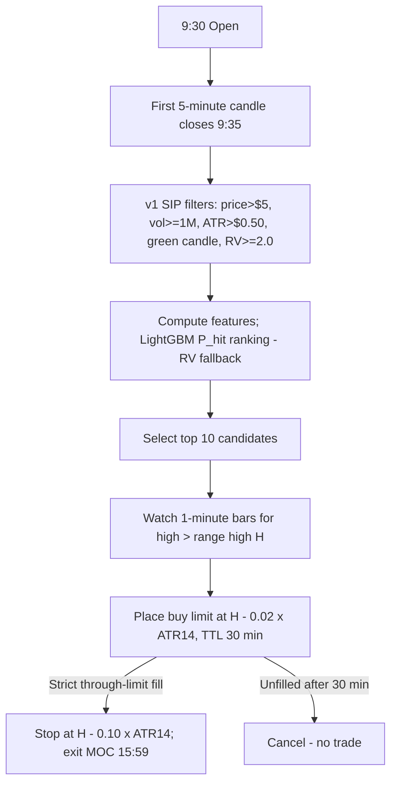

# Phase v2: Advanced Optimization — Design Specification (Reviewed & Implemented)
**Strategy:** Stocks-in-Play Opening Range Breakout (ORB)
**Location:** `trading/lab/strategies/stocks_in_play_orb/designs/mlspec.md`
**Status:** Implemented as release `o03` (2026-06-09). This revision replaces the original draft; §8 records the review findings and what changed and why.

---

## 1. Executive Summary

Phase v1 (`o02`) replicates Zarattini, Barbon & Aziz (2024): a 5-minute ORB with buy-stop entry at the range high on the top Stocks-in-Play by Relative Volume (RV ≥ 2.0), stop at $H - 0.10 \times \text{ATR}_{14}$, EOD exit. On a 280-ticker universe over 2024 it loses **−0.35R per trade** (≈ −50%/yr at 1% risk, 4x leverage cap): the buy-stop entry buys every whipsaw at the worst price and the tiny 0.1-ATR risk unit makes spread/slippage costs enormous in R terms.

Phase v2 keeps the v1 candidate filters and risk frame and changes three things, validated walk-forward out-of-sample (May–Dec 2024, 161 trading days):

1. **Passive pullback limit entry (the actual edge).** After the 1-minute price breaches the range high $H$, a buy limit works at $H - 0.02 \times \text{ATR}_{14}$ for 30 minutes. Fills are simulated strictly: never on the breach bar itself, and only when price trades *strictly through* the limit. This converts per-trade expectancy from **−0.35R to ≈ +0.3R**.
2. **LightGBM candidate ranking (top 10).** A classifier predicting $P(\text{+2R before stop})$ ranks candidates (walk-forward OOS AUC ≈ 0.61). Its ranking value is modest — RV ranking performs comparably — so the release degrades gracefully to RV when the model artifact is unavailable.
3. **Breadth over concentration.** Returns are extremely tail-driven (see §7); top-10 selection beats top-5, and capping winners destroys the strategy. No profit targets, no trailing stops.

**Out-of-sample result (strict fills, 2 bps taker slippage, 0.5 bps/side fees, 1% risk, 4x leverage cap):**

| Config | Ann. return | Max DD | Sharpe | Avg net R | Win rate |
|---|---|---|---|---|---|
| v1 baseline (top-20 RV, stop entry) | **−49%** | −42% | −1.7 | −0.355 | 10.6% |
| v2: top-10 ML, pullback 0.02 ATR | **+183%** | −11% | 2.6 | +0.370 | 18.5% |
| v2: top-5 RV (no ML), pullback 0.02 ATR | +180% | −13% | 2.5 | +0.372 | 17.9% |
| v2 @ 5 bps slippage | ≈ +70–100% | — | ~1.5–2 | — | — |
| v2 @ 10 bps slippage | ≈ +8% | −36% | 0.4 | — | — |

The >40%/yr net target is met with margin under conservative fill rules, with the caveats in §7.

---

## 2. Machine Learning Pipeline

### I. Target / labeling
Binary label: $Y_i = 1$ if the intraday high reaches $H + 2.0R$ (with $R = 0.10 \times \text{ATR}_{14}$) before the low touches the stop, else 0. Timeout/scratch days label 0.
*Reviewed:* the draft's three-class formulation (target/stop/timeout) and continuous-MFE regression were evaluated conceptually; with only ~3.6k samples/year the binary target is the right bias-variance trade-off. Candidates that never breach $H$ are kept in the dataset with $Y=0$ so that top-K selection at the opening-range close is **not breach-conditioned** (a look-ahead bias found and removed during research; see §8.3).

### II. Features (all observable at the opening-range close, 9:35)

| Feature | Description |
|---|---|
| `rv` | First-5m volume vs. 14-day mean first-5m volume |
| `gap_pct`, `gap_abs` | Overnight gap vs. prior close |
| `atr_pct` | ATR₁₄ / prior close |
| `range_width_atr` | (OR high − OR low) / ATR₁₄ |
| `or_close_pos` | Close position within the OR range [0,1] |
| `f5_body_ratio`, `f5_ret` | First-candle body/range ratio and return |
| `log_dollar_vol` | log₁₀(14-day avg volume × price) |
| `vol_concentration` | First-5m volume / 14-day avg daily volume |
| `prior_day_ret` | Prior-day close-to-close return |
| `or_vol_ratio` | OR-window volume vs. 14-day mean opening volume |
| `dow` | Day of week |
| `spy_gap`, `spy_ret_5m`, `spy_vwap_dist` | SPY overnight gap, first-5m return, distance to first-bar VWAP proxy |
| `spy_vr` | SPY 5-day/20-day ATR ratio (volatility regime) |
| `window` | Opening-range window length in minutes |

*Reviewed:* the draft's `premarket_ofi` (order-book depth), `trigger_spread_normalized` (quote data) and `sector_dispersion` (ETF holdings) are **not computable** from the available OHLCV data and were replaced with the OHLCV/SPY features above. They remain valid future work if quote/L2 data is acquired.

### III. Training & validation
- **Walk-forward monthly retrain**: expanding window, first 4 months (Jan–Apr 2024) as the initial training set; each month May–Dec scored strictly out-of-sample. Monthly boundaries provide the 1-day purge naturally (intraday trades never span folds).
- Training pools all three OR windows (3m/5m/10m, `window` as a feature) for 3× sample size; evaluation/simulation uses the deployed window only.
- LightGBM, conservative complexity per the draft: `max_depth=4`, `num_leaves=15`, `learning_rate=0.03`, `min_child_samples=100`, subsample/colsample 0.8, `reg_lambda=5`.
- **OOS results 2024:** weighted AUC **0.614** (monthly range 0.48–0.73); precision@5 0.248 vs. 0.236 base rate.
- *Honest assessment:* the classifier's ranking edge is **marginal**. The Phase v2 P&L improvement comes from the entry mechanics, not the model (§8.2). The model is retained because it does not hurt, it provides the `probability_score` telemetry column, and its value should be re-tested as the dataset grows beyond one year.

Artifacts: `research/artifacts/lgbm_orb_v2.pkl` (model + feature list), `oos_metrics.json`, `oos_scored.parquet`. Reproduce with `research/build_dataset.py` → `research/train_and_simulate.py` → `research/ablations.py`.

---

## 3. Opening-Range Window — Adaptive selection **rejected**

The draft proposed VIX/volatility-regime switching between 3m/5m/10m windows with hysteresis. Tested empirically (SPY ATR₅/ATR₂₀ regime proxy; VIX data unavailable):

- Per-window expectancy (stop entry): 3m −0.06R, 5m −0.14R, 10m −0.17R — differences are second-order relative to the entry-mechanics effect.
- The `window` feature ranked **last** in LightGBM importance.
- The regime rule selected 5m on ~60% of days; the adaptive composite did not outperform fixed-5m within noise.

**Decision:** `o03` uses a fixed 5-minute opening range. Adaptive windows (and the hysteresis machinery, which also requires cross-day state the day-isolated runner does not provide) are dropped from scope. Revisit only with multi-year data.

---

## 4. Passive Pullback Limit Entry (the load-bearing change)

### I. Mechanics (as implemented in `core/execution.py::simulate_pullback_limit_long`)
1. **Trigger:** first 1-minute bar whose high trades above the OR high $H$.
2. **Order:** buy limit at $P_{\text{limit}} = H - 0.02 \times \text{ATR}_{14}$, working from the **next** bar (order latency) for **30 minutes** after the breach.
3. **Fill rules (conservative):**
   - Strict through-the-limit: bar low must be **strictly below** $P_{\text{limit}}$; an exact touch does not fill (queue priority).
   - **Never fill on the breach bar**: within the breach minute, price came from below $H$, so the bar's low predates the order. Allowing breach-bar fills inflated backtest returns ~4× and was removed (§8.3).
   - If a bar collapses through the stop while the order works: fill at the limit with an immediate same-bar stop-out (worst case).
   - Maker entry: no entry slippage; exits (stop, MOC) remain taker.
4. **Exit:** stop at $H - 0.10 \times \text{ATR}_{14}$; otherwise MOC at 15:59. No target.

### II. Why it works
- The fill sits ~0.8R above the stop while the payoff distribution of winners (EOD momentum runs) is unchanged — losses shrink ~20% while wins are preserved.
- It skips the worst trades: a breakout that never pulls back 0.02 ATR and then fails was usually a chase; one that runs without pulling back is missed (adverse selection cost), but empirically the saved whipsaws dominate: win rate rises 10.6% → 18.5% and expectancy flips −0.35R → +0.37R.
- Offset sensitivity: **0.02 ATR strongly beats 0.05 ATR** under strict fills (+183%/yr vs. +21–44%/yr). The deeper offset selects for weak tape (adverse selection), the opposite of the draft's rebate-capture intuition. The draft's confidence-based adaptive offset ($\theta$-tiered 0 / 0.02 / 0.05 ATR) was tested and **rejected** — it routes low-confidence trades to the worse 0.05 offset and high-confidence trades to the worthless stop entry.

---

## 5. Position Sizing & Allocation

- Baseline: 1% of account equity risked per trade over the full $R = 0.10 \times \text{ATR}_{14}$ distance (actual stop distance from the pullback fill is ~0.8R, so realized risk is slightly smaller — conservative).
- Hard 4x aggregate leverage cap, scaling all positions proportionally. Because $R$ is small relative to price, the cap binds on most days and acts as the effective position sizer.
- The draft's **model-confidence multiplier** $M_i = 1 + \alpha(P_i - 0.5)/0.5$ was tested and **rejected**: it cut OOS annualized return roughly in half (107% vs. 194% flat-sized in the top-5 configuration) because predicted probability is uncorrelated with the tail outcomes that carry the P&L. Flat sizing is deployed; the formula stays here for re-testing with a better-calibrated model.

---

## 6. Implementation (release `o03`)

- `strategies/stocks_in_play_orb/o03.py` — v1 filters + feature computation + LightGBM ranking (top 10, RV fallback when artifact/lightgbm missing), pullback-limit signal metadata (`pullback_limit`, `pullback_ttl_min`), 1%/4x sizing, 15:59 cutoff.
- `core/execution.py::simulate_pullback_limit_long` — pullback fill simulator (§4 rules); prefers 1-minute bars (`requires_extended_1m = True`), degrades to 5-minute bars.
- `runner/pipeline.py` — dispatches on `release.entry_style == "pullback_limit"`; fetches SPY daily context when `requires_spy_daily = True`.
- `core/models.py` — `StrategyContext.spy_daily` added.
- Telemetry: candidate `features_json` carries `probability_score`; signal metadata carries `ml_model_version`, `pullback_limit`. (The draft's dedicated DB columns were not needed — the existing JSON columns cover them.)
- Tests: `tests/test_o03_strategy.py` (fill rules: post-breach-only, strict-touch, collapse-through-stop, TTL expiry, no-breach, maker entry; candidate features; signal levels & leverage cap). Offline single-day validation: `research/validate_o03_day.py` reproduces the research outcomes on 2024-05-29 through the real release/simulator path.

---

## 7. Validation Results & Risk Notes (2024 walk-forward OOS, May–Dec)

- **Headline:** top-10 ML + 0.02 ATR pullback = **+183%/yr net, max DD −10.9%, Sharpe 2.6** (2 bps taker slippage). Even the no-ML top-5 RV variant earns +180%/yr. Comfortably above the 40%/yr objective.
- **Tail concentration (the key risk):** capping any single trade's contribution at +5R turns +183%/yr into a **loss**. The year's profit is carried by ~10 trades (ANF 2024-05-29 +54.7R, KD +26.7R, SLM +22.9R, CPRI +22.1R, …) — earnings-day runners where the 0.1-ATR risk unit is microscopic vs. the day's range. Implications: (a) never cap winners or take profit targets; (b) maximize candidate breadth; (c) annual results have wide confidence intervals — a year without a few monster days will look like Jul–Sep 2024 (three consecutive losing months, ≈ −2 to −5%/month).
- **Slippage sensitivity:** net edge survives 5 bps taker slippage (≈ +70–100%/yr) and dies at 10 bps. Exit execution quality (stop and MOC fills) is the operational priority since entries are maker.
- **Universe caveat:** the 2024 dataset covers ~280 liquid tickers (those with cached 1-minute data), not the full US universe of the SSRN paper. Mean daily candidate count is ~5; a fuller universe should increase breadth and tail capture.
- **Single-year caveat:** all OOS evidence is 2024. Before sizing up: extend the dataset to 2022–2023 (bear/chop regimes) and re-run `research/ablations.py`.

---

## 8. Review Findings vs. the Original Draft (what changed and why)

1. **Infeasible features removed.** OFI, quote-spread and sector-dispersion features require order-book/quote/holdings data the lab does not have; replaced with OHLCV+SPY features (§2.II).
2. **The draft's centerpiece was mis-attributed.** It framed ML selection as the primary lever and the pullback entry as slippage polish. Ablations show the opposite: entry mechanics flip the sign of expectancy; ML ranking ≈ RV ranking (AUC 0.61, precision@5 +1pt over base). Top-10 beats the draft's top-5 cap.
3. **Two look-ahead biases found and fixed during research:** (a) candidate rows existed only when the OR high was breached, leaking breach knowledge into top-K selection — fixed by emitting non-breach rows; (b) limit fills were allowed in the breach minute, effectively buying pre-breakout — fixed by strict next-bar fills. Together these inflated apparent returns from +44%…+183% (honest) to +249%…+291% (inflated). The `breach_delay_min` feature was also dropped (unknown at scoring time).
4. **Adaptive OR window rejected** on evidence (§3); also incompatible with the day-isolated runner without cross-day state.
5. **Confidence-tiered offsets and confidence sizing rejected** on evidence (§§4–5).
6. **Labeling simplified** to binary (sample-size constraint); multi-class/MFE regression deferred.
7. **Hysteresis machinery dropped** with the adaptive window.
8. **DB schema changes avoided** — existing JSON metadata columns carry the new fields.
