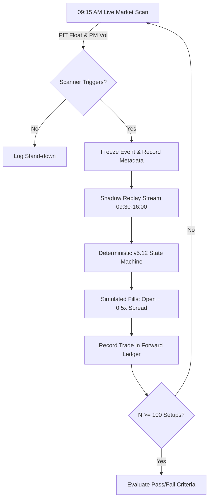

# Peer Review: Warrior v4/v5 Research & Implementation Architecture

**Reviewer:** Gemini (Independent Quantitative Review)  
**Date:** July 23, 2026  
**Target:** Warrior Strategy (`strategies/warrior/`), Replay Engine, and v4/v5 Iterations  

---

## 1. Executive Summary & Validity Assessment

### The Three Most Serious Validity Problems (Ranked)

> [!CAUTION]
> **Rank 1: Severe Universe Selection & Look-Ahead Bias via Non-Point-In-Time (Non-PIT) Current Float**  
> **Mechanism:** Sourcing float data from current snapshot caches for historical events (2024–2026) fundamentally invalidates historical universe selection. Low-float small-cap momentum stocks experience extreme structural transformations over time: dilution, reverse stock splits, warrant conversions, S-1 offerings, and ATM share issuances.  
> **Impact:** A stock that had a 1.5M share float during a massive momentum spike in 2024 may have a 40M share float today (causing it to be improperly excluded from historical scans), whereas a stock that had a 20M float in 2024 but underwent a 1-for-20 reverse split in 2025 has a 1M float today (causing it to be improperly included in historical scans, even though it was not a low-float stock when the trade occurred). This creates bidirectional look-ahead bias and severely distorts the conditional distribution of returns.

> [!WARNING]
> **Rank 2: Sample Size Exhaustion & Multiple Hypothesis Testing on Inspected Panels**  
> **Mechanism:** Out of 567 total scanner rows in the database, only 139 represent regular trading hours (RTH) setups. Of these 139, 127 setups were repeatedly consumed and visually inspected during the development of v3, v4, and v5.0–v5.11 iterations. Only 12 residual setups remain uninspected.  
> **Impact:** Iterative parameter tuning (e.g., score thresholds in v5.2–v5.6, event release timing adjustments in v5.10–v5.11) on an inspected dataset constitutes classic data-mining / snooping. The 12 remaining uninspected rows produced exactly 1 trade under v5.12 ($N=1$). Consequently, there is zero statistical power ($N=1$) to evaluate out-of-sample performance. The reported backtest P&L metrics (+0.02R on 1 trade) are diagnostics of software execution, not evidence of a statistical edge.

> [!IMPORTANT]
> **Rank 3: Microstructure Friction Under-Modeling & Fill Optimism**  
> **Mechanism:** Low-float momentum breakouts are defined by extreme intraday microstructural friction: wide bid-ask spreads (1%–5%+), order book depth exhaustion, volatility trading halts (LULD / SSR), and execution latency.  
> **Impact:** The replay engine evaluates execution using 1-minute OHLC bars. Even with conservative stop-first bar resolution, buying at 1-minute Open/Close prices without modeling bid-ask spread crossing, market order slippage, or participation cap limits during low-volume bars yields overly optimistic fill prices. On low-float momentum stocks, entering market orders at breakout points frequently incurs top-tick fills or severe slippage.

---

### Architectural Verdict: Is v4/v5 a Sensible Direction?

**Verdict: YES on state-machine determinism; NEEDS REFACTORING on heuristic scoring.**

1. **Deterministic State Machine (v5) is Mandatory:** Transitioning away from LLM-in-the-loop trade execution (v3) to a fully deterministic Python state machine (v5) is the correct architectural choice for quantitative execution. LLMs introduce non-determinism, API latency, high token costs, hallucination risks in order parameters, and an inability to conduct reproducible audit trails.
2. **Heuristic Score Classifier Requires Simplification:** The current v5 design relies on an arbitrary hand-tuned scoring classifier (combining pattern geometry, volume, VWAP, and MACD into a score out of 100 with cutoffs like `score >= 70`). Hand-crafted integer score cutoffs create step-function sensitivities and invite hyper-parameter fitting.
3. **Core Recommendation:** Maintain the deterministic state machine execution engine of v5, but strip out the arbitrary weighted score layer in favor of simple, boolean structural trade criteria (e.g., `is_breakout AND above_vwap AND volume_expansion`).

---

### Categorized Recommendations

All proposed changes are classified according to research constraints:

| Recommendation | Classification | Rationale |
| :--- | :--- | :--- |
| **Rename RVOL to `PriorDayVolRatio`** | `Integrity fix` | Prevents conceptual confusion with intraday relative volume (`IntradayRVOL`). Can be done immediately without P&L impact. |
| **Correct 5-min Bar Event Availability to `:40:00`** | `Integrity fix` | Left-labelled `09:35` 5-minute candle covers `09:35:00`–`09:39:59`. Release at `:39:00` is a 1-minute look-ahead. Must execute at `:40:00` Open. |
| **Add Mandatory Warning Flags for Non-PIT Float** | `Integrity fix` | Mark all historical runs with `NON_PIT_FLOAT_WARNING` metadata tag to prevent misinterpretation of backtests. |
| **Implement Spread & Slippage Penalty Models** | `Forward experiment` | Add parameter `fill_slippage = spread / 2` or `fill_price = entry_bar_high` for buys during forward shadow runs. |
| **Pre-register Fixed Exit Strategy (Trailing 5-min Low)** | `Forward experiment` | Test trailing stop below prior 5-minute low instead of rigid 1R/2R scaling + score-based exit pressure. |
| **Sealed Forward Paper/Shadow Cohort (100 Events)** | `Forward experiment` | Freeze code & config; execute live pre-market scans and shadow trade execution for 100 live events. |
| **Historical Re-Evaluation with Point-in-Time Float** | `Blocked` | Blocked until a point-in-time fundamental float database (SEC filings / market data vendor) is acquired. |
| **Level 2 / Order Book Tape Microstructure Replay** | `Blocked` | Blocked due to lack of tick-level L2/NBBO depth data. |

---

## 2. Prioritized Next-Experiment Plan

### Protocol: Sealed Forward Shadow Trading (v5.12-frozen)

Rather than performing further historical sweeps on the exhausted 139-row dataset, all research must pivot to a **Sealed Forward Shadow Experiment**.



#### Plan Specifications
- **Code Baseline:** Freeze `v5.12` codebase (Git SHA locked). No code or parameter modifications during the evaluation period.
- **Scanner Execution:** Run daily live pre-market scanner between 09:15 and 09:25 AM using real-time point-in-time float and pre-market volume quotes.
- **Fill Model:** Execution at next 1-minute candle Open (`:40:00` for a `:35` 5-min bar) + 0.50 * Estimated Bid-Ask Spread slippage penalty.
- **Sample Target:** $N = 100$ validated scanner setup opportunities.

#### Pass / Fail Criteria

| Metric | Pass Threshold | Fail / Kill Threshold | Rationale |
| :--- | :--- | :--- | :--- |
| **Net Expectancy** | $\ge +0.15 \text{ R / setup}$ | $< 0.00 \text{ R / setup}$ | Confirms positive statistical edge net of frictions. |
| **Win Rate / Profit Factor** | Win Rate $\ge 40\%$ OR Profit Factor $\ge 1.6$ | Profit Factor $< 1.1$ | Validates asymmetric risk-reward profile. |
| **Participation Rate** | Trades executed on $\ge 15\%$ of setups | Trades executed on $< 5\%$ | Ensures policy is not overly restrictive/overfitted. |
| **Max Drawdown** | Max Drawdown $\le 8.0 \text{ R}$ | Max Drawdown $> 12.0 \text{ R}$ | Prevents catastrophic capital depletion. |
| **Execution Determinism** | 100% state-machine completion | Any uncaught state deadlock | Ensures software reliability. |

---

## 3. Direct Answers to the 14 Hard Questions

### Research Validity

#### Q1: Does the scanner itself create a selection-conditioned backtest even after event release is fixed? What information is available at start, close, and following minute of the 5-minute breakout bar?
**Answer:**  
Yes, the scanner creates a selection-conditioned cohort. If the scanner filters tickers based on daily criteria (e.g. daily high, daily volume, or full-day price action), it introduces severe look-ahead bias. 

To maintain strict causality, the information breakdown across the breakout bar must be:
- **Start of 5-min bar (09:35:00):** Only bars up to 09:34:59 are known. The breakout has not occurred yet.
- **Close of 5-min bar (09:39:59):** The 09:35–09:39 5-minute candle OHLCV closes. The breakout is confirmed in historical data.
- **Following minute (09:40:00):** This is the **first valid timestamp** when an external system or trader can process the completed 5-minute candle and submit an order. The order fills at the Open price of the 09:40:00 1-minute bar.

If the scanner evaluates setups using any data after 09:39:59, or releases notifications prior to 09:39:59, causality is violated.

#### Q2: Is using prior-day volume / 20-day average as "RVOL" conceptually misleading or an acceptable causal premarket liquidity proxy? Should it be renamed?
**Answer:**  
It is **conceptually misleading** and should be renamed immediately (`Integrity fix`).  
In day-trading and market-microstructure literature, Relative Volume ($RVOL$) specifically refers to *intraday cumulative volume compared to the historical average cumulative volume at that exact time of day* (e.g., cumulative volume at 09:35 AM today vs 20-day average volume at 09:35 AM). 

Comparing prior-day total volume to a 20-day daily average volume measures multi-day volume expansion / stock regime changes, not intraday breakout volume surges. It should be renamed `PriorDayVolRatio` or `PMRVOL` (Premarket Relative Volume) to avoid confusion with intraday relative volume.

#### Q3: Is current float only a universe-selection defect, or can it materially distort the conditional trade distribution enough to invalidate all historical claims?
**Answer:**  
It **materially distorts the conditional trade distribution** and invalidates all historical performance claims.  
Low-float momentum strategies (Ross Cameron style) rely specifically on extreme supply inelasticity (e.g., float < 10M shares). In small-cap equities:
1. High-momentum runners frequently issue equity (S-1/S-3 filings, ATM offerings) following a price spike, expanding their float from 2M to 30M shares over a few months. Evaluating them today with a 30M float removes their historical winning trades from your backtest.
2. Failing small-caps perform 1-for-10 or 1-for-30 reverse splits, reducing float from 30M to 1M shares. Evaluating them today includes them in your historical backtest when their actual historical float was 30M (and thus they lacked supply inelasticity).

This creates bidirectional, non-random selection bias.

#### Q4: Are the 12 residual rows meaningful at all, or should the result be treated as a pure wiring test?
**Answer:**  
The 12 residual rows are **statistically meaningless** for strategy evaluation ($N=12$, resulting in 1 single executed trade in v5.12).  
This result must be treated **strictly as a software integration / wiring test** to verify zero state-machine deadlocks, proper event handling, and reproduction consistency across execution workers. No performance conclusions (+0.02R) should be drawn from 1 trade.

#### Q5: What additional survivorship, ticker-symbol, corporate-action, cache-revision, session, and calendar biases should be audited?
**Answer:**  
The following operational biases must be audited:
1. **Survivorship Bias:** Tickers that were delisted, bankrupt, or moved to OTC market after 2024 must be present in the historical universe scans.
2. **Corporate Action Adjustment Bias:** Historical prices adjusted for reverse stock splits can artificially alter historical breakout price levels and dollar-volume filters if non-adjusted prices are not used for historical level checks.
3. **Symbol Change / CUSIP Relinking:** Tickers changing symbols post-reorganization (e.g., AAA to AAAD) causing dropped historical bars.
4. **Half-Day Session Bias:** Early market closes (e.g., July 3rd, Black Friday) distorting time-of-day VWAP and exit cutoffs.
5. **Cache Revision Bias:** Historical data vendor REST APIs updating historical volume/bar prints retroactively (e.g., post-market trade corrections).

---

### Strategy Design

#### Q6: Is it sound to make candle geometry deterministic while retaining a separate score layer, or is the score merely a fragile hand-built classifier? Which patterns would you remove first?
**Answer:**  
The composite score layer is a **fragile, hand-built heuristic classifier**. Combining weighted measurements into an integer score (e.g. 30% pattern + 20% volume + 25% VWAP + 25% MACD $\ge 70$) creates arbitrary step-function cutoffs where a score of 69 stands down while 70 trades.

**Recommendations:**
1. **Remove First:** Remove the arbitrary composite score integer and exit-pressure weighted score entirely.
2. **Replace With:** Simple boolean rule evaluations (`is_bull_flag AND price > vwap AND volume > prior_bar_volume`).
3. **Pattern Removal:** Remove complex multi-indicator composite scores; retain only clean geometric patterns (micro-pullback break, 5-minute high break) and strict VWAP filtering.

#### Q7: Is the v5 event-minute requirement structurally sensible, or does it make the policy unreasonably selective? Give a causal alternative.
**Answer:**  
The strict event-minute requirement (requiring entry *only* on the exact minute the scanner event is released) is structurally flawed. If the 5-minute breakout candle was a massive extended 12% green bar, entering at the close/open of the event minute forces the strategy to buy the top of an extended move (chasing). Conversely, if the breakout candle was tight, the entry is reasonable.

**Causal Alternative (Micro-Pullback Entry Window):**  
Allow a 1-to-3 minute entry window post-event release, requiring entry on a **micro-pullback to the breakout level or 9-EMA** on the 1-minute chart, provided the risk-to-reward ratio to the recent high is $\ge 1.5$. This prevents buying extended tops while maintaining causality.

#### Q8: Does the v5 fixed 1R/2R scaling and exit pressure distort the intended "breakout or bailout, then runner" behavior? What management rule should be pre-registered?
**Answer:**  
Yes. Selling 50% of the position at 1R truncates tail wins. Momentum trading in small-caps generates the majority of cumulative P&L from rare multi-R runners (3R–10R+). Scaling out early at 1R reduces position size before the core move occurs.

**Pre-registered Forward Exit Rule:**
1. **Initial Risk:** Stop loss placed below the structural 5-minute breakout candle low.
2. **Partial Scale (Risk Reduction):** Sell 33% at +1.5R; adjust stop loss on remaining shares to Breakeven (Entry Price).
3. **Runner Management:** Trail remaining 67% of shares using the **Low of the prior completed 5-minute candle** (or close below 9-EMA on 1-min). Exit immediately if a bearish topping tail or red volume reversal occurs.

#### Q9: Should scanner-event trigger information be visible to a deterministic policy at all, or should the policy re-derive the break entirely from the tape?
**Answer:**  
The policy should **re-derive the breakout independently from the revealed OHLCV tape**.  
Relying on the scanner's historical trigger level/time introduces an information dependency on external pre-processing. If the deterministic policy is robust, its internal `candlebar.py` pattern engine should independently detect the 5-minute consolidation and breakout event from the incoming 1-minute stream. The scanner should serve solely as a universe filter (identifying active tickers), not an intraday signal cheat code.

#### Q10: Is an LLM useful anywhere in this architecture after deterministic pattern and execution work?
**Answer:**  
An LLM should **NOT be used in the real-time execution path** (entry/exit/sizing decisions).

**Valid Non-Execution LLM Use Cases:**
1. **Qualitative News & Catalyst Classification (Pre-Market):** Classifying news headlines (e.g., differentiating between a high-value FDA drug approval vs an S-1 dilution filing or promotional press release).
2. **Post-Trade Performance Attribution (Post-Market):** Generating natural-language post-mortem reviews of daily executions against discretionary trading rules.

---

### Engineering and Validation

#### Q11: Is release on the `:39` minute a correct simulation of knowledge after the left-labelled `:35` bar closes, or should execution begin on the next minute/open instead?
**Answer:**  
Releasing on `:39` and executing within `:39` is a **1-minute look-ahead defect**.  

In standard market-data conventions:
- A left-labelled `09:35` 5-minute candle covers the minute intervals `09:35:00` through `09:39:59`.
- The candle is only complete and verified at timestamp `09:39:59.999`.
- Therefore, the event notification can only be processed by an execution system at `09:40:00`.
- The earliest possible execution entry is at the **Open of the `09:40:00` 1-minute candle**.

#### Q12: Which fill assumptions are likely most consequential for low-float momentum names, and how would you report sensitivity?
**Answer:**  
The most consequential fill assumptions are:
1. **Bid-Ask Spread Crossing:** Market orders buy at the Ask and sell at the Bid. On volatile low-float stocks, spreads widen to 1%–3% during breakouts.
2. **Slippage on Market Orders:** During high-volume breakout minutes, market orders suffer adverse fill slippage (filling near the High of the entry minute).
3. **Volume Participation Caps:** Order sizes exceeding 5%–10% of 1-minute bar volume cannot fill instantaneously without severe market impact.

**Sensitivity Reporting Protocol:** Report backtest / shadow performance across 3 explicit fill tiers:
- *Tier 1 (Optimistic Baseline):* Fill at 1-min Candle Open.
- *Tier 2 (Realistic Spread Penalty):* Fill at 1-min Candle Open $+ (0.50 \times \text{Average Spread})$.
- *Tier 3 (Adverse Slippage Stress Test):* Fill at 1-min Candle High for entries, 1-min Candle Low for stop exits.

#### Q13: What exact forward-paper protocol would make a future v5.12 result credible?
**Answer:**  
A forward-paper result will be credible if and only if it follows a pre-registered protocol:
1. **Pre-Registration:** Lock code repository Git SHA, configuration JSON, and evaluation metrics before starting.
2. **Duration & Scope:** 100 consecutive live pre-market scanner events (minimum 30 executed trades).
3. **Real-time Logging:** Log pre-market scan results daily at 09:25 AM, recording live point-in-time float and volume.
4. **Execution Audit:** Compare simulated paper fills against actual live top-of-book quotes at execution timestamps to measure fill delta.
5. **Kill Switch Criteria:** Halt test immediately if cumulative drawdown exceeds $8.0\text{R}$ or 5 consecutive full-stop losses occur.

#### Q14: What test cases are missing from the pattern engine, event release plumbing, execution engine, and audit path?
**Answer:**  
The following unit & integration test cases must be added:

```python
# Missing Essential Test Cases

# 1. Pattern Engine Edge Cases
def test_flat_topped_breakout_zero_volume_spike():
    """Verify pattern detector handles zero-volume or low-liquidity bars without division by zero."""
    pass

def test_multi_bar_consolidation_with_dropped_minutes():
    """Verify pattern engine behavior when 1-minute OHLC stream has missing time ticks."""
    pass

# 2. Event Release & Timing
def test_left_labelled_5min_bar_release_timestamp():
    """Assert event for 09:35 bar is withheld until exactly 09:40:00."""
    pass

# 3. Execution Engine Microstructure
def test_partial_fill_participation_cap_rollover():
    """Verify unfilled shares under participation cap roll over to subsequent minutes correctly."""
    pass

def test_trading_halt_luld_gap_exit():
    """Verify stop loss handling when a stock reopens after a 5-minute volatility halt below stop level."""
    pass
```

---

## 4. Final Summary & Action Items

```
+-------------------------------------------------------------------------------+
|                             SUMMARY OF ACTIONS                                |
+-------------------------------------------------------------------------------+
| 1. HALT all historical hyper-parameter tuning on inspected 139-row dataset.   |
| 2. APPLY immediate integrity fixes (rename RVOL, fix 09:40:00 event release). |
| 3. SIMPLIFY v5 state machine (replace integer score with boolean criteria).   |
| 4. LAUNCH 100-event sealed forward shadow trading cohort with PIT float.      |
+-------------------------------------------------------------------------------+
```
